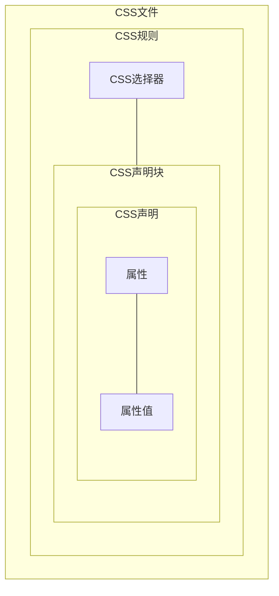
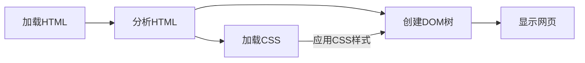

# CSS介绍

## CSS概况

### CSS的作用

CSS 是用来指定文档如何展示给用户的一门语言——如网页的样式、布局、等等  
一份文档是由标记语言组织起来的文本文件（如用HTML组织文档），展示一份文档给用户实际上是将文档变成用户可用的文件  
CSS 可以用于给文档添加样式，如改变文本样式、创建布局、添加动画等特效  

### CSS的语法

CSS 是一门`基于规则的语言`，你可以定义用于你的网页中特定元素样式的一组规则  

```css
    h1 {
        color: red;
        font-size: 5em;
    }
    p {
        color: black;
    }
```

其中CSS规则的语法组成如下  

1. 选择器selector：选择我们希望应用样式规则的HTML元素
2. `{ }`与其内一系列声明，声明的语法为`属性: 属性值;`
3. 声明内的`属性`和`属性值`与HTML元素内的`属性`和`属性值`行为相似

一个CSS样式表可以有多个规则  

### CSS模块

CSS 由许多`模块`构成，例如`Backgrounds and Borders`模块  
其内包含模块的属性、特性等等  

### CSS规范

所有的标准 Web 技术 (HTML, CSS, JavaScript 等) 都被定义在一个巨大的文档中，称作`规范`  
它是由 (像是 W3C、WHATWG、ECMA) 这些`规范化组织`所发布的，其中定义了各种技术是如何工作的  

### CSS的浏览器支持

让所有的浏览器都同时支持一个 CSS `新特性`是不现实的，通常都会一个`空档期`  
会出现一些浏览器已经支持`新特性`而另一些仍未支持`新特性`的状态  
因此，查看特性的实现状态是非常有用的  

## CSS使用入门

### 连接CSS文件

共有三种方法连接HTML和CSS，其中最为常用的是使用`<link>`标签  

```html
    <head>
        <link rel="stylesheet" href="css文件地址">
    </head>
```

### 给HTML元素添加样式

使用选择器选中元素即可添加样式，使用多个选择器时用`,`隔开它们，这被称为`群组选择器`  
在下例中使用的是`标签选择器`，它会选择所有的对应元素  

```css
    p, li{
        color: green;
    }
```

### 改变元素默认行为

现代浏览器有对HTML元素的默认样式  
如果想要改变这个默认样式，只需要在css文件中应用相应规则即可  

### 使用类名

如果想要给某一类的元素运用样式，那么不必一个个的选择  

1. 使用`class="类名1 类名2"`属性给HTML元素添加类名
2. 使用CSS的`类选择器`选中该类`.类名`
3. 添加声明即可应用样式到该类

### 后代选择器（包含选择器）

在选择器中间以`空格`隔开，即可使用`后代选择器`  
它会选择前一选择器的后代中符合后一选择器要求的元素

### 相邻兄弟选择器

以`+`相隔选择器，即可使用相邻兄弟选择器  
它会选择在前一选择器下面的兄弟节点中符合后一选择器要求的第一个元素

### 根据状态应用样式

元素拥有不同的状态，如被访问过的、没被访问过的、被鼠标悬停的等等  
css也可以为这些不同的状态应用样式  
如`a:link`代表未被访问的`<a>`，`a:visited`代表被访问了的`<a>`  

## CSS的组成

### 连接CSS到HTML

下面的三种方法优先级是`内联样式` > `内部样式表` > `外部样式表`

#### 外部样式表

将CSS写入到一个单独的`.css`文件，网页即可连接该`.css文件`用于设定样式  

```html
    <head>
        <link rel="stylesheet" href="css文件地址">
    </head>
```

这样的方法能够让`.css`文件被多个网页使用  

#### 内部样式表

将样式表直接写入到HTML文档的内部称为`内部样式表`  
这种方法要求把CSS写入到`<head>`的`<style>`标签内  

```html
    <head>
        <style>
            CSS样式表
        </style>
    </head>
```

在某些情况下，这种方法也许更好  
但在大多数情况下，使用`外部样式表`更有利于维护、复用等等  

#### 内联样式

内联样式仅仅影响单个的HTML元素，它被包含在元素的`style`属性之中  

```html
    <p style="CSS声明">一个段落元素</p>
```

**尽量不要使用这种方法**，这种方法的维护难度最高  
它将HTML和CSS杂糅在一起，使得开发维护变得非常麻烦  

### CSS选择器

CSS内有多种选择器，如`标签选择器`、`类选择器`、`id选择器`、`群组选择器`、`后代选择器`等等  

不过使用这些选择器指定元素是有`优先级`的  
当不同CSS规则冲突时，根据选择器优先级来判定合适规则  

如果选择器相同，则后面定义的规则将被应用，这被称为`层叠`  

### 属性和属性值

css文件的包含关系如下所示  



虽然大部分的`属性值`是`关键字`或`数值`，但也有一些是函数形式  

如用于在CSS中进行简单计算的`calc()`函数  

```css
    body{
        width: calc(90% - 30px);
    }
```

### @规则

`@规则`是一些特殊的规则，提供了关于 CSS 应该执行什么或如何表现的指令  
如`@import`是导入另一个样式表进入，`@media`是媒体查询  

```css
    @import 'styles2.css';
    body {
    background-color: pink;
    }
    @media (min-width: 30em) {
    body {
        background-color: blue;
    }
    }
```

### 简写属性

一些属性，如 `font`、`background`、`padding`、`border` 和 margin 等属性称为简写属性  
它们允许在一行中设置多个属性值，从而节省时间并使代码更整洁  

> :exclamation:使用 CSS 简写属性的一个不太明显的方面是省略的值如何重置，一个没有在 CSS 简写属性中指定的值会恢复到它的初始值。
> 这意味着 CSS 简写属性中的省略可以**覆盖之前设置的值**

### 添加CSS注释

使用`/* */`添加注释，可以单行也可以多行  

### CSS中的空白

空白是指实际的空格、制表符和换行符  
浏览器会忽略了 CSS 中的空白，空白的价值在于它可以提高可读性  

> :exclamation:CSS声明通过空白字符分离不同的值，属性名称不应该含有空白字符

## CSS如何运行

### 浏览加载网页的基础流程



1. 浏览器加载 HTML 文件
2. 将 HTML 文件转化成一个 DOM
3. 拉取该 HTML 相关的大部分资源，比如嵌入到页面的图片、视频和 CSS 样式
4. 拉取到 CSS 之后会进行解析，将不同的规则应用在对应的 DOM 的节点中，并添加节点依赖的样式（这个中间步骤称为渲染树）
5. 上述的规则应用于渲染树之后，渲染树会依照应该出现的结构进行布局
6. 网页展示在屏幕上（这一步被称为着色）

### 关于DOM

一个 DOM 有一个树形结构，标记语言中的每一个元素、属性以及每一段文字都对应着结构树中的一个节点  

DOM和HTML的转换示例

```html
    <p>
        Let's use:
        <span>Cascading</span>
        <span>Style</span>
        <span>Sheets</span>
    </p>
```

```dom
    P
    ├─ "Let's use:"
    ├─ SPAN
    |  └─ "Cascading"
    ├─ SPAN
    |  └─ "Style"
    └─ SPAN
        └─ "Sheets"
```

### 当浏览器遇到了无法解析的CSS代码

当浏览器遇到了无法解析的CSS声明时，它会直接跳过该声明  
同样，遇到了无法解析的选择器时她也会跳过该选择器  

这样的设计使得在考虑`兼容性`时十分有用  
由于CSS的`层叠`特性，可以有多个兼容性的声明却只实际应用一个声明  

```css
    .box {
    width: 500px;
    width: calc(100% - 50px);
    }
```
