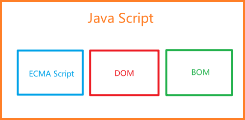

# JavaScript 的实现

完整的 JS 实现包含`核心（ECMAScript）`、`文档对象模型（DOM）`、`浏览器对象模型（BOM）`  

  

## ECMA Script

它并不局限于Web浏览器，Web浏览器只是它的一种`宿主环境`  
宿主环境提供 ECMA Script 的`基准实现`和与`环境交互所需扩展`  

ECMA-262 第6版，俗称 ES6、ES2015  
ECMA-262 第7版，俗称 ES7、ES2016  

## DOM

DOM 全称`文档对象模型`，是一个应用编程接口（API）  
它将整个页面抽象成一颗树，而树包含有许多节点与枝条  

DOM 也拥有一个由 W3C（万维网联盟）制定的标准  

* DOM Level 1：
  * DOM Core：提供了映射XML文档的方式
  * DOM HTML：扩展了 Core 并增加了特定于 HTML 的对象和方法
* DOM Level 2：
  * DOM 视图：描述追踪文档不同视图（如应用了CSS前后的文档）的接口
  * DOM 事件：描述事件以及事件处理的接口
  * DOM 样式：描述处理元素 CSS 样式的接口
  * DOM 遍历和范围：描述遍历和操作 DOM 树的接口
* DOM Level 3：
  * 统一的加载和保存文档方法
  * 验证文档方法
* DOM Level 4：
  * W3C 至此开始`动态实时更新 DOM 标准`，统称为 DOM4

## BOM

BOM 全称`浏览器对象模型`，同样是API  
它支持访问、操作浏览器窗口，也可以控制浏览器显示页面之外的部分  

在`HTML5`之前 BOM 没有一个标准，HTML5 出现后它尽可能的涵盖了 BOM 特性  

BOM 通常针对浏览器窗口和子窗口，人们通常会把任何特定于浏览器的扩展都归在 BOM 的范畴内  
例如提供浏览器信息、提供屏幕分辨率信息、提供浏览器占用资源信息等等  

[笔记目录](../../《JavaScript高级程序设计（第四版）》学习笔记.md#1-何为js)  
[上一篇：JS的简要历史](./1-JS的简要历史.md)  
