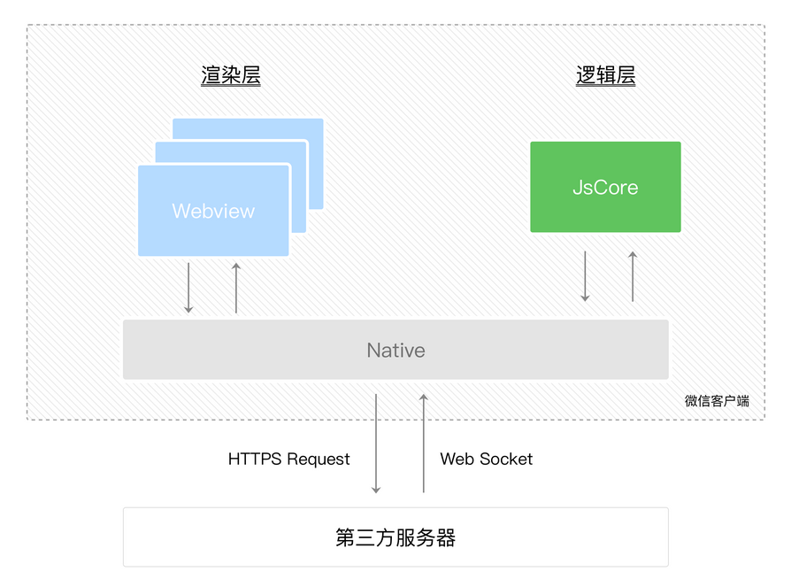

# 小程序宿主环境

`微信客户端`给小程序所提供的环境为`宿主环境`，小程序借助宿主环境提供的能力，可以完成许多普通网页无法完成的功能  

## 渲染层和逻辑层

小程序的运行环境分成`渲染层`和`逻辑层`，其中 WXML 模板和 WXSS 样式工作在渲染层，JS 脚本工作在逻辑层  
小程序的渲染层和逻辑层`分别由2个线程管理`：渲染层的界面使用了`WebView 进行渲染`，逻辑层采用`JsCore线程运行JS脚本`  
一个小程序存在多个界面，所以渲染层存在多个WebView线程，这两个线程的通信会经由微信客户端（Native）做中转，逻辑层发送网络请求也经由Native转发  

  

## 程序与页面

微信客户端在打开小程序之前，会把整个小程序的代码包下载到本地  
紧接着通过 `app.json` 的 `pages` 字段就可以知道你当前小程序的所有页面路径  
而写在 `pages` 字段的第一个页面就是这个小程序的首页  
  
小程序启动之后，在 `app.js` 定义的 App 实例的 `onLaunch` 回调会被执行  
  
页面是怎么写的：  

1. 微信客户端会先根据 `eg.json` 配置生成一个界面，顶部的颜色和文字你都可以在这个 `json` 文件里边定义好
2. 紧接着客户端就会装载这个页面的 `WXML` 结构和 `WXSS` 样式
3. 最后客户端会装载 `eg.js`  

```js
Page({ // Page 是一个页面构造器
  data: { // 参与页面渲染的数据
    logs: []
  },
  onLoad: function () {
    // 页面渲染后 执行
  }
})
```

## 组件

小程序提供了丰富的基础组件给开发者，开发者可以像搭积木一样，组合各种组件拼合成自己的小程序  
就和Vue的组件差不多  

## API

为了让开发者可以很方便的调起微信提供的能力，例如获取用户信息、微信支付等等，小程序提供了很多 API 给开发者去使用  
多数 API 的回调都是异步，你需要处理好代码逻辑的异步问题  
