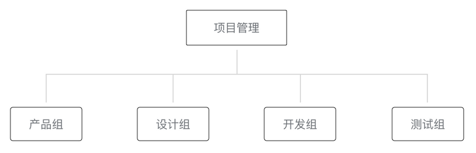
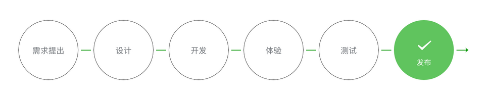
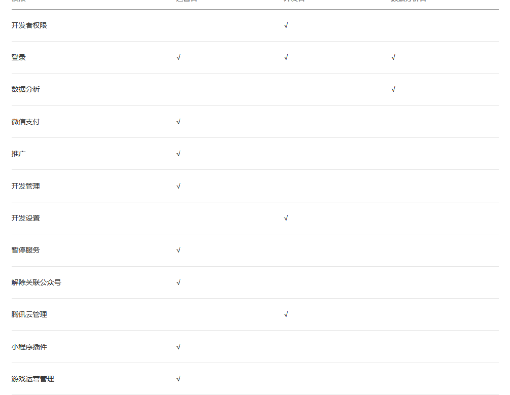
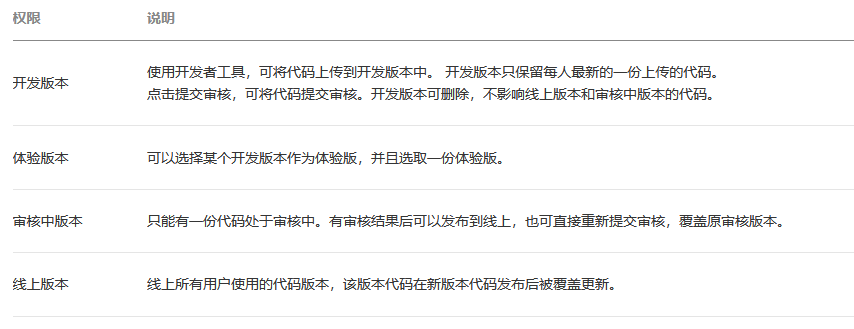

# 小程序协同工作和发布

在中大型的公司里，人员的分工非常仔细，一般会有不同岗位角色的员工同时参与同一个小程序项目  
为此，小程序平台设计了不同的权限管理使得项目管理者可以更加高效管理整个团队的协同工作  

## 协同工作

  
  

## 小程序的版本

  
一般来说，每个开发者拥有自己对应的一个开发版本  
为了让测试和产品经理有一个完整稳定的版本可以体验测试，小程序平台允许把其中一个开发版本设置成体验版  

## 发布上线

### 预览

点击开发者工具顶部操作栏的预览按钮，开发者工具会自动打包当前项目，并上传小程序代码至微信的服务器，成功之后会在界面上显示一个二维码  
使用当前小程序开发者的微信扫码即可看到小程序在手机客户端上的真实表现  

### 上传代码

上传代码是用于提交体验或者审核使用的  
上传成功之后，登录小程序管理后台 - 版本管理 - 开发版本 就可以找到刚提交上传的版本了  

### 提交审核

小程序的发布是需要经过审核的  
请开发者严格测试了版本之后，再提交审核，过多的审核不通过，可能会影响后续的时间  

### 发布

小程序提供了两种发布模式：全量发布和分阶段发布  

* 全量发布：是指当点击发布之后，所有用户访问小程序时都会使用当前最新的发布版本
* 分阶段发布：是指分不同时间段来控制部分用户使用最新的发布版本，分阶段发布我们也称为灰度发布
