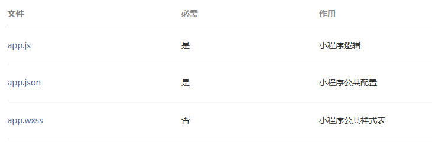
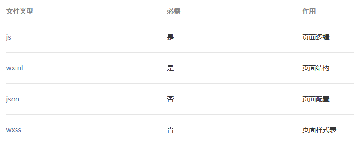

# 目录结构

小程序包含一个描述整体程序的 `app` 和多个描述各自页面的 `page`  

## app

一个小程序主体部分由三个文件组成，必须放在项目的根目录  
  

## page

一个小程序页面由四个文件组成  
  
**为了方便开发者减少配置项，描述页面的四个文件必须具有相同的路径与文件名**  

## 允许上传的文件

以下文件会经过编译，因此上传之后无法直接访问到：`.js`、`app.json`、`.wxml`、*.`wxss`（其中 wxml 和 wxss 文件仅针对在 app.json 中配置了的页面）  
除此之外，只有后缀名在白名单内的文件可以被上传  
