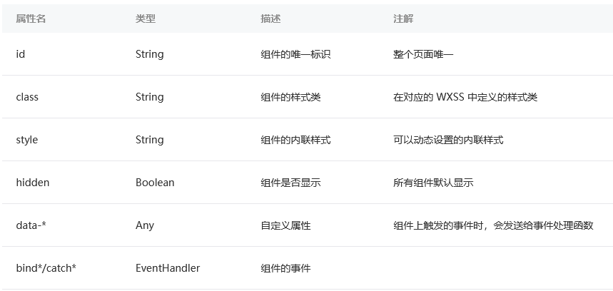

# WXML模板

WXML 要求标签必须是`严格闭合`的，没有闭合将会导致编译错误  
WXML中的属性是`大小写敏感`的  

## 数据绑定

要求程序的运行过程中，要有动态的去改变渲染界面的能力  
WXML 通过 `{{变量名}}` `(变量名是大小写敏感的)`来绑定 WXML 文件和对应的 JavaScript 文件中的 `data 对象属性`（就像Vue一样）  
**属性值也可以动态的去改变**，有所不同的是，属性值**必须被包裹在双引号中**（和Vue不同）  

```wxml
<text data-test="{{test}}"> hello world</text>
```

没有被定义的变量的或者是被设置为 undefined 的变量不会被同步到 wxml 中  

## 逻辑语法

还可以在 `{{ }}` 内进行简单的逻辑运算  
如`三元运算`、`数学计算`、`放置数字、字符串、数组`  

## 条件逻辑

```wxml
wx:if="{{condition}}"
wx:elif="{{condition}}"
wx:else

//array是一个 对象数组
wx:for="{{array}}"
    {{index}}: {{item}}

//用wx:for-index和wx:for-item把index和item绑定到 局部变量 上
wx:for="{{array}}" wx:for-index="idx" wx:for-item="itemName"
    {{idx}}: {{itemName}}

//wx:key 来指定列表中项目的唯一的标识符
//它是字符串，值需要是唯一的字符串或数字，且不能动态改变
```

## 模板

可以在模板中定义代码片段，然后在不同的地方调用  
使用 `name` 属性，作为模板的名字。然后在 `<template/>` 内定义代码片段  

```wxml
<template name="msgItem">
    <text> {{index}}: {{msg}} </text>
</template>
```

**使用模板**：使用 `is` 属性，声明需要的使用的模板，然后将模板所需要的 `data` 传入  

```wxml
<template is="msgItem" data="{{index, msg}}"/>
```

## 引用

WXML 提供两种文件引用方式`import`和`include`  
  
**import** 可以在该文件中使用目标文件定义的 template（引入template）  
import 有`作用域`的概念，即只会 import 目标文件中定义的 template，import `不具有递归的特性`  

```wxml
<import src="item.wxml"/>
```

**include** 可以将目标文件中除了 `<template/>` `<wxs/>` 外的整个代码引入，相当于是拷贝到 include 位置  

```wxml
<include src="header.wxml"/>
<view> body </view>
<include src="footer.wxml"/>
```

## 共同属性

所有wxml 标签都支持的属性称之为共同属性  

  
