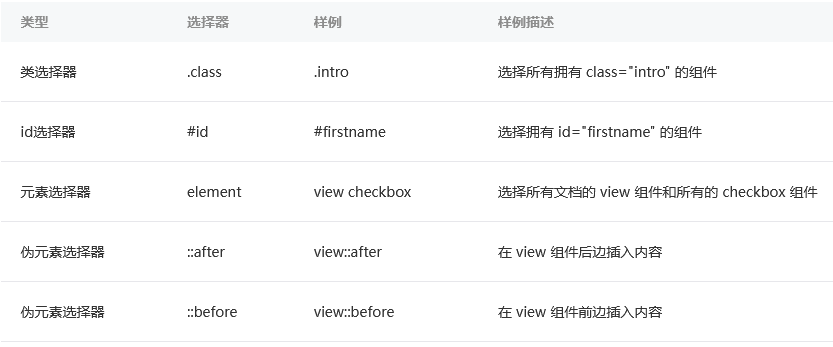
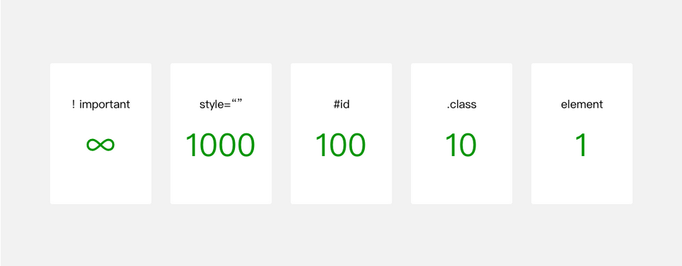

# WXSS样式

WXSS与Web开发中的CSS类似，为了更适合小程序开发，WXSS对CSS做了一些补充以及修改  

* `/app.wxss` 项目公共样式
* `/pages/xxx/xxx.wxss` 页面样式
* `/*/*.wxss` 其它

## 尺寸单位 rpm

在WXSS中，引入了`rpx`尺寸单位，引用新尺寸单位的目的是，**适配不同宽度的屏幕**，开发起来更简单  
  
小程序编译后，rpx会做一次px换算(是相对单位，相对的是`屏幕宽/750`)  
换算是以750个物理像素为基准，也就是在一个宽度为750物理像素的屏幕下，1rpx = 1px  
  

## WXSS引用

和css中的引用差不多  

```wxss
@import './test_0.wxss'
```

由于WXSS最终会被编译打包到目标文件中，用户只需要下载一次，在使用过程中不会因为样式的引用而产生多余的文件请求  
也就是说是逻辑上的引用，实际上运行时都是被打包好了  

## 内联样式

和CSS一样，不过WXSS可以通过变量改变style  

## 选择器

WXSS**不完全支持**CSS的选择器  

  

选择器的**权重**如下  

  

和CSS一样，WXSS也是层叠式的（后面覆盖前面）  

## 官方样式库

WeUI是一套与微信原生视觉体验一致的基础样式库，由微信官方设计团队为微信内网页和微信小程序量身设计，令用户的使用感知更加统一  
[WeUI-Github](https://github.com/Tencent/weui-wxss)  
