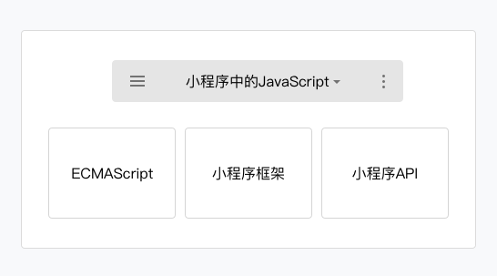

# 小程序的JS

小程序中 JavaScript 构成如图  
  
  
不同的平台的小程序的脚本执行环境也是有所区别的（IDE、Android、IOS）  
有些不支持`ES6`，小程序IDE提供语法转码工具帮助开发者，将 ES6代码转为 ES5代码  

## 模块化

小程序中可以将任何一个JavaScript 文件作为一个模块，通过`module.exports` 或者 `exports` 对外暴露接口  

```js
// moduleA.js
module.exports = { }

// B.js
var multiplyBy2 = require('./moduleA')
```

和普通的ES6模块系统差不多  

## 脚步执行顺序

小程序的执行的入口文件是 `app.js` ，并且会根据其中 require 的模块顺序决定文件的运行顺序  
当 app.js 执行结束后，小程序会按照开发者在 `app.json` 中定义的 pages 的顺序，逐一执行  

## 作用域

小程序的脚本的作用域同 NodeJS 更为相似  
在文件中声明的变量和函数只在该文件中有效，不同的文件中可以声明相同名字的变量和函数，不会互相影响  
  
当需要使用**全局变量**的时，通过使用全局函数 `getApp()` 获取全局的实例，并设置相关属性值，来达到设置全局变量的目的  
也就是：**获取全局对象，再在全局对象上定义属性**  

```js
// a.js
var global = getApp()
global.globalValue = 'globalValue'

// b.js
var global = getApp()
console.log(global.globalValue) // 输出 globalValue
```
