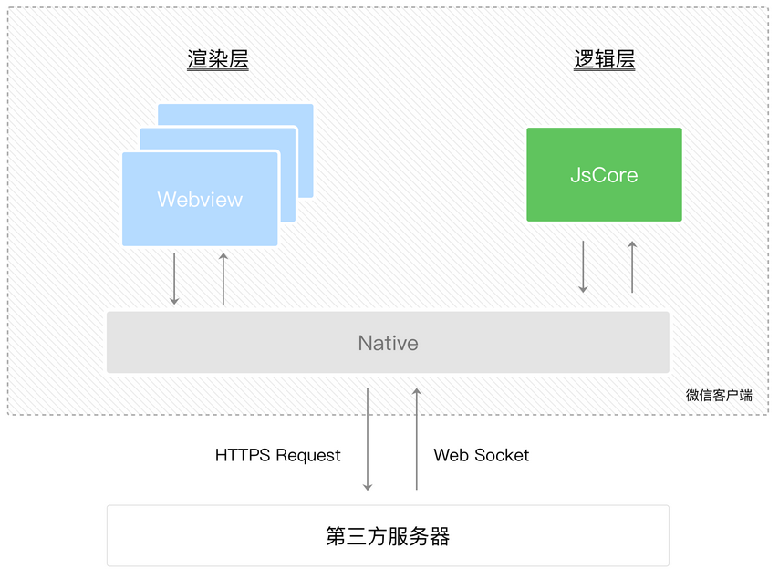
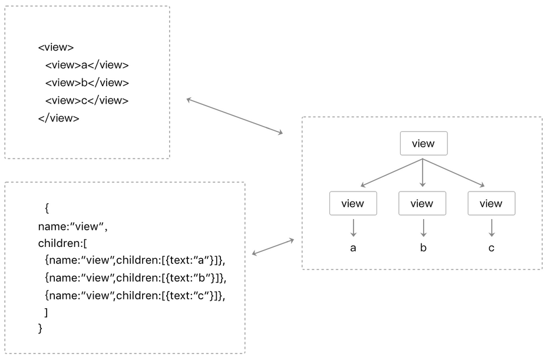
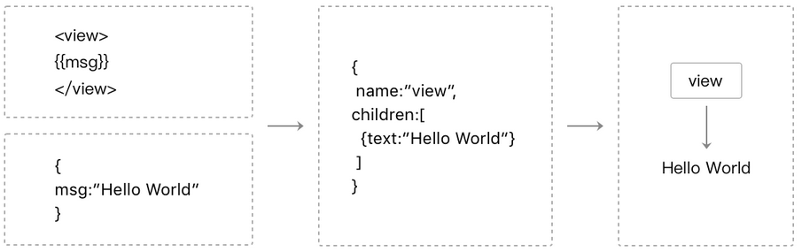
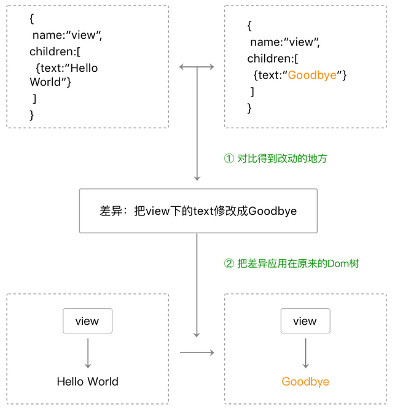
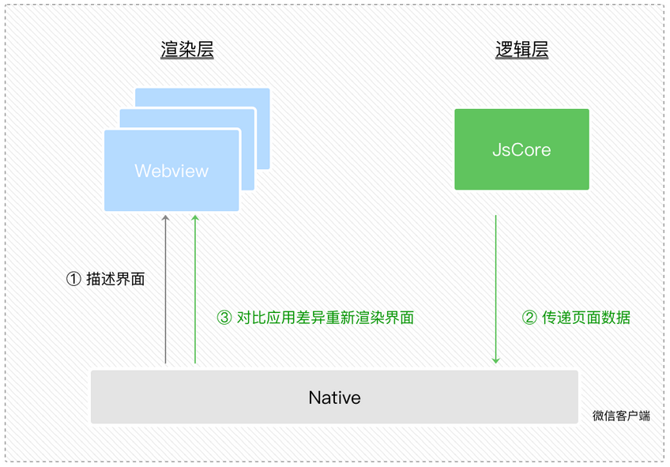

# 渲染层和逻辑层

WXML 模板和 WXSS 样式工作在渲染层，JS 脚本工作在逻辑层  
  
1. 渲染层和数据相关。
2. 逻辑层负责产生、处理数据。
3. 逻辑层通过 Page 实例的 setData 方法传递数据到渲染层。

## 通信模型

  

## 数据驱动

如果有某种“方法”可以让状态和视图绑定在一起（状态变更时，视图也能自动变更），那我们就可以省去手动修改视图的工作，这个方法就是`数据驱动`  
  
**WXML结构实际上等价于一棵Dom树**，通过一个**JS对象也可以来表达Dom树**的结构  

  

WXML可以先转成JS对象，然后再渲染出真正的Dom树  

  

通过setData把msg数据从“Hello World”变成“Goodbye”，产生的JS对象对应的节点就会发生变化  
此时可以对比前后两个JS对象得到变化的部分，然后把这个差异应用到原来的Dom树上  
从而达到更新UI的目的，这就是**数据驱动的原理**  

  

## 双线程下的界面渲染

在渲染层，宿主环境会把WXML转化成对应的JS对象  
逻辑层发生数据变更时，通过宿主环境提供的setData方法把数据从逻辑层传递到渲染层  
经过对比前后差异，把差异应用在原来的Dom树上  

  
