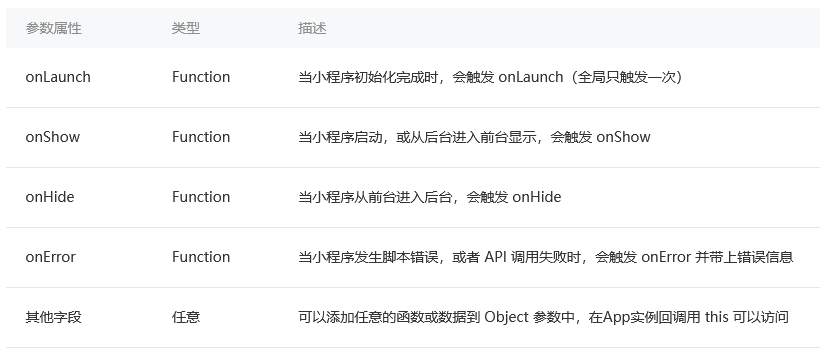
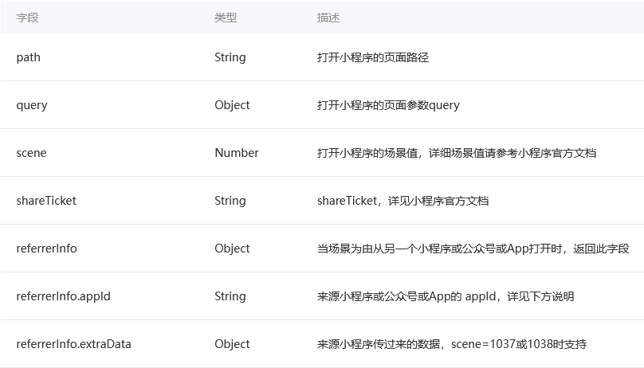
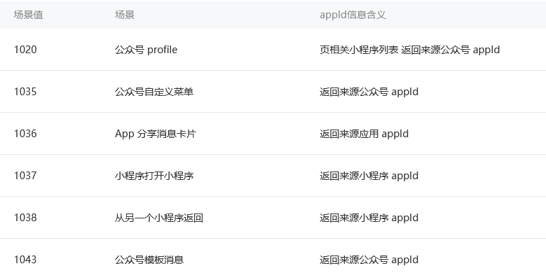
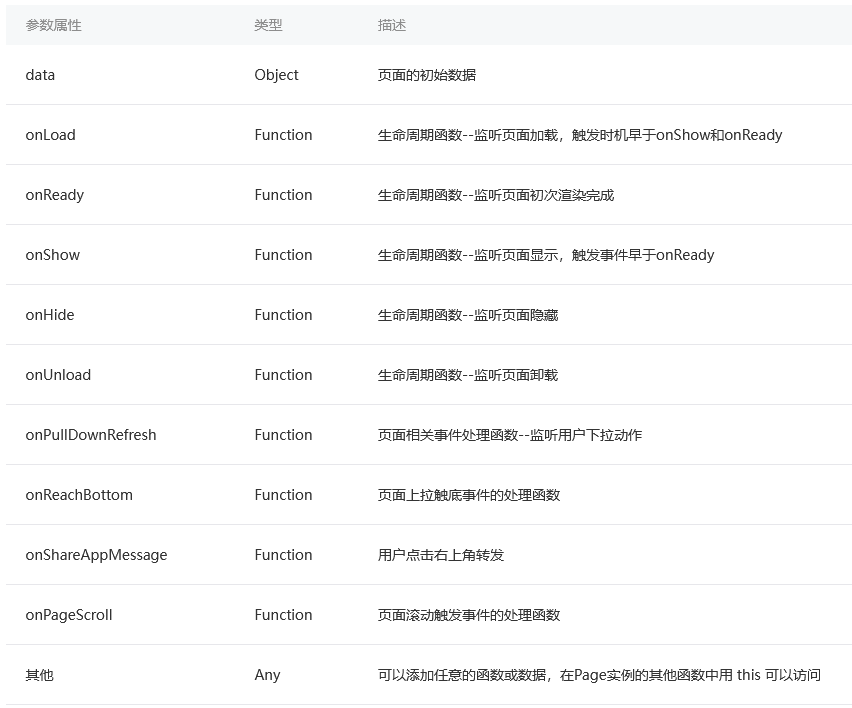
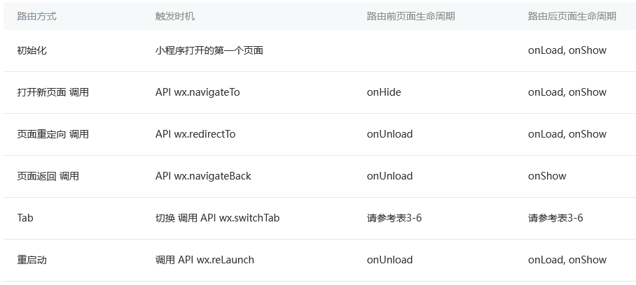
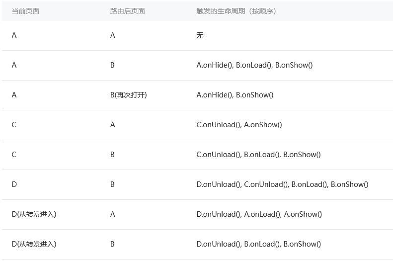

# 程序与页面

从逻辑组成来说，一个`小程序`是由多个`页面`组成的`程序`  
了解程序和页面的概念以及它们的生命周期是非常重要的  

## 程序

`小程序`指的是产品层面的程序，而`程序`指的是代码层面的程序实例  
为了避免误解，下文采用`App`来代替代码层面的`程序`概念  

### 程序构造器`App()`

`App()` 构造器必须写在项目根目录的`app.js`里，App实例是`单例对象`，在其他JS脚本中可以使用宿主环境提供的 `getApp()` 来获取程序实例  
App构造器接受一个`Object`参数  

```js
App({
  onLaunch: function(options) {},
  onShow: function(options) {},
  onHide: function() {},
  onError: function(msg) {},
  globalData: 'I am global data'
})
```

  

### 程序的生命周期和打开场景

初次进入小程序的时候，微信客户端初始化好宿主环境，同时从网络下载或者从本地缓存中拿到小程序的代码包，把它注入到宿主环境，初始化完毕后，微信客户端就会给App实例派发onLaunch事件，App构造器参数所定义的onLaunch方法会被调用  
  
可以看到，App的生命周期是由微信客户端根据用户操作主动触发的。为了避免程序上的混乱，我们**不应该从其他代码里主动调用App实例的生命周期函数**  
  
在微信客户端中打开小程序有很多途径，微信客户端会把打开方式带给`onLaunch`和`onShow`的调用`参数options`  
[点击查看所有的途径参数（场景值）](https://developers.weixin.qq.com/miniprogram/dev/reference/scene-list.html)  
  
**onLaunch,onShow参数**  
  
  
支持返回 `referrerInfo.appId` 的场景
  

### 小程序全局数据

JS脚本是运行在JsCore的线程里，小程序的每个页面各自有一个WebView线程进行渲染  
小程序切换页面时，小程序逻辑层的JS脚本运行上下文依旧在同一个JsCore线程中  
App实例是单例的，因此**不同页面直接可以通过App实例下的属性来共享数据**  
  
*要特别留意一点，所有页面的脚本逻辑都跑在同一个JsCore线程，页面使用setTimeout或者setInterval的定时器，然后跳转到其他页面时，这些定时器并没有被清除，需要开发者自己在页面离开的时候进行清理*  

## 页面

一个小程序可以有很多页面，每个页面承载不同的功能，页面之间可以互相跳转  

### 文件构成和路径

一个页面是分三部分组成：界面、配置和逻辑  
一个页面的文件需要放置在同一个目录下，其中WXML文件和JS文件是必须存在的，JSON和WXSS文件是可选的  
**页面路径需要在小程序代码根目录`app.json`中的`pages`字段声明**，否则这个页面不会被注册到宿主环境中，默认pages字段的第一个页面路径为小程序的首页  

### 页面构造器`Page()`

宿主环境提供了 `Page()` 构造器用来注册一个小程序页面，Page()在页面脚本`page.js`中调用  
Page构造器接受一个`Object参数`  
  

### 页面的生命周期和打开参数

* 页面**初次加载**的时候，微信客户端就会给Page实例派发`onLoad`事件，onLoad在页面没被销毁之前只会触发1次
* **页面显示**之后，Page构造器参数所定义的`onShow`方法会被调用，从别的页面返回到当前页面时，当前页的onShow方法都会被调用
* 页面**初次渲染完成**时，Page构造器参数所定义的`onReady`方法会被调用，onReady在页面没被销毁前只会触发1次
* **页面不可见**时，Page构造器参数所定义的`onHide`方法会被调用，这种情况会在使用wx.navigateTo切换到其他页面、底部tab切换时触发
* 当前页面**使用`wx.redirectTo`或`wx.navigateBack`返回到其他页**时，当前页面会被微信客户端销毁回收，此时Page构造器参数所定义的`onUnload`方法会被调用

onLoad早于 onShow，onShow早于onReady  
Page的生命周期是由微信客户端根据用户操作主动触发的。为了避免程序上的混乱，我们**不应该在其他代码中主动调用Page实例的生命周期函数**  
  
**页面的打开参数query**  
页面Page构造器里onLoad的option可以拿到当前页面的打开参数，其类型是一个Object，其键值对与页面URL上query键值对一一对应  
微信小程序的页面链接和URL一样，同时也要用UrlEncode  

### 页面的数据

data参数是页面第一次渲染时从逻辑层传递到渲染层的数据  
Page实例的原型中有`setData`函数，我们可以在Page实例下的方法调用`this.setData`把数据传递给渲染层，从而达到更新界面的目的  
setData传递数据实际是一个`异步`的过程，所以setData的第二个参数是一个callback回调，在这次setData对界面渲染完毕后触发  
data中的key还可以非常灵活，以数据路径的形式给出`this.setData({"d[1].text": 'Goodbye'})`，注意**此时key要用双引号**  

* 直接修改 Page实例的this.data 而不调用 this.setData 是无法改变页面的状态的，还会造成数据不一致
* 由于setData是需要两个线程的一些通信消耗，为了提高性能，每次设置的数据不应超过1024kB
* 不要把data中的任意一项的value设为undefined，否则可能会有引起一些不可预料的bug

### 页面的用户行为

* 下拉刷新 `onPullDownRefresh`
  * 监听用户下拉刷新事件，需要在`app.json的window`选项中或`页面配置page.json`中设置`enablePullDownRefresh`为true
  * 当处理完数据刷新后，`wx.stopPullDownRefresh`可以停止当前页面的下拉刷新
* 上拉触底 `onReachBottom`
  * 监听用户上拉触底事件，可以在`app.json的window`选项中或`页面配置page.json`中设置触发距离`onReachBottomDistance`
  * 在触发距离内滑动期间，本事件只会被触发一次
* 页面滚动 `onPageScroll`
  * 监听用户滑动页面事件，参数为 Object，包含 `scrollTop` 字段，表示页面在垂直方向已滚动的距离（单位px）
* 用户转发 `onShareAppMessage`
  * 只有定义了此事件处理函数，右上角菜单才会显示“转发”按钮
  * 此事件需要return一个`Object，包含title和path`两个字段，用于自定义转发内容

### 页面跳转和路由

一个小程序拥有多个页面，我们可以通过`wx.navigateTo`推入一个新的页面  
页面以栈的形式表示，称为`页面栈`，以列表形式书写（前底后顶）  
小程序宿主环境限制了这个页面栈的最大层级为10层  

* `wx.navigateTo({ url: 'pageD' })` 可以往当前页面栈多推入（进入）一个 pageD
* `wx.navigateBack()` 可以推出（退出）当前页面栈的最顶上页面
* `wx.redirectTo({ url: 'pageE' })` 是替换当前页变成pageE

小程序提供了**原生的`Tabbar`支持**，我们可以在`app.json声明tabBar字段`来定义Tabbar页  

```js
  "tabBar": {
    "list": [
      { "text": "Tab1", "pagePath": "pageA" },
      { "text": "Tab1", "pagePath": "pageF" },
      { "text": "Tab1", "pagePath": "pageG" }
    ]
  }
```

* 使用`wx.switchTab({ url: 'pageF' })`，此时原来的页面栈会被清空（除了已经声明为Tabbar页外的其他页面会被销毁），然后会切到pageF所在的tab页面  
* `wx.navigateTo`和`wx.redirectTo`只能打开非TabBar页面，`wx.switchTab`只能打开Tabbar页面
* 使用 `wx. reLaunch({ url: 'pageH' })` 重启小程序，并且打开pageH

  
A和B是Tab页面，C由A进，D由C进：`[A[C[D]], B]`  
Tabbar页面初始化之后不会被销毁  
  
可以看到，这些页面的运作就是和栈一样的进入退出  
