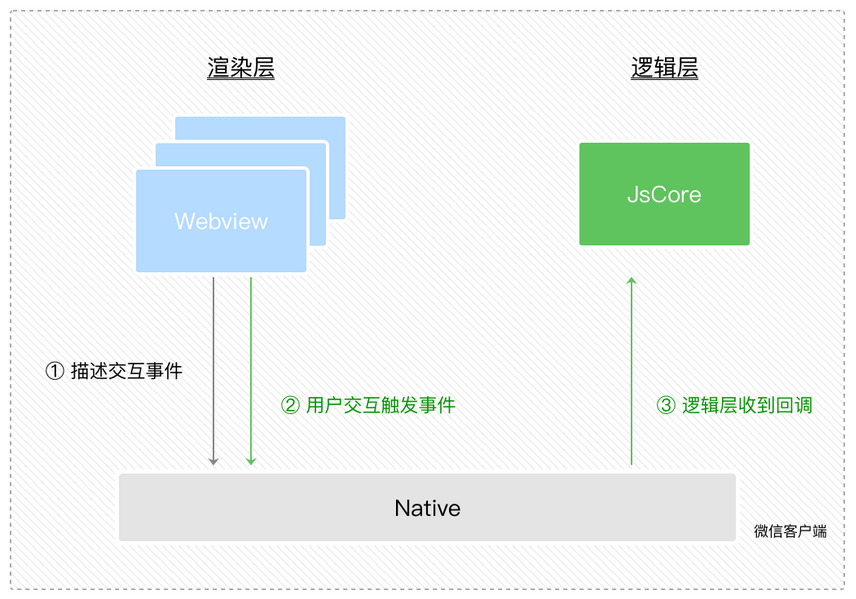
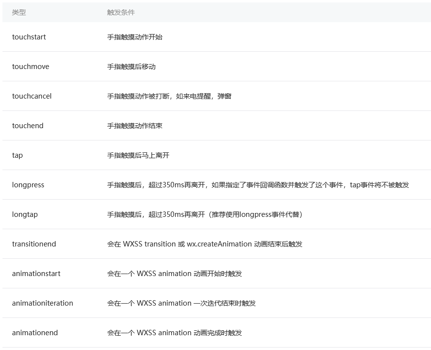
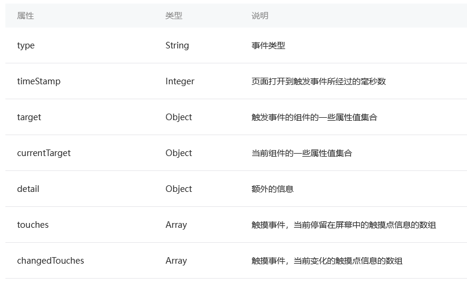
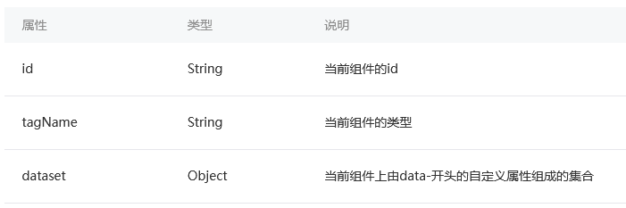
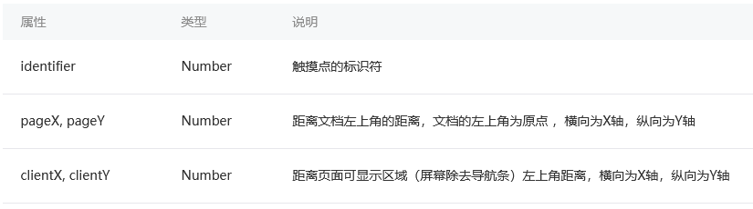
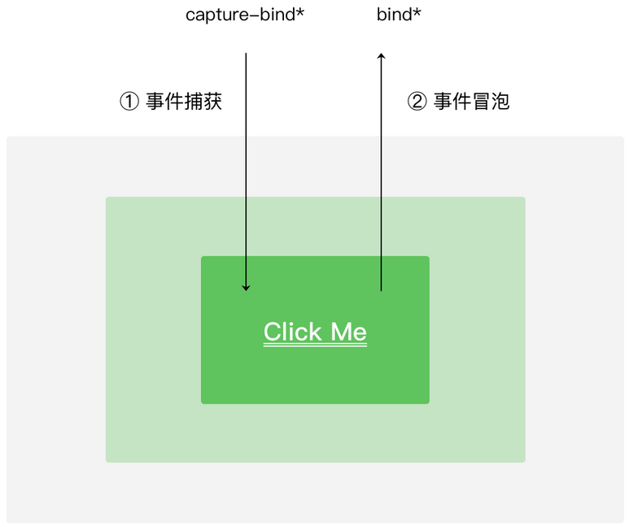

# 事件

把这种`用户在渲染层的行为反馈`以及`组件的部分状态反馈`抽象为渲染层传递给逻辑层的`事件`  
  

```html
<!-- page.wxml -->
<view id="tapTest" data-hi="WeChat" bindtap="tapName"> Click me! </view>
```

```js
// page.js
   Page({
  tapName: function(event) {
    console.log(event)
  }
})
```

事件是通过`bindtap`这个属性绑定在组件上的，同时在当前页面的`Page构造器`中定义对应的`事件处理函数tapName`  
用户点击该view区域时，达到触发条件生成事件`tap`，该事件处理函数tapName会被执行，同时还会收到一个事件对象event  

## 事件类型和事件对象

**常见事件类型**  
  
  
**事件对象event**  
  
currentTarget为当前事件所绑定的组件，而target则是触发该事件的源头组件  
  
**target和currentTarget的event对象属性**  
  
  
**touch和changedTouches的event对象属性**  
  

## 事件绑定与冒泡捕获

`bind`或者`catch`开头，然后跟上事件的类型，如`bindtap`、`catchtouchstart`，也可以是如`bind:tap`、`catch:touchstart`，bind和catch前还可以加上`capture-`来表示捕获阶段  
然后加上`="FuncName"`，FuncName是对应的页面Page构造器中定义同名的函数  
  
**bind和capture-bind的含义分别代表事件的冒泡阶段和捕获阶段**  
  
`bind事件`绑定不会阻止冒泡事件向上冒泡，`catch事件`绑定可以阻止冒泡事件向上冒泡  
