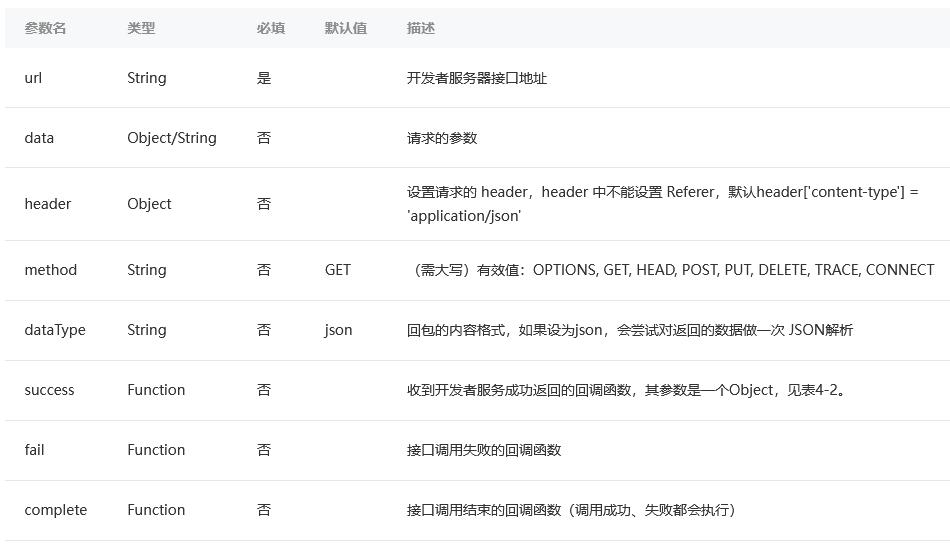
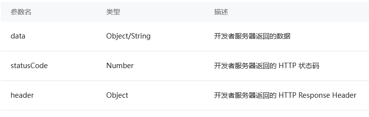

# 发起HTTPS网络通信

小程序经常需要往服务器传递数据或者从服务器拉取信息，这个时候可以使用`wx.request`这个API  

```js
wx.request({
  url: 'https://test.com/getinfo',
  success: function(res) {
    console.log(res)// 服务器回包信息
  }
})
```

  

## 服务器接口

url参数是当前发起请求的服务器接口地址，小程序宿主环境要求request发起的网络请求必须是`https`协议请求，因此开发者服务器必须**提供HTTPS服务的接口**  
wx.request请求的域名需要在小程序管理平台进行配置  

## 请求参数

通过wx.request这个API，有两种方法把数据传递到服务器：通过`url上的参数`以及通过`data参数`  
`url:'https://test.com/getinfo?id=1&version=1.0.0'`或者是`data: { id:1, version:'1.0.0' }`  
  
header参数设置content-type头部为application/json，小程序发起的请求的包体内容就是data参数对应的JSON字符串  

## 收到回包

小程序端收到回包后会触发success回调，同时回调会带上一个Object信息（属性如下）  
  
只要成功收到服务器返回，无论HTTP状态码是多少都会进入success回调  

## 使用技巧

**设置超时时间**  
默认的request超时时间是60秒，可以通过app.json指定超时时间大小  

```json
{
  "networkTimeout": {"request": 3000}
}
```
