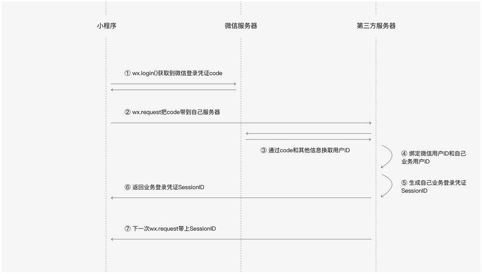
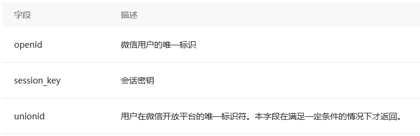

# 微信登录

  

## 获取微信登录凭证code

上述微信登录的流程中并不是通过wx.login直接获取微信用户的id  
如果以id为信息直接发送请求获取数据，那么可以通过伪造请求获取服务器的信息  
wx.login生成一个带有时效性的凭证称为`微信登录凭证code`，其有效时间仅为**5分钟**  

## 发送code到开发者服务器

在wx.login的success回调中拿到微信登录凭证，紧接着会通过wx.request把code传到开发者服务器，为了后续可以换取微信用户身份id  

```js
Page({
  tapLogin: function() {
    wx.login({
      success: function(res) {
        if (res.code) {
          wx.request({
            url: 'https://test.com/login',
            data: {
              username: 'zhangsan', // 用户输入的账号
              password: 'pwd123456', // 用户输入的密码
              code: res.code
            },
            success: function(res) {
              // 登录成功
              if (res.statusCode === 200) {
               console.log(res.data.sessionId)// 服务器回包内容
              }
            }
          })
        } else {
          console.log('获取用户登录态失败！' + res.errMsg)
        }
      }
    });
  }
})
```

## 到微信服务器换取微信用户身份id

后台拿到了前边wx.login()所生成的微信登录凭证code，此时就可以拿这个code到微信服务器换取微信用户身份  
微信服务器为了确保拿code过来换取身份信息的人就是刚刚对应的小程序开发者，到微信服务器的请求要同时带上`AppId`和`AppSecret`  
AppId和AppSecret是微信鉴别开发者身份的重要信息，AppId是公开信息，但是**AppSecret是开发者的隐私数据不应该泄露**  
code在成功换取一次信息之后会立即失效  
  
微信服务器提供的接口地址是:  
`https://api.weixin.qq.com/sns/jscode2session?appid=<AppId>&secret=<AppSecret>&js_code=<code>&grant_type=authorization_code`  
接口会返回以下字段:  
  

* openid就是前文一直提到的微信用户id，可以用这个id来区分不同的微信用户
* 开发者可以用session_key请求微信服务器其他接口来获取一些其他信息（不要泄露）

## 绑定微信用户身份id和业务用户身份

微信会建议开发者把这两个信息的对应关系存起来，我们把这个对应关系称之为“绑定”  
有了这个绑定信息，小程序在下次需要用户登录的时候就可以不需要输入账号密码  
这样静默授权的登录方式显得非常便捷  

## 业务登录凭证SessionId

开发者服务器和开发者的小程序应该也有会话密钥，在本书中我们就把它称之为SessionId  
用户登录成功之后，开发者服务器需要**生成会话密钥SessionId**，在服务端**保持SessionId对应的用户身份信息**，同时**把SessionId返回给小程序**  
小程序后续发起的**请求中携带上SessionId**，开发者服务器就可以**通过服务器端的Session信息查询到当前登录用户的身份**  
这样我们就不需要每次都重新获取code，省去了很多通信消耗  
