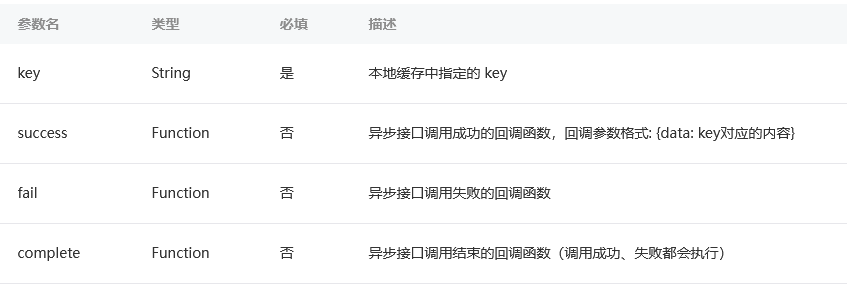
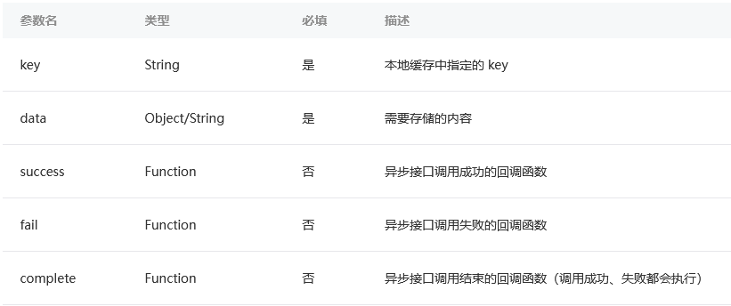

# 本地数据缓存

本地数据缓存是小程序存储在当前设备上硬盘上的数据  
我们可以利用本地数据缓存来存储用户在小程序上产生的操作  
我们还可以利用本地缓存一些服务端非实时的数据提高小程序获取数据的速度  

## 读写本地数据缓存

* 通过`wx.getStorage`/`wx.getStorageSync`读取本地缓存
* 通过`wx.setStorage`/`wx.setStorageSync`写数据到缓存
* Sync后缀的接口表示是同步接口

**wx.getStorage的使用**  

```js
wx.getStorage({
  key: 'key1',
  success: function(res) {
    // 异步接口在success回调才能拿到返回值
    var value1 = res.data
  },
  fail: function() {
    console.log('读取key1发生错误')
  }
})
```

  

**wx.setStorage的使用**  

```js
wx.setStorage({
  key:"key",
  data:"value1"
  success: function() {
    console.log('写入value1成功')
  },
  fail: function() {
    console.log('写入value1发生错误')
  }
})
```

  

## 缓存限制和隔离

小程序宿主环境会管理不同小程序的数据缓存，不同小程序的本地缓存空间是分开的，每个小程序的缓存空间上限为`10MB`  
考虑到同一个设备可以登录不同微信用户，宿主环境还对不同用户的缓存进行了隔离，避免用户间的数据隐私泄露  
用户的关键信息不建议只存在本地缓存，应该把数据放到服务器端进行持久化存储  

## 利用本地缓存提前渲染界面

* 我们在拉取信息数据后把数据存在本地缓存里
* 在onLoad发起请求前，先检查是否有缓存过数据
* 如果有的话直接渲染用户界面
* 然后等到wx.request的success回调之后再覆盖本地缓存重新渲染新的用户界面

一般在对数据实时性/一致性要求不高的页面采用这个方法来做提前渲染，用以优化小程序体验  

## 缓存用户登录态SessionId

通常用户在没有主动退出登录前，用户的登录态会一直保持一段时间，就无需用户频繁地输入账号密码  
如果我们把SessionId记录在Javascript中某个内存变量，当用户关闭小程序再进来小程序时，之前内存的SessionId已经丢失，此时我们就需要**利用本地缓存的能力来持久化存储SessionId**  

```js
//page.js
var app = getApp()
Page({
  onLoad: function() {
    // 调用wx.login获取微信登录凭证
    wx.login({
      success: function(res) {
        // 拿到微信登录凭证之后去自己服务器换取自己的登录凭证
        wx.request({
          url: 'https://test.com/login',
          data: { code: res.code },
          success: function(res) {
            var data = res.data
            // 把 SessionId 和过期时间放在内存中的全局对象和本地缓存里边
            app.globalData.sessionId =data.sessionId
            wx.setStorageSync('SESSIONID',data.sessionId)

            // 假设登录态保持1天
            var expiredTime = +new Date() +1*24*60*60*1000
            app.globalData.expiredTime =expiredTime
            wx.setStorageSync('EXPIREDTIME',expiredTime)
          }
        })
      }
    })
  }
})
```

在重新打开小程序的时候，我们把上一次存储的SessionId内容取出来，恢复到内存  

```js
//app.js
App({
  onLaunch: function(options) {
    var sessionId =wx.getStorageSync('SESSIONID')
    var expiredTime =wx.getStorageSync('EXPIREDTIME')
    var now = +new Date()
    if (now - expiredTime <=1*24*60*60*1000) {
      this.globalData.sessionId = sessionId
      this.globalData.expiredTime = expiredTime
    }
  },
  globalData: {
    sessionId: null,
    expiredTime: 0
  }
})
```
