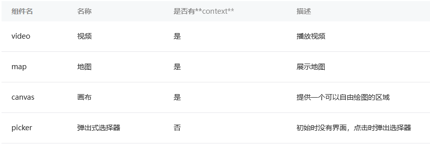

# 原生组件

在内置组件中，有一些组件较为特殊，它们并不完全在Exparser的渲染体系下，而是由`客户端原生参与组件的渲染`，这类组件我们称为`原生组件`  

## 原生组件运行机制

* 组件被创建，包括组件属性会依次赋值。
* 组件被插入到DOM树里，浏览器内核会立即计算布局，此时我们可以读取出组件相对页面的位置（x, y坐标）、宽高。
* 组件通知客户端，客户端在相同的位置上，根据宽高插入一块原生区域，之后客户端就在这块区域渲染界面
* 当位置或宽高发生变化时，组件会通知客户端做相应的调整

原生组件在WebView这一层的渲染任务是很简单，只需要渲染一个占位元素，之后客户端在这块占位元素之上叠了一层原生界面  
因此，**原生组件的层级会比所有在WebView层渲染的普通组件要高**  

## 原生组件好处

* 扩展Web的能力，比如像输入框组件（input, textarea）有更好地控制键盘的能力。
* 体验更好，同时也减轻WebView的渲染工作
* 绕过setData、数据通信和重渲染流程，使渲染性能更好

**常见原生组件**  
  
交互比较复杂的原生组件都会提供`context`，用于直接操作组件  

## 原生组件渲染限制

原生组件脱离在WebView渲染流程外，这带来了一些限制  
**一些CSS样式无法应用**于原生组件  
最为常见的问题是，原生组件会浮于页面其他组件之上（相当于拥有正无穷大的z-index值）**使其它组件不能覆盖在原生组件上**展示  
可以考虑使用cover-view和cover-image组件。这两个组件也是原生组件，同样是脱离WebView的渲染流程外，而原生组件之间的层级就可以按照一定的规则控制  
