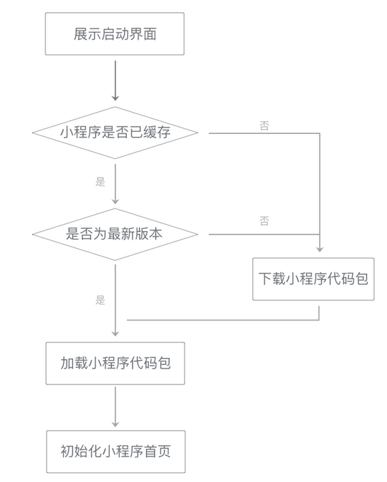
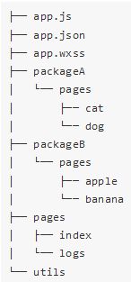

# 启动

在小程序启动时，微信会为小程序展示一个固定的启动界面，界面内包含小程序的图标、名称和加载提示图标  
此时，微信会在背后完成几项工作：下载小程序代码包、加载小程序代码包、初始化小程序首页  
  

## 代码包下载

小程序第一次启动时，微信需要下载小程序代码包，如果小程序代码包未更新且还被保留在缓存中，则下载小程序代码包的步骤会被跳过  
小程序代码包不是小程序的源代码，而是编译、压缩、打包之后的代码包  
对低于1MB的代码包，其下载时间可以控制在929ms（iOS）、1500ms（Android）内  

1. 精简代码，去掉不必要的WXML结构和未使用的WXSS定义
2. 减少在代码包中直接嵌入的资源文件
3. 压缩图片，使用适当的图片格式

## 分包加载流程

如果小程序比较复杂，优化后的代码总量可能仍然比较大，此时可以采用**分包加载**的方式进行优化  
采用分包时，小程序的代码包可以被划分为几个：  

* 一个是`主包`，包含小程序启动时会马上打开的页面代码和相关资源  
* 其余是`分包`，包含其余的代码和资源  

小程序启动时，只需要先将主包下载完成，就可以立刻启动小程序，显著降低小程序代码包的下载时间  

**分包的目录结构**  
  

**分包的`app.json`配置**  

```json
{
  "pages":[
    "pages/index",
    "pages/logs"
  ],
  "subPackages": [
    {
      "root": "packageA",
      "pages": [
        "pages/cat",
        "pages/dog"
      ]
    }, {
      "root": "packageB",
      "pages": [
        "pages/apple",
        "pages/banana"
      ]
    }
  ]
}
```

组织成上图的形式，这两个子目录就构成了两个分包，每个分包下都可以有自己的页面代码和资源文件  
除掉这两个目录的部分就是小程序的主包，**启动时需要访问的页面及其依赖的资源文件应放在主包中**  

## 代码包加载

微信会在小程序启动前为小程序准备好通用的运行环境  
这个运行环境包括几个供小程序使用的线程，并在其中完成小程序基础库的初始化，预先执行通用逻辑，尽可能做好小程序的启动准备  
  
小程序的代码包被下载（或从缓存中读取）完成后，小程序的代码会被加载到适当的线程中执行  
所有app.js、页面所在的JS文件和所有其他被require的JS文件会被*自动执行一次*，小程序基础库会完成所有页面的注册  
  
需要注意的是，**如果一个页面被多次创建，并不会使得这个页面所在的JS文件被执行多次，而仅仅是根据初始数据多生成了一个页面实例（this），`在页面JS文件中直接定义的变量`，在所有这个页面的实例间是共享的**  
  
在小程序代码包加载完毕后，小程序基础库会根据启动路径选择一个页面来启动  
这时会根据页面路径和初始数据创建一个新页面，页面创建和运行期间会涉及许多数据通信和页面渲染
