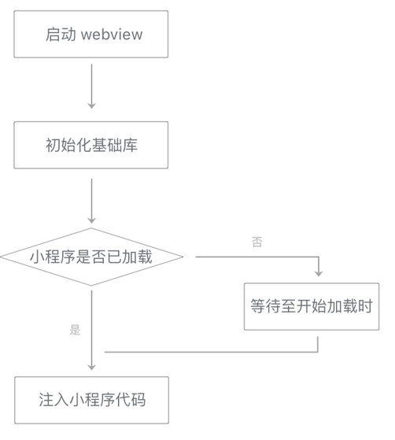

# 页面层级的准备

在视图层内，小程序的每一个页面都独立运行在一个页面层级上  
小程序启动时仅有一个页面层级，每次调用`wx.navigateTo`，都会**创建一个新的页面层级**，相对地，`wx.navigateBack`会**销毁一个页面层级**  
  
对于每一个新的页面层级，视图层都需要进行一些额外的准备工作  
页面层级的准备工作分为三个阶段  

1. 启动一个WebView
2. 在WebView中初始化基础库，还会进行一些基础库内部优化
3. 注入小程序WXML结构和WXSS样式（这一阶段无法在小程序启动前执行）

  

对于`wx.redirectTo`，这个调用不会打开一个新的页面层级，而是将当前页面层级重新初始化  
