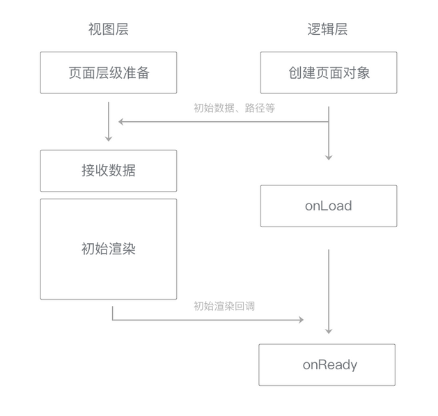

# 数据通信

在每个小程序页面的生命周期中，存在着若干次页面数据通信  
逻辑层向视图层发送页面数据（data和setData的内容），视图层向逻辑层反馈用户事件  

## 页面初始数据通信

在`小程序启动`或一个`新的页面被打开`时，页面的初始数据（data）和路径等相关信息会从逻辑层发送给视图层，用于视图层的初始渲染  
Native层会将这些数据直接传递给视图层，同时向用户展示一个新的页面层级，视图层在这个页面层级上进行界面绘制  
视图层接收到相关数据后，根据页面路径来选择合适的WXML结构，WXML结构与初始数据相结合，得到页面的第一次渲染结果  
  
`页面初始化时间`大致由`页面初始数据通信时间`和`初始渲染时间`两部分构成  
数据通信的时间指数据从逻辑层开始组织数据到视图层完全接收完毕的时间，数据量小于64KB时总时长可以控制在30ms内  

## 更新数据通信

初始渲染完毕后，视图层可以在开发者调用`setData`后执行界面更新  
  
数据传输时，逻辑层会执行一次`JSON.stringify`来去除掉setData数据中不可传输的部分  
逻辑层还会将`setData`所设置的数据字段与`data`合并，使开发者可以用`this.data`读取到变更后的数据  

* 不要过于频繁调用setData，应考虑将多次setData合并成一次setData调用
* 数据通信的性能与数据量正相关，因而如果有一些数据字段`不在界面中展示`且`数据结构比较复杂`或`包含长字符串`，则`不应使用setData`来设置这些数据
* 与界面渲染无关的数据最好不要设置在data中，可以考虑设置在page对象的其他字段下

## 用户事件通信

视图层会接受用户事件，如`点击事件`、`触摸事件`等  

* 当一个用户事件被触发且有相关的事件监听器需要被触发时，视图层会将信息反馈给逻辑层
* 如果一个事件没有绑定事件回调函数，则这个事件不会被反馈给逻辑层
* 视图层中有一套高效的事件处理体系，可以快速完成事件生成、冒泡、捕获等过程

视图层将事件反馈给逻辑层时，同样需要一个通信过程，通信的方向是从视图层到逻辑层  

* 去掉不必要的事件绑定（WXML中的bind和catch），从而减少通信的数据量和次数
* 事件绑定时需要传输target和currentTarget的dataset，因而不要在节点的data前缀属性中放置过大的数据
