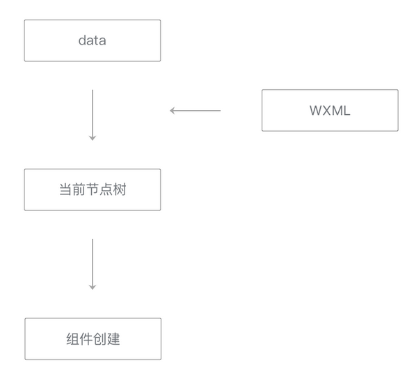
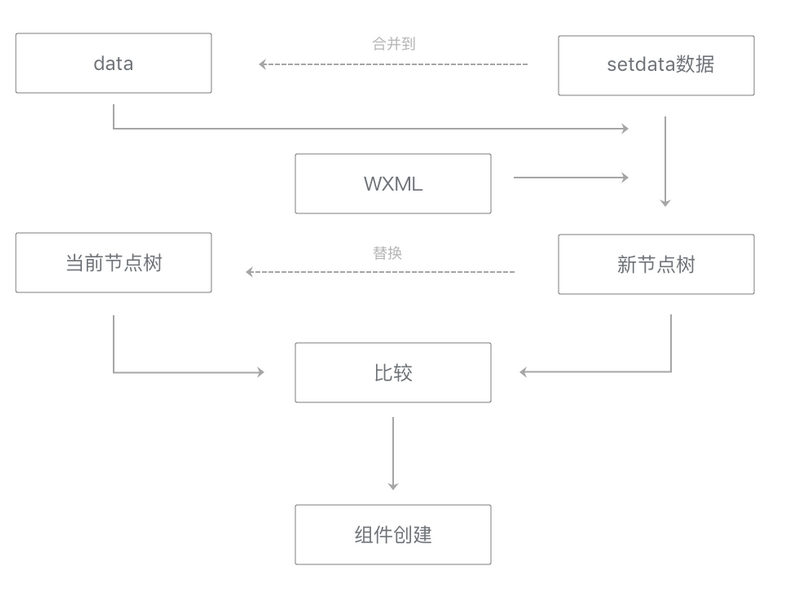

# 视图层渲染

视图层在接收到初始数据（data）和更新数据（setData数据）时，需要进行视图层渲染  

## 初始渲染

初始渲染发生在页面刚刚创建时  
  
在这整个流程中，时间开销大体上与节点树中节点的总量成正比例关系  
因而`减少WXML中节点的数量`可以有效降低初始渲染和重渲染的时间开销，提升渲染性能  

## 重渲染

初始渲染完毕后，视图层可以多次应用setData的数据，每次应用setData数据时，都会执行重渲染来更新界面  

* 初始渲染中得到的data和当前节点树会保留下来用于重渲染
* 每次重渲染时，将data和setData数据套用在WXML片段上，得到一个新节点树
* 将新节点树与当前节点树进行比较，这样可以得到哪些节点的哪些属性需要更新、哪些节点需要添加或移除
* 最后，将setData数据合并到data中，并用新节点树替换旧节点树

  
`去掉不必要设置的数据、减少setData的数据量`也有助于提升这一个步骤的性能  
