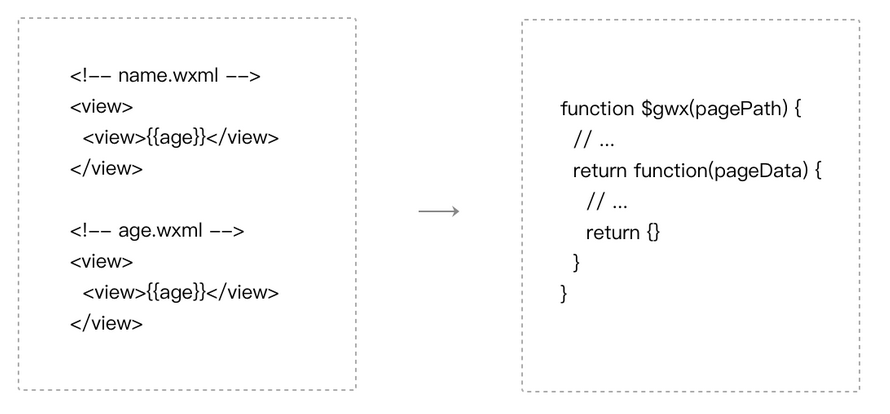
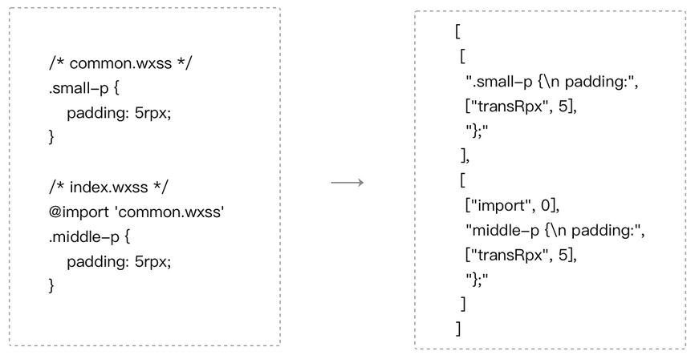
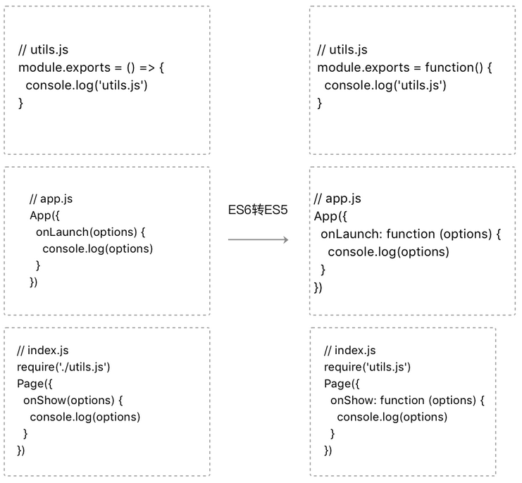
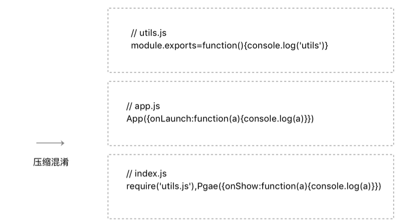
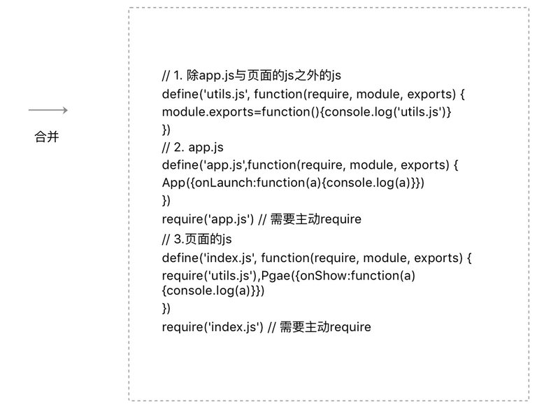

# 代码编译

微信开发者工具和微信客户端都无法直接运行小程序的源码，因此我们需要对小程序的源码进行编译  
代码编译过程包括本地预处理、本地编译和服务器编译  
微信开发者工具**模拟器运行的代码**只经过本地预处理、本地编译，**没有服务器编译过程**，而微**信客户端运行的代码是额外经过服务器编译的**  

## 编译WXML

小程序的渲染层的运行环境是一个WebView，而WebView无法直接理解WXML标签，所以需要经过编译  
微信开发者工具内置了一个二进制的WXML编译器  
这个编译器`接受WXML代码文件列表`，处理完成之后`输出JavaScript代码`，这段代码是`各个页面的结构生成函数`  

  

* 编译过程将所有的WXML代码最终变成一个JavaScript 函数，预先注入在WebView中  
* 在运行时确定了页面路径之后，将路径作为参数传递给这个函数得到该页面的结构生成函数  
* 页面结构生成函数接受页面数据，输出一段描述页面结构的JSON
* 最终通过小程序组件系统生成对应的HTML  

```js
//$gwx 是WXML编译后得到的函数
//根据页面路径获取页面结构生成函数
var generateFun = $gwx('name.wxml')
//页面结构生成函数接受页面数据，得到描述页面结构的JSON
var virtualTree = generateFun({
   name:  'miniprogram'
})
/** virtualTree == {
   tag: 'view'，
   children: [{
       tag: 'view',
       children: ['miniprogram']
     }]
 }**/
 //小程序组件系统在虚拟树对比后将结果渲染到页面上
 virtualDom.render(virtualTree)
```

上传代码时，微信开发者工具直接将本地的WXML代码文件提交到后台，由后台进行WXML编译，后台的WXML编译器和开发者工具本地内置的WXML编译器是同一套代码生成的  

## 编译WXSS

微信开发者工具内置了一个二进制的WXSS编译器  
这个编译器`接受WXSS文件列表`，分析文件之间的`引用关系`，同时`预处理rpx`，`输出一个样式信息数组`，每个WXSS文件对应于这个数组中的一项  

  

运行时，根据当前的屏幕宽度，计算出1rpx对应多少像素单位，然后将样式信息数组转换成最终的样式添加到页面中  
为了方便开发者，微信开发者工具提供了上传代码时样式自动补全的功能，利用PostCSS 对WXSS文件进行预处理，自动添加样式前缀  

## 编译JavaScript

微信客户端在运行小程序的逻辑层的时候`只需要加载一个JS文件`（我们称为app-service.js）  
在代码上传之前，微信开发者工具会对开发者的JS 文件做一些预处理，包括ES6转ES5和代码压缩  
在服务器编译过程将每个JS文件的内容分别包裹在define域中，再按一定的顺序合并成 app-service.js  

  
  
  
