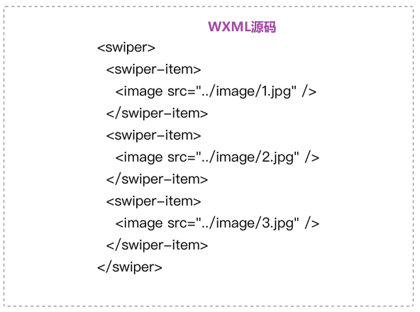
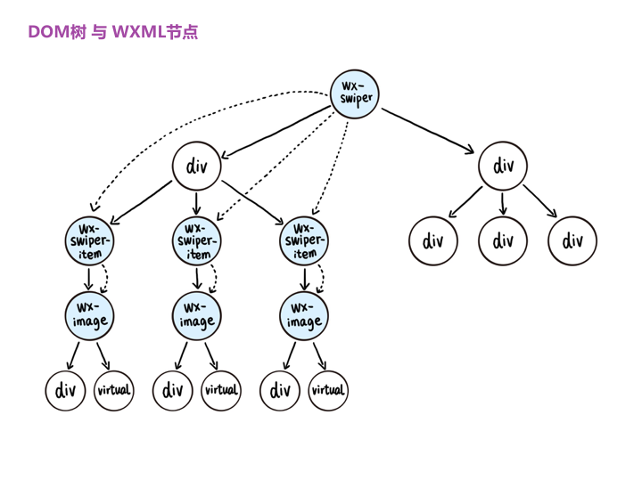
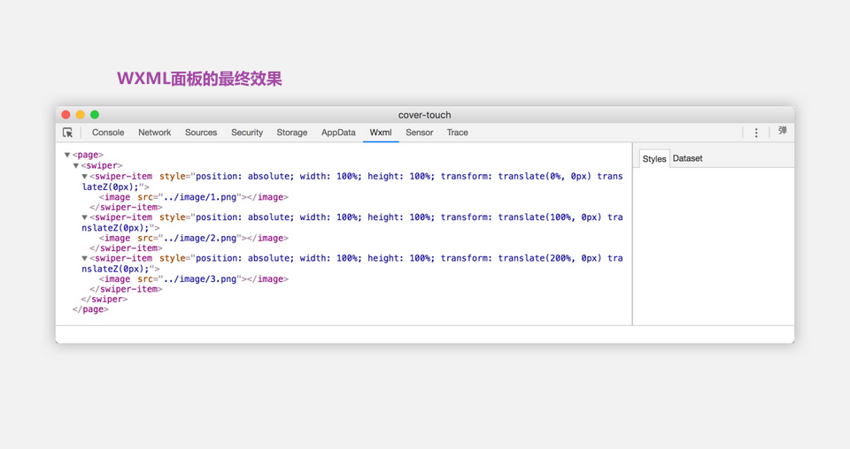

# 调试器

代码调试是开发者工具的最主要的功能之一，包括界面调试和逻辑调试  
提供打开`Chrome Devtools`调试界面的接口，开发者工具在Chrome Devtools的基础上进行扩展和定制  
  
开发者工具上显示的调试器是调试`逻辑层`WebView，主要使用Chrome Devtools的Sources面板调试逻辑层JS代码  
微信小程序IDE开发了Chrome Devtools插件WXML 面板，用于展示`渲染层`界面调试的用户交互界面  
  
开发者写的WXML源码与真实的DOM树之间存在较大的差异，需要经过一个最小树算法，将非小程序组件节点剔除后才能呈现出与WXML源码一致的效果  
  
  
  
