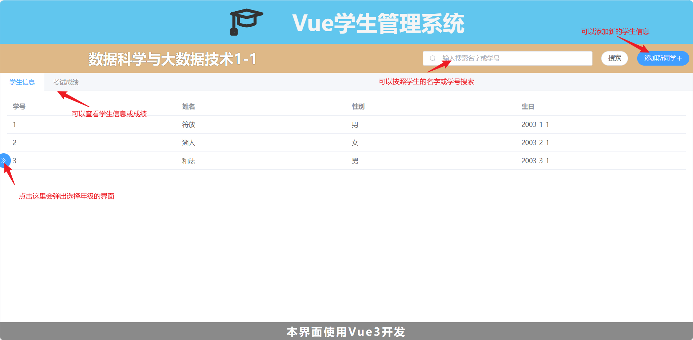
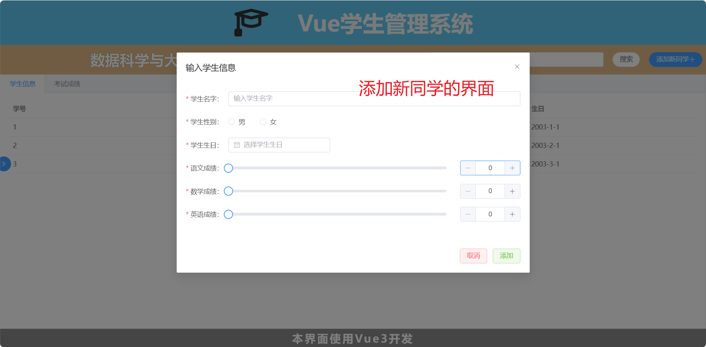
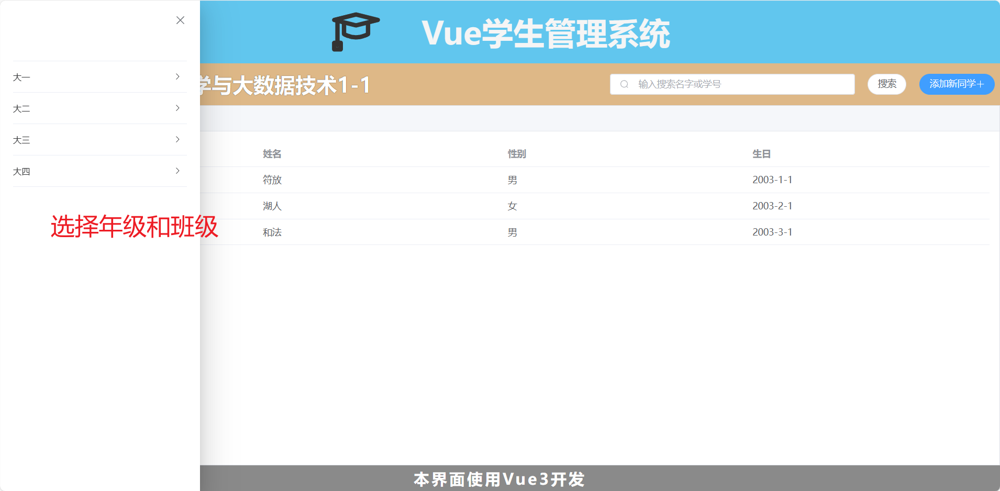
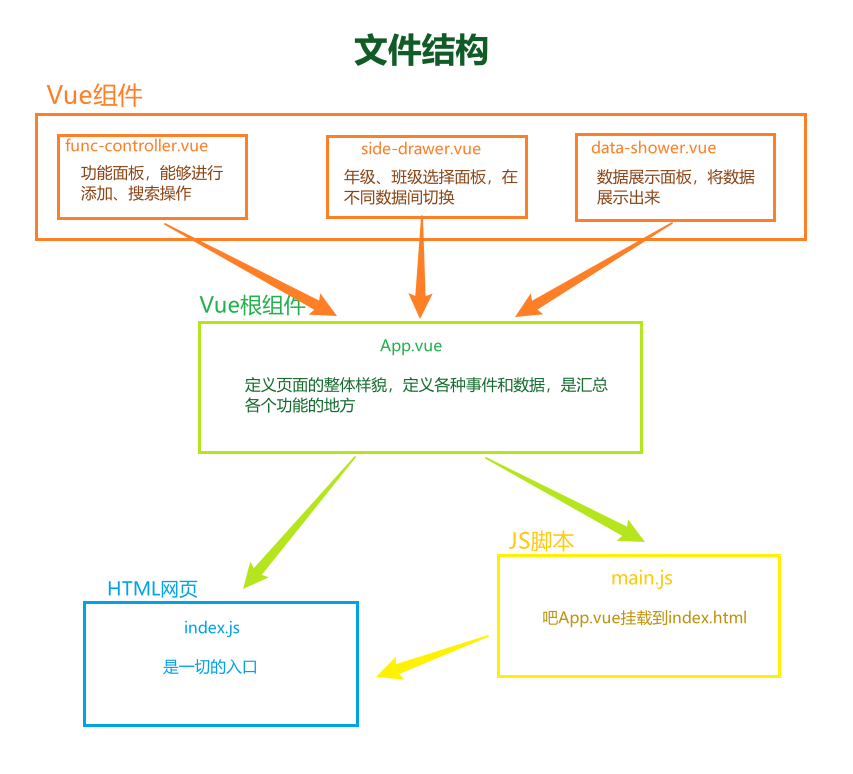
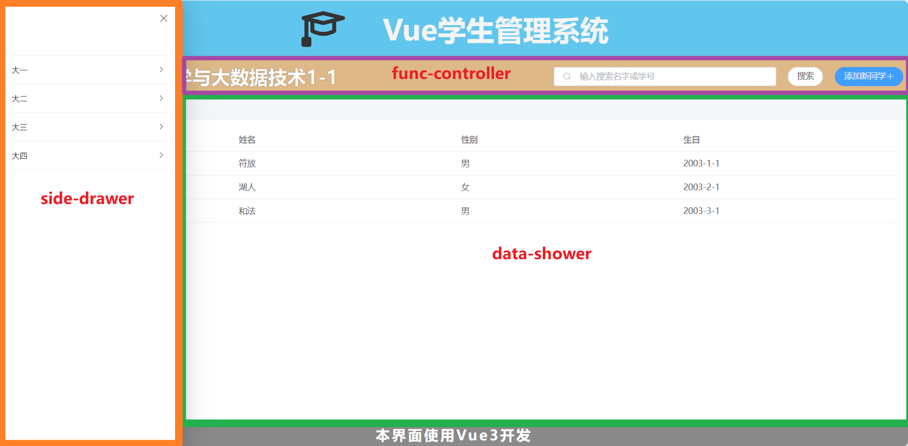
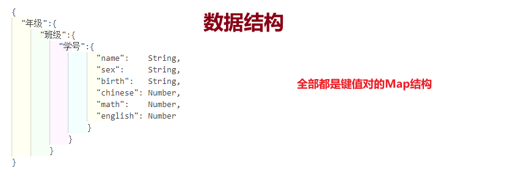

# Vue3 + Element Plus 学生管理系统

该项目核心逻辑简单，功能较少，是前端课程设计或者练手的合适项目  
我提供了整个Vue3项目文件，可以直接导入进行开发  
也提供了编译后的文件，可以直接使用  
  
我还将提供代码的**核心逻辑可视化**  
结合代码可以快速写出能够应付了事的**实验报告、课程设计书、讲解PPT**  

## 直接使用网站（不导入Vue项目）

* 下载文件夹`学生管理系统（直接可用）`
* 内部包含了`js`、`css`、`html`文件
* 打开里面的`index.html`就可以用了

## 导入Vue项目（以Vue3使用项目）

* 下载文件夹`【Vue3学生管理系统】（Vue3项目）`
* 解压`student-management-system.zip`
* 按照常规操作导入项目文件夹`student-management-system`即可

## 项目的运行界面和功能

## 项目的核心逻辑可视化

