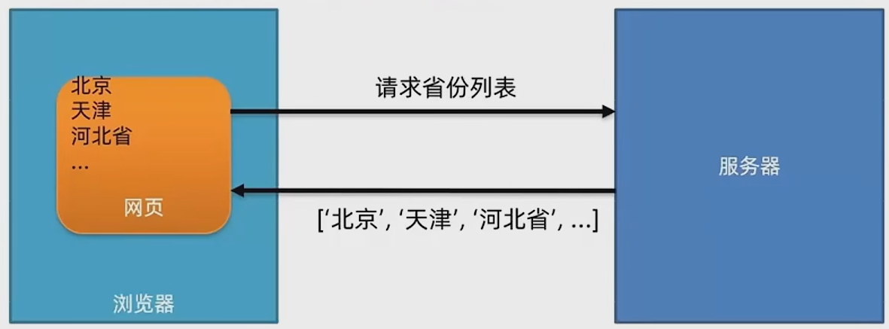
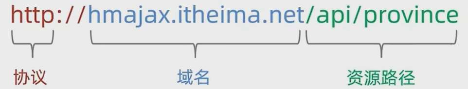
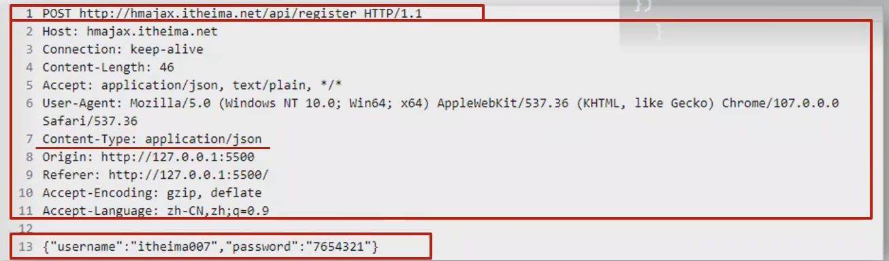
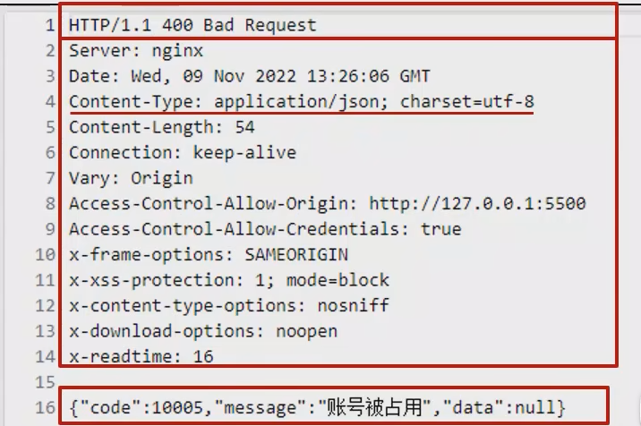
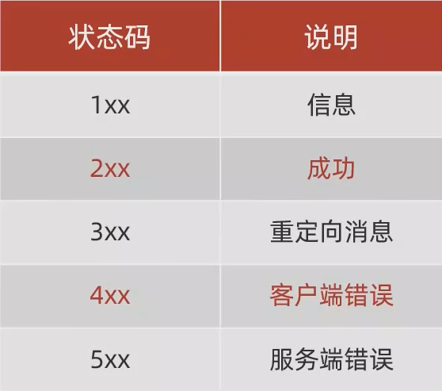

# Ajax基础

Ajax时浏览器和服务器进行数据通信的技术  

  

## axios库

1. 引入axios.js（在js中引入）
2. axios函数会被导入，给它添加配置，添加`.then(() => {})`回调函数
3. `params`属性是查询参数对象，`data`属性是提交数据参数

```html
<html>
    <head></head>
    <body>
        <p class="ms"></p>
        <script src="https://cdn.jsdelivr.net/npm/axios/dist/axios.min.js"></script>
        <script>
            axios({
                url: ''
            }).then((result) => {
                let message = result.data
                document.querySelector('.ms').innerText = message
            })
        </script>
    </body>
</html>
```

## axios错误处理

```js
axios.post()
    .then(() => {})
    .catch((error) => {
        alert(error.response.data.message)
    })
```

## URL

统一资源定位符，这些网址可以对应到任意资源（html资源，图片资源，数据资源这些）  

  

## HTTP请求报文

请求报文：浏览器按照HTTP要求的格式，发送给服务器的内容  

1. 请求行：请求方法、URL、协议
2. 请求头：以键值对格式组织的一系列信息
3. 请求体：发送的资源

  

## HTTP响应报文

响应报文：浏览器按照HTTP要求的格式，返回给浏览器的内容  

1. 响应行（状态行）：协议、状态码、状态信息
2. 响应头：以键值对格式组织的一系列信息
3. 空行：空行之后是服务器返回的资源
4. 响应体：返回的资源

  
  
  

## form-serialize插件

快速收集表单元素的值  

1. 引入`form-serialize.js`
2. 使用`serialize`函数，收集表单元素：`serialize(form, {hash: true, empty: true})`
   1. `form`是具体的表单元素的引用
   2. `hash`为`true`返回js对象，为`false`返回查询字符串
   3. `empty`设置是否获取空值

## 上传图片

1. html中存在`<input type="file">`
2. 获取图片文件`e.target.files[index]`
3. 用`FormData`携带图片文件
4. 发起请求，`post`并且`data: fd`（fd是一个FormData对象）
5. 获取图片保存在服务器上的URL地址
6. 展示图片

```html
<html>
    <body>
        <input type="file" class="upload">
        
    </body>
</html>
```

```js
document.querySelector('.upload').addEventListener('change', e => {
    const fd = new FormData()
    fd.append('img', e.target.files[0])
    axios({
        url: '',
        method: 'POST',
        data: fd
    }).then((result) => {
        const imgURL = result.data.data.url
        document.querySelector('.my-img').src = imgURL
    })
})
```
