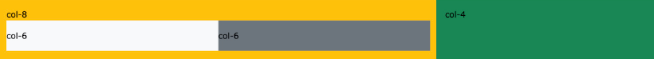
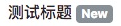
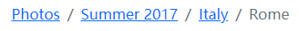

# 菜鸟教程bootstrap5

> Bootstrap 是全球最受欢迎的前端组件库，用于开发响应式布局、移动设备优先的 WEB 项目。
> Bootstrap5 目前是 Bootstrap 的最新版本，是一套用于 HTML、CSS 和 JS 开发的开源工具集。
> 它支持 Sass 变量和 mixins、响应式网格系统、大量的预建组件和强大的 JavaScript 插件，助你快速设计和自定义响应式、移动设备优先的站点。
>
> * **容易上手**：只要对 HTML 和 CSS 有基本了解的人都可以很快速的使用 Bootstrap
> * **响应式设计**：Bootstrap 可以根据不同平台（手机、平板电脑和台式机）进行调整
> * **移动优先**：在 Bootstrap 中，自适应移动端是框架的核心部分
> * **浏览器兼容性**：Bootstrap5 兼容所有主流浏览器（除IE）

## bootstrap5安装使用

### 使用CDN引入

```css
    <link rel="stylesheet" href="https://cdn.staticfile.org/twitter-bootstrap/5.1.1/css/bootstrap.min.css">
    <script src="https://cdn.staticfile.org/twitter-bootstrap/5.1.1/js/bootstrap.bundle.min.js"></script>
```

国内除了<https://www.staticfile.org/>还可以使用<https://cdnjs.com/>  

### 直接下载文件

去官网 <https://getbootstrap.com/> 下载 Bootstrap5 资源库  
还可以使用包管理工具来安装它们  

* `npm install bootstrap`
* `yarn add bootstrap`
* `gem install bootstrap -v 5.1.1`
* `composer require twbs/bootstrap:5.1.1`

### 新建一个简单的bootstrap5页面

使用H5的页面，并设置编码、viewport meta  

```html
    <!DOCTYPE html>
    <html>
        <head>
            <meta charset="utf-8">
            <meta name="viewport" content="width=device-width, initial-scale=1">
        </head>
    </html>
```

Bootstrap 5 需要一个容器元素来包裹网站的内容  

* `.container 类`用于固定宽度并支持响应式布局的容器
* `.container-fluid 类`用于 100% 宽度，占据全部视口（viewport）的容器

```html
    <div class="container">
        <h1>My First Bootstrap Page</h1>
        <p>Hello World!</p> 
    </div>
```

## bootstrap5容器

### 固定宽度

`.container`类用于创建固定宽度的响应式页面  
宽度 (max-width) 会根据屏幕宽度同比例放大或缩小  

| 屏幕大小区间 | 超级小屏幕<br><576px | 小屏幕<br>>=576px | 中等屏幕<br>>=768px | 大屏幕<br>>=992px | 特大屏幕<br>>=1200px | 超级大屏幕<br>>=1400px |
| :---: | :---: | :---: | :---: | :---: | :---: | :---: |
| `max-width` | 100% | 540px | 720px | 960px | 1140px | 1320px |

### 100%宽度

`.container-fluid` 类用于创建一个全屏幕尺寸的容器，容器始终跨越整个屏幕宽度  

### 容器内边距

**默认情况**下，容器都有填充左右内边距，**顶部和底部没有填充内边距**  
Bootstrap 提供了一些间距**类**用于填充边距，比如 `.pt-5` 就是用于填充顶部内边距  

```html
    <div class="container pt-5"></div>
```

### 容器边框和颜色

Bootstrap 也提供了一些边框和颜色**类**用于设置容器的样式  
如`.border`、`bg-primary`、`bg-dark`  

```html
    <div class="container p-5 my-5 border"></div>
    <div class="container p-5 my-5 bg-dark text-white"></div>
    <div class="container p-5 my-5 bg-primary text-white"></div>
```

### 响应式容器

可以使用 `.container-sm|md|lg|xl|xxl` 类来创建响应式容器  
容器的 max-width 属性值会根据屏幕的大小来改变  

| 使用的响应式容器类 | 超级小屏幕<br><576px | 小屏幕<br>>=576px | 中等屏幕<br>>=768px | 大屏幕<br>>=992px | 特大屏幕<br>>=1200px | 超级大屏幕<br>>=1400px |
| :---: | :---: | :---: | :---: | :---: | :---: | :---: |
| `container-sm` | 100% | 540px | 720px | 960px | 1140px | 1320px |
| `container-md` | 100% | 100% | 720px | 960px | 1140px | 1320px |
| `container-lg` | 100% | 100% | 100% | 960px | 1140px | 1320px |
| `container-xl` | 100% | 100% | 100% | 100% | 1140px | 1320px |
| `container-xxl` | 100% | 100% | 100% | 100% | 100% | 1320px |

```html
    <div class="container-sm">.container-sm</div>/*small*/
    <div class="container-md">.container-md</div>/*middle*/
    <div class="container-lg">.container-lg</div>/*large*/
    <div class="container-xl">.container-xl</div>/*extra large*/
    <div class="container-xxl">.container-xxl</div>/*extra extra large*/
```

## bootstrap5网格系统

Bootstrap 提供了一套响应式、移动设备优先的流式网格系统  
随着屏幕或视口（viewport）尺寸的增加，系统会自动分为最多 12 列  

### 网格类

* `.col-`：针对所有设备
* `.col-sm-`：平板 - 屏幕宽度等于或大于 576px
* `.col-md-`：桌面显示器 - 屏幕宽度等于或大于 768px
* `.col-lg-`：大桌面显示器 - 屏幕宽度等于或大于 992px
* `.col-xl-`：特大桌面显示器 - 屏幕宽度等于或大于 1200px
* `.col-xxl-`：超大桌面显示器 - 屏幕宽度等于或大于 1400px

### 网格系统规则

* 网格每一行需要放在设置了 `.container` 或 `.container-fluid`  类的容器中，这样就可以自动设置一些外边距与内边距
* 使用行来创建水平的列组
* 内容需要放置在列中，并且只有列可以是行的直接子节点
* 预定义的类如 `.row` 和 `.col-sm-4` 可用于快速制作网格布局
* 列通过填充创建列内容之间的间隙，这个间隙是通过 `.rows` 类上的负边距设置第一行和最后一列的偏移
* 网格列是**通过跨越指定的12个列来创建**，例如设置三个相等的列，则用三个`.col-sm-4`
* Bootstrap 5 和  4 使用 flexbox（弹性盒子） 而不是浮动

### 网格的基本结构

```html
<!-- 第一个例子：控制列的宽度及在不同的设备上如何显示 -->
    <div class="row">
        <div class="col-*-*"></div>
    </div>
    <div class="row">
        <div class="col-*-*"></div>
        <div class="col-*-*"></div>
        <div class="col-*-*"></div>
    </div>
    <!-- 第二个例子：或让 Bootstrap 者自动处理布局 -->
    <div class="row">
        <div class="col"></div>
        <div class="col"></div>
        <div class="col"></div>
    </div>
```

第一个例子：创建一行(`<div class="row">`)，然后添加需要的列( .col-*-* 类中设置)  
第一个星号 (*) 表示响应的设备: sm, md, lg 或 xl, 第二个星号 (*) 表示一个数字, 同一行的数字相加为 12  

第二个例子: 不在每个 col 上添加数字，让 bootstrap 自动处理布局，同一行的每个列宽度相等(这种情况下是根据剩余可用空间分配的)  

### 网格设置特性

自动等宽

```html
    /*下面例子中3列自动等宽*/
    <div class="row">
        <div class="col">.col</div>
        <div class="col">.col</div>
        <div class="col">.col</div>
    </div>
```

响应式宽度手动设计

```html
    /*4列由手动设置响应式等宽*/
    /*在移动设备上，即屏幕宽度小于 576px 时，四个列将会上下堆叠排版*/
    <div class="col-sm-3">.col-sm-3</div>
    <div class="col-sm-3">.col-sm-3</div>
    <div class="col-sm-3">.col-sm-3</div>
    <div class="col-sm-3">.col-sm-3</div>
```

不等宽的手动设计

```html
    /*创建不等宽度的响应式列*/
    /*在移动设备上，即屏幕宽度小于 576px 时，两个列将会上下堆叠排版*/
    <div class="row">
        <div class="col-sm-4">.col-sm-4</div>
        <div class="col-sm-8">.col-sm-8</div>
    </div>
```

自动分配宽度的运行

```html
    /*只设置一列的宽度，其他列会自动均分剩下的宽度*/
    <div class="row">
        <div class="col">col</div>/*25%*/
        <div class="col-6">col-6</div>/*50%*/
        <div class="col">col</div>/*25%*/
    </div>
```

不同屏幕宽度的行为

```html
    /*不同宽度下的列样式*/
    /*在桌面设备的显示器上两个列的宽度各占 50%
    如果在平板端则左边的宽度为 25%，右边的宽度为 75%
    在移动手机等小型设备上会堆叠显示*/
    <div class="container-fluid">
        <div class="row">
            <div class="col-sm-3 col-md-6">
                <p>第一列</p>
            </div>
            <div class="col-sm-9 col-md-6">
                <p>第二列</p>
            </div>
        </div>
    </div>
```

让列嵌套

```html
    <div class="row">
        <div class="col-8">
            .col-8
            <div class="row">
                <div class="col-6">.col-6</div>
                <div class="col-6">.col-6</div>
            </div>
        </div>
        <div class="col-4">.col-4</div>
    </div>
```



让列偏移

偏移列通过`offset-*-*`类来设置，第一个星号是设备，第二个星号是1~11的数字  
这些类会把一个列的左外边距增加 * 列  

```html
    <div class="row">
        <div class="col-md-4">.col-md-4</div>
        /*下面的列左外边距是4列*/
        <div class="col-md-4 offset-md-4">.col-md-4 .offset-md-4</div>
    </div>
```

## bootstrap5文字排版

### bootstrap5默认设置

Bootstrap 5 默认的 `font-size: 16px`、`line-height: 1.5`  
默认的 `font-family: "Helvetica Neue", Helvetica, Arial, sans-serif`  
此外，所有的 `<p>` 元素 `margin-top: 0`、`margin-bottom: 1rem`  

### 标题样式

`<h1>到<h6>`的所有HTML标题样式都被bootstrap定义了  
它们的使用方法可以和HTML一样，也可以使用`.h1`或`.display-1`这样的类  

```html
    <h1>标题1</h1>
    <p class="h2">标题2</p>
    <p class="display-3">标题3</p>
```

### 其它排版类

| 类名 | 描述 |
| :---: | :---: |
| `.lead` | 让段落更突出 |
| `.small` | 指定更小文本 (为父元素的 85% ) |
| `.text-start` | 左对齐 |
| `.text-center` | 居中 |
| `.text-end` | 右对齐 |
| `.text-justify` | 设定文本对齐,段落中超出屏幕部分文字自动换行 |
| `.text-nowrap` | 段落中超出屏幕部分不换行 |
| `.text-lowercase` | 设定文本小写 |
| `.text-uppercase` | 设定文本大写 |
| `.text-capitalize` | 设定单词首字母大写 |
| `.initialism` | 显示在 `<abbr>` 元素中的文本以小号字体展示，且可以将小写字母转换为大写字母 |
| `.list-unstyled` | 移除默认的列表样式，列表项中左对齐，这个类仅适用于直接子列表项 |
| `.list-inline` | 将所有列表项放置同一行 |

## bootstrap5颜色

bootstrap5提供了一些有意义的颜色类  

下面是一些文本的颜色  

```html
    <p class="text-muted">柔和的文本。</p>
    <p class="text-primary">重要的文本。</p>
    <p class="text-success">执行成功的文本。</p>
    <p class="text-info">代表一些提示信息的文本。</p>
    <p class="text-warning">警告文本。</p>
    <p class="text-danger">危险操作文本。</p>
    <p class="text-secondary">副标题。</p>
    <p class="text-dark">深灰色文字。</p>
    <p class="text-body">默认颜色，为黑色。</p>
    <p class="text-light">浅灰色文本（白色背景上看不清楚）。</p>
    <p class="text-white">白色文本（白色背景上看不清楚）。</p>
    /*使用下面的两个类改变文本的透明度*/
    <p class="text-black-50">透明度为 50% 的黑色文本，背景为白色。</p>
    <p class="text-white-50 bg-dark">透明度为 50% 的白色文本，背景为黑色。</p>
```

下面则是一些背景颜色  

```html
    <p class="bg-primary text-white">重要的背景颜色。</p>
    <p class="bg-success text-white">执行成功背景颜色。</p>
    <p class="bg-info text-white">信息提示背景颜色。</p>
    <p class="bg-warning text-white">警告背景颜色</p>
    <p class="bg-danger text-white">危险背景颜色。</p>
    <p class="bg-secondary text-white">副标题背景颜色。</p>
    <p class="bg-dark text-white">黑色背景颜色。</p>
    <p class="bg-light text-dark">浅灰背景颜色。</p>
```

## bootstrap5表格

### 表格样式

基础表格：使用`.table`来设置基础表格样式，这个样式是有横线没竖线的  

```html
    <table class="table">
        ...
    </table>
```

条纹表格：通过添加`.table-striped`可以把表格变成条纹表格，相邻两行颜色不同  

```html
    <table class="table table-striped">
        ...
    </table>
```

带边框表格：使用`.table-bordered`为表格添加边框  

```html
    <table class="table table-bordered">
        ...
    </table>
```

无边框表格：使用`.table-borderless`将表格所有边框移除  

```html
    <table class="table table-borderless">
        ...
    </table>
```

较小的表格：通过`.table-sm`来减少内边距进而设置较小的表格  

```html
    <table class="table table-sm">
        ...
    </table>
```

鼠标悬停状态表格：`.table-hover`可以为表格的每一行添加鼠标悬停效果  

```html
    <table class="table table-hover">
        ...
    </table>
```

### 表格颜色

通过指定意义的颜色类可以为整个表格、行、单元格设置背景颜色  

| 类名 | 描述 |
| :---: | :---: |
| `.table-primary` | 蓝色: 指定这是一个重要的操作 |
| `.table-success` | 绿色: 指定这是一个允许执行的操作 |
| `.table-danger` | 红色: 指定这是可以危险的操作 |
| `.table-info` | 浅蓝色: 表示内容已变更 |
| `.table-warning` | 橘色: 表示需要注意的操作 |
| `.table-active` | 灰色: 用于鼠标悬停效果 |
| `.table-secondary` | 灰色: 表示内容不怎么重要 |
| `.table-light` | 浅灰色，可以是表格行的背景 |
| `.table-dark` | 深灰色，可以是表格行的背景 |

### 响应式表格

`.table-responsive`类用于创建响应式表格：屏幕宽度小于 992px 时创建水平滚动条，大于 992px 则没有滚动条  

```html
    <div class="table-responsive">
        <table class="table">
            ...
        </table>
    </div>
```

| 类名 | 屏幕宽度 |
| :---: | :---: |
| `.table-responsive-sm` | < 576px |
| `.table-responsive-md` | < 768px |
| `.table-responsive-lg` | < 992px |
| `.table-responsive-xl` | < 1200px |
| `.table-responsive-xxl` | < 1400px |

## bootstrap5图片

### 图片样式

圆角图片：`.rounded`可以让图片显示圆角效果  

```html
    
```

椭圆图片：`.rounded-circle`设置图片为椭圆形  

```html
    
```

缩略图：`img-thumbnail`设置图片为缩略图样式（有白边，圆角）  

```html
    
```

### 图片对齐方式

`.float-start`将图片左对齐，`.float-end`将图片右对齐  

```html
    
    
```

`.mx-auto`(margin:auto)和`d-block`(display:block)将图片居中  

```html
    
```

### 响应式图片

添加 `.img-fluid` 类来设置响应式图片  
`.img-fluid`类设置了`max-width: 100%`、`height: auto`  

```html
    
```

## bootstrap5信息提示框

### 创建提示框

在`<div>`加上`.alert`和具体提示类即可创建一个提示框  

```html
    <div class="alert alert-success">绿色</div>
    <div class="alert alert-info">青色</div>
    <div class="alert alert-warning">橘黄色</div>
    <div class="alert alert-danger">红色</div>
    <div class="alert alert-primary">蓝色</div>
    <div class="alert alert-secondary">浅灰色</div>
    <div class="alert alert-light">浅灰色</div>
    <div class="alert alert-dark">深灰色</div>
```

### 提示框添加链接

给提示框内的链接添加`alert-link`即可让链接匹配提示框颜色  

```html
    <div class="alert alert-success"><a href="#" class="alert-link"></a></div>
```

### 关闭提示框

我们可以在提示框中的`div`中添加`.alert-dismissible`类，然后在关闭按钮的链接上添加 `class="btn-close" data-bs-dismiss="alert"`来设置提示框的关闭操作  

```html
    <div class="alert alert-success alert-dismissible">
        <button type="button" class="btn-close" data-bs-dismiss="alert"></button>
        <strong>成功!</strong> 指定操作成功提示信息。
    </div>
```

给提示框`<div>`添加`.fade`和`.show`用于设置提示框在关闭时的淡出和淡入效果  

```html
    <div class="alert alert-danger alert-dismissible fade show">
```

## bootstrap5按钮

### 按钮的类型

```html
    <button type="button" class="btn">基本按钮</button>
    <button type="button" class="btn btn-primary">主要按钮</button>
    <button type="button" class="btn btn-secondary">次要按钮</button>
    <button type="button" class="btn btn-success">成功</button>
    <button type="button" class="btn btn-info">信息</button>
    <button type="button" class="btn btn-warning">警告</button>
    <button type="button" class="btn btn-danger">危险</button>
    <button type="button" class="btn btn-dark">黑色</button>
    <button type="button" class="btn btn-light">浅色</button>
    <button type="button" class="btn btn-link">链接</button>
```

这些按钮类可以使用在`<a>`、`<button>`、`<input>`元素上面  

```html
    <a href="#" class="btn btn-info" role="button">链接按钮</a>
    <button type="button" class="btn btn-info">按钮</button>
    <input type="button" class="btn btn-info" value="输入框按钮">
    <input type="submit" class="btn btn-info" value="提交按钮">
    <input type="reset" class="btn btn-info" value="重置按钮">
```

### 按钮的边框及悬浮动画

下面的类会给按钮一个边框，鼠标悬浮上面时按钮会出现颜色，点击时边框会发生变化  

```html
    <button type="button" class="btn btn-outline-primary">主要按钮</button>
    <button type="button" class="btn btn-outline-secondary">次要按钮</button>
    <button type="button" class="btn btn-outline-success">成功</button>
    <button type="button" class="btn btn-outline-info">信息</button>
    <button type="button" class="btn btn-outline-warning">警告</button>
    <button type="button" class="btn btn-outline-danger">危险</button>
    <button type="button" class="btn btn-outline-dark">黑色</button>
    <button type="button" class="btn btn-outline-light text-dark">浅色</button>
```

### 不同大小的按钮

```html
    <button type="button" class="btn btn-primary btn-lg">大号按钮</button>
    <button type="button" class="btn btn-primary">默认按钮</button>
    <button type="button" class="btn btn-primary btn-sm">小号按钮</button>
```

### 块级按钮

通过在父类中添加`.d-grid`，按钮中添加`.btn-block`可以设置块级按钮  
如果要多个块级按钮，可以在父级中添加`.gap-*`  

```html
    <div class="d-grid gap-3">
        <button type="button" class="btn btn-primary btn-block">100% 宽度的按钮</button>
        <button type="button" class="btn btn-primary btn-block">100% 宽度的按钮</button>
        <button type="button" class="btn btn-primary btn-block">100% 宽度的按钮</button>
    </div>
```

### 激活和禁用按钮

`.active`类可以设置按钮是可用的，`.disabled`类可以设置按钮是不可点击的  

### 加载按钮

可以设置一个正在加载的按钮  

```html
    /*转圈圈的白条*/
    <button class="btn btn-primary">
        <span class="spinner-border spinner-border-sm"></span>
    </button>
    /*闪动的白点*/
    <button class="btn btn-primary">
        <span class="spinner-grow spinner-grow-sm"></span>
    </button>
```

## bootstrap5按钮组

### 按钮组定义

Bootstrap 5 中允许我们将按钮放在同一行上  
在`<div>`元素上添加`.btn-group`类来创建按钮组  
还可以使用`.btn-group-lg|sm|xs`类来设置按钮组的大小  

```html
    <div class="btn-group btn-group-lg">
        <button type="button" class="btn btn-primary">Apple</button>
        <button type="button" class="btn btn-primary">Samsung</button>
        <button type="button" class="btn btn-primary">Sony</button>
    </div>
```

此外，还可以使用`.btn-group-vertical`类来创建垂直的按钮组  

### 内嵌按钮组及下拉菜单

可以在按钮组内设置下拉菜单  

```html
    <div class="btn-group">
        <button type="button" class="btn btn-primary">Apple</button>
        <button type="button" class="btn btn-primary">Samsung</button>
        <div class="btn-group">
            <button type="button" class="btn btn-primary dropdown-toggle" data-bs-toggle="dropdown">
            Sony
            </button>
            <div class="dropdown-menu">
                <a class="dropdown-item" href="#">Tablet</a>
                <a class="dropdown-item" href="#">Smartphone</a>
            </div>
        </div>
    </div>
```

## bootstrap5徽章

徽章（Badges）主要用于突出显示新的或未读的项  
如需使用徽章，只需要将`.badge`类加上带有指定意义的颜色类(如`.bg-secondary`)添加到`<span>`元素上即可  
徽章可以根据父元素的大小的变化而变化  

```html
    <span class="badge bg-primary">主要</span>
    <span class="badge bg-secondary">次要</span>
    <span class="badge bg-success">成功</span>
    <span class="badge bg-danger">危险</span>
    <span class="badge bg-warning">警告</span>
    <span class="badge bg-info">信息</span>
    <span class="badge bg-light">浅色</span>
    <span class="badge bg-dark">深色</span>
```

还可以给span添加`.rounded-pill`来将徽章设置成胶囊状  

## bootstrap5进度条

### 进度条的基本设置

创建一个基本的进度条的步骤如下：

* 添加一个带有`.progress`类的`<div>`
* 在上面的`<div>`内添加一个带有`.progress-bar`的空 `<div>`
* 添加一个带有百分比表示的宽度的`style`属性，例如`style="width:70%"`表示进度条在70%的位置

```html
    <div class="progress" style="height: 20px;">
        <div class="progress-bar" style="width:70%">给进度条添加标签</div>
    </div>
```

进度条高度默认为 16px。我们可以使用 CSS 的 `height` 属性来修改它  
还可以在`<div>`内写字，以直接给进度条添加标签  

### 进度条的颜色条纹

给空`<div>`添加背景颜色类，可以改变进度条颜色  
如果添加了`.progress-bar-striped`则会给进度条一个条纹  
在此基础上再添加`.progress-bar-animated`可以给条纹一个动画  

```html
<div class="progress">
  <div class="progress-bar bg-info progress-bar-striped progress-bar-animated" style="width:40%"></div>
</div>
```

### 混合进度条

在`.progress`的`<div>`内添加多个`<div>`则会有多个进度条相连  

```html
    <div class="progress">
        <div class="progress-bar bg-success" style="width:40%">
            Free Space
        </div>
        <div class="progress-bar bg-warning" style="width:10%">
            Warning
        </div>
        <div class="progress-bar bg-danger" style="width:20%">
            Danger
        </div>
    </div>
```

  

## bootstrap5加载效果

### 加载效果创建

要创建加载中效果可以使用`.spinner-border`类  
并且可以使用文本颜色类来设置不同的颜色  
如果要创建闪烁的加载效果可以用`.spinner-grow`类  

```html
    <div class="spinner-border text-muted"></div>
    <div class="spinner-grow text-primary"></div>
    <div class="spinner-border text-success"></div>
    <div class="spinner-grow text-info"></div>
```

### 设置加载效果大小

使用`.spinner-border-sm`或`.spinner-grow-sm`来创建更小的加载效果  

```html
    <div class="spinner-border spinner-border-sm"></div>
    <div class="spinner-grow spinner-grow-sm"></div>
```

## bootstrap5分页

网页开发过程，如果碰到内容过多，一般都会做分页处理  
例如评论区的分页，一页十个评论  

### 分页的创建

要创建一个基本的分页可以在 `<ul>` 元素上添加 `.pagination` 类  
然后在 `<li>` 元素上添加 `.page-item` 类  
`<li>` 元素的 `<a>` 标签上添加 `.page-link` 类  
可以在`<li>`标签应用`.active`高亮当前页面，应用`.disabled`禁用分页链接  

```html
    <ul class="pagination">
        <li class="page-item disabled"><a class="page-link" href="#">Previous</a></li>
        <li class="page-item active"><a class="page-link" href="#">1</a></li>
        <li class="page-item"><a class="page-link" href="#">2</a></li>
        <li class="page-item"><a class="page-link" href="#">3</a></li>
        <li class="page-item"><a class="page-link" href="#">Next</a></li>
    </ul>
```

### 分页的样式

使用`.pagination-lg`设置大的分页条目，`.pagination-sm`设置小的  
默认是左对齐，可以使用`.justify-content-center`设置居中，`.justify-content-end`设置右对齐  

```html
    <ul class="pagination pagination-lg justify-content-center">
        <li class="page-item">...</li>
    </ul>
```

### 面包屑导航

`.breadcrumb` 和 `.breadcrumb-item` 类用于设置面包屑导航  

```html
    <ul class="breadcrumb">
        <li class="breadcrumb-item"><a href="#">Photos</a></li>
        <li class="breadcrumb-item"><a href="#">Summer 2017</a></li>
        <li class="breadcrumb-item"><a href="#">Italy</a></li>
        <li class="breadcrumb-item active">Rome</li>
    </ul>
```

实现效果：  

## bootstrap5列表组

### 创建列表组

要创建列表组，可以在`<ul>`元素上添加`.list-group`类  
在`<li>`元素上添加`.list-group-item`类  
使用`.active`设置激活状态，`.disable`设置禁用状态  

```html
    <ul class="list-group">
        <li class="list-group-item active">第一项</li>
        <li class="list-group-item">第二项</li>
        <li class="list-group-item disabled">第三项</li>
    </ul>
```

### 列表组样式

想让鼠标悬停时显示灰色背景就添加`.list-group-item-action`到项之中  
移除列表边框可以添加`.list-group-flush`到列表  
想让列表变为水平则添加`.list-group-horizontal`到列表  

```html
    <ul class="list-group list-group-horizontal list-group-flush">
        <li class="list-group-item .list-group-item-action">第一项</li>
        <li class="list-group-item .list-group-item-action">第二项</li>
    </ul>
```

此外还可以给列表项指定多种颜色  

```html
    <li class="list-group-item list-group-item-success">成功列表项</li>
    <li class="list-group-item list-group-item-secondary">次要列表项</li>
    <li class="list-group-item list-group-item-info">信息列表项</li>
    <li class="list-group-item list-group-item-warning">警告列表项</li>
    <li class="list-group-item list-group-item-danger">危险列表项</li>
    <li class="list-group-item list-group-item-primary">主要列表项</li>
    <li class="list-group-item list-group-item-dark">深灰色列表项</li>
    <li class="list-group-item list-group-item-light">浅色列表项</li>
```

## bootstrap5卡片

### 创建一个卡片

使用`.card`和`.card-body`来创建一个简单的卡片  
卡片内可以包括头部`.card-header`、内容`.card-body`、底部`.card-footer`  

```html
    <div class="card">
        <div class="card-header">头部</div>
        <div class="card-body">内容</div> 
        <div class="card-footer">底部</div>
    </div>
```

### 卡片的样式与内容

可以使用`背景颜色类`来给卡片定义颜色  
可以在头部元素上使用`.card-title`类来设置卡片的标题  
.card-text 类用于设置卡`.card-body`类中的文本  
`.card-link`类用于给链接设置颜色  

```html
    <div class="card">
        <div class="card-body">
            <h4 class="card-title">Card title</h4>
            <p class="card-text">Some example text. Some example text.</p>
            <a href="#" class="card-link">Card link</a>
            <a href="#" class="card-link">Another link</a>
        </div>
    </div>
```

### 图片卡片

给``添加`.card-img-top`（图片在文字上方）或`.card-img-bottom`（图片在文字下方来设置图片卡片  

```html
    <div class="card">
        
        <div class="card-body">
            <h4 class="card-title">Card title</h4>
            <p class="card-text">Some example text. Some example text.</p>
            <a href="#" class="card-link">Card link</a>
            <a href="#" class="card-link">Another link</a>
        </div>
    </div>
```

如果图片要设置为背景，可以使用`.card-img-overlay`类  

```html
    <div class="card">
        
        <div class="card-img-overlay">
            <h4 class="card-title">Card title</h4>
            <p class="card-text">Some example text. Some example text.</p>
            <a href="#" class="card-link">Card link</a>
            <a href="#" class="card-link">Another link</a>
        </div>
    </div>
```

## bootstrap5下拉菜单

### 下拉菜单创建

`.dropdown`类用来指定一个下拉菜单  
我们可以使用一个按钮或链接来打开下拉菜单  
按钮或链接需要添加`.dropdown-toggle`和`data-bs-toggle="dropdown"`
`<div>`元素上添加`.dropdown-menu`类来设置实际下拉菜单，然后在下拉菜单的选项中添加`.dropdown-item`类  

```html
    <div class="dropdown">
        <button type="button" class="btn btn-primary dropdown-toggle" data-bs-toggle="dropdown">
            下拉菜单按钮
        </button>
        <div class="dropdown-menu">
            <a class="dropdown-item" href="#">链接 1</a>
            <a class="dropdown-item" href="#">链接 2</a>
            <a class="dropdown-item" href="#">链接 3</a>
        </div>
    </div>
```

### 下拉菜单的样式

`.dropdown-divider`类用于在下拉菜单中创建一个水平的分割线  
`.dropdown-header`类用于在下拉菜单中添加标题  
同样可以使用`.active`和`.disable`表示激活和禁用  

```html
    <li><a class="dropdown-item" href="#">常规项</a></li>
    <li><h5 class="dropdown-header">标题</h5><a class="dropdown-item active" href="#">激活项</a></li>
    <li><hr class="dropdown-divider"></hr></li>
    <li><a class="dropdown-item disabled" href="#">禁用项</a></li>
```

设置整个下列菜单的对齐方法  
`.dropend`是右对齐，`.dropstart`是左对齐  

```html
    <div class="dropdown dropend">
    ...
    </div>
    <div class="dropdown dropstart">
    ...
    </div>
```

### 下拉菜单的弹出方向

下拉菜单的默认弹出方向是向下，但也可以手动设置弹出方向  

添加`dropstart`到`<div>`以设置向左弹出的下拉菜单  

```html
    <div class="dropdown dropstart">
    ...
    </div>
```

添加`.dropdown-menu-end`到`<div>`以设置向右弹出的下拉菜单  

```html
    <div class="dropdown dropdown-menu-end">
    ...
    </div>
```

添加`dropup`到`<div>`以设置向上弹出的上拉菜单  

```html
    <div class="dropdown dropup">
    ...
    </div>
```

## bootstrap5折叠

`.collapse`类用于指定一个被折叠的元素，例如`<div>`  
控制内容的隐藏与显示，需要在`<a>`或`<button>`元素上添加`data-bs-toggle="collapse"`属性，而`data-target="#id"`属性是指向被折叠的内容  

```html
    <button data-bs-toggle="collapse" data-bs-target="#demo">折叠</button>

    <div id="demo" class="collapse">
    这里面的内容会被折叠
    </div>
```

默认情况下，被折叠的内容是隐藏的，添加`.show`可以让他默认显示  

```html
    <div id="demo" class="collapse show">
    这里是一些测试的内容。。。
    </div>
```

## bootstrap导航

### 创建一个导航

如果你想创建一个简单的水平导航栏，可以在`<ul>`元素上添加`.nav`类，在每个`<li>`选项上添加`.nav-item`类，在每个链接上添加`.nav-link`类  

```html
    <ul class="nav">
        <li class="nav-item">
            <a class="nav-link" href="#">Link</a>
        </li>
        <li class="nav-item">
            <a class="nav-link" href="#">Link</a>
        </li>
        <li class="nav-item">
            <a class="nav-link" href="#">Link</a>
        </li>
        <li class="nav-item">
            <a class="nav-link disabled" href="#">Disabled</a>
        </li>
    </ul>
```

添加`.justify-content-center`或`.justify-content-end`给`<ul>`能够使它居中显示或右对齐  
添加`.flex-column`可以创建一个垂直导航  

```html
<ul class="nav justify-content-center">
    <li class="nav-item">...</li>
</ul>
<ul class="nav justify-content-end">
    <li class="nav-item">...</li>
</ul>
<ul class="nav flex-column">
    <li class="nav-item">...</li>
</ul>
```

### 导航样式

选项卡样式：使用`.nav-tabs`类可以将导航转化为选项卡  

```html
    <ul class="nav nav-tabs">
        <li class="nav-item">
            <a class="nav-link active" href="#">Active</a>
        </li>
        <li class="nav-item">
            <a class="nav-link disabled" href="#">Disabled</a>
        </li>
    </ul>
```

胶囊导航样式：`.nav-pills`类可以将导航项设置成胶囊形状  

```html
    <ul class="nav nav-pills">
        <li class="nav-item">
            <a class="nav-link active" href="#">Active</a>
        </li>
        <li class="nav-item">
            <a class="nav-link disabled" href="#">Disabled</a>
        </li>
    </ul>
```

导航等宽：`.nav-justified`类可以设置导航项齐行等宽显示  

```html
    <ul class="nav nav-pills nav-justified">..</ul>
    <ul class="nav nav-tabs nav-justified">..</ul>
```

下拉菜单：和定义下拉菜单一样，可以给导航项也定义一个下拉菜单  

```html
    <li class="nav-item dropdown">
        <a class="nav-link dropdown-toggle" data-bs-toggle="dropdown" href="#">Dropdown</a>
        <div class="dropdown-menu">
            <a class="dropdown-item" href="#">Link 1</a>
            <a class="dropdown-item" href="#">Link 2</a>
            <a class="dropdown-item" href="#">Link 3</a>
        </div>
    </li>
```

### 动态导航选项卡

如果要设置选项卡是动态可切换的，可以在每个链接上添加`data-bs-toggle="tab"`属性  
如果要设置成胶囊选项卡，那么应该使用`data-bs-toggle="pill"`  
然后在每个选项**对应的内容**的上添加`.tab-pane`类  
对应选项卡的内容的`<div>`标签使用`.tab-content`类  
如果你希望有淡入效果可以在`.tab-pane`后添加`.fade`类  

```html
    <!-- Nav tabs -->
    <!--每个a标签都有两个新属性，有一个指向内容的-->
    <ul class="nav nav-tabs">
        <li class="nav-item">
            <a class="nav-link active" data-bs-toggle="tab" href="#home">Home</a>
        </li>
        <li class="nav-item">
            <a class="nav-link" data-bs-toggle="tab" href="#menu1">Menu 1</a>
        </li>
        <li class="nav-item">
            <a class="nav-link" data-bs-toggle="tab" href="#menu2">Menu 2</a>
        </li>
    </ul>

    <!-- Tab panes -->
    <!--下面是具体的内容-->
    <div class="tab-content">
        <div class="tab-pane active container" id="home">...</div>
        <div class="tab-pane container" id="menu1">...</div>
        <div class="tab-pane container" id="menu2">...</div>
    </div>
```

## bootstrap5导航栏

### 导航栏的创建

使用`.navbar`类来创建一个标准的导航栏，后面紧跟`.navbar-expand-xxl|xl|lg|md|sm`类来创建响应式的导航栏  
导航栏上的选项可以使用`<ul>`元素并添加`class="navbar-nav"`类  
在`<li>`元素上添加`.nav-item`类，`<a>`元素上使用`.nav-link`类  
并且可以使用`.justify-content-center`来使导航栏居中  

```html
<!-- 小屏幕上水平导航栏会切换为垂直的 -->
    <nav class="navbar navbar-expand-sm bg-light justify-content-center">
        <!-- Links -->
        <ul class="navbar-nav">
            <li class="nav-item">
            <a class="nav-link" href="#">Link 1</a>
            </li>
            <li class="nav-item">
            <a class="nav-link" href="#">Link 2</a>
            </li>
            <li class="nav-item">
            <a class="nav-link" href="#">Link 3</a>
            </li>
        </ul>
    </nav>
```

如果将`.navbar-expand-xxl|xl|lg|md|sm`去除，则导航栏会变成垂直的  
可以对导航栏使用背景颜色类以及`.navbar-dark`、`.navbar-light`  
以及使用`.fixed-top`或`.fixed-bottom`将导航栏固定在顶部或底部  

### 导航栏内容

品牌LOGO：用`.navbar-brand`类高亮显示品牌/Logo  

```html
    <nav class="navbar navbar-expand-sm bg-dark navbar-dark">
        <a class="navbar-brand" href="#">
            
        </a>
        ...
    </nav>
```

折叠导航栏：  
在按钮上添加`class="navbar-toggler"`，`data-bs-toggle="collapse"`与`data-target="#目标id"`  
在设置了`class="collapse navbar-collapse"`类的`div`上包裹导航内容  
`div`元素上的`id`匹配按钮`data-target`的上指定的`id`  

```html
    <nav class="navbar navbar-expand-md bg-dark navbar-dark">
        <!-- Brand -->
        <a class="navbar-brand" href="#">Navbar</a>
        
        <!-- Toggler/collapsibe Button -->
        <button class="navbar-toggler" type="button" data-bs-toggle="collapse" data-bs-target="#collapsibleNavbar">
            <span class="navbar-toggler-icon"></span>
        </button>
        
        <!-- Navbar links -->
        <div class="collapse navbar-collapse" id="collapsibleNavbar">
            <ul class="navbar-nav">
                <li class="nav-item">
                    <a class="nav-link" href="#">Link</a>
                </li>
                <li class="nav-item">
                    <a class="nav-link" href="#">Link</a>
                </li>
                <li class="nav-item">
                    <a class="nav-link" href="#">Link</a>
                </li> 
            </ul>
        </div>
    </nav>
```

导航栏使用下拉菜单：

```html
    <nav class="navbar navbar-expand-sm bg-dark navbar-dark">
        <!-- Brand -->
        <a class="navbar-brand" href="#">Logo</a>
        
        <!-- Links -->
        <ul class="navbar-nav">
            <li class="nav-item">
            <a class="nav-link" href="#">Link 1</a>
            </li>
            <!-- Dropdown -->
            <li class="nav-item dropdown">
                <a class="nav-link dropdown-toggle" href="#" id="navbardrop" data-bs-toggle="dropdown">
                    Dropdown link
                </a>
                <div class="dropdown-menu">
                    <a class="dropdown-item" href="#">Link 1</a>
                    <a class="dropdown-item" href="#">Link 2</a>
                    <a class="dropdown-item" href="#">Link 3</a>
                </div>
            </li>
        </ul>
    </nav>
```

导航栏的表单与按钮：表单`<form>`元素使用`class="form-inline"`类来排版输入框与按钮  

```html
    <nav class="navbar navbar-expand-sm bg-dark navbar-dark">
        <form class="form-inline">
            <input class="form-control" type="text" placeholder="Search">
            <button class="btn btn-success" type="submit">Search</button>
        </form>
    </nav>
```

导航栏文本：使用`.navbar-text`类来设置导航栏上非链接文本  

```html
    <nav class="navbar navbar-expand-sm bg-dark navbar-dark">
        <!-- Links -->
        <ul class="navbar-nav">
            <li class="nav-item">
                <a class="nav-link" href="#">Link 1</a>
            </li>
            <li class="nav-item">
                <a class="nav-link" href="#">Link 2</a>
            </li>
        </ul>
        <!-- Navbar text-->
        <span class="navbar-text">
            Navbar text
        </span>
    </nav>
```

## bootstrap5轮播图

```html
    <!-- 轮播 -->
    <div id="demo" class="carousel slide" data-bs-ride="carousel">
        
        <!-- 指示符 -->
        <div class="carousel-indicators">
            <button type="button" data-bs-target="#demo" data-bs-slide-to="0" class="active"></button>
            <button type="button" data-bs-target="#demo" data-bs-slide-to="1"></button>
            <button type="button" data-bs-target="#demo" data-bs-slide-to="2"></button>
        </div>
        
        <!-- 轮播图片 -->
        <div class="carousel-inner">
            <div class="carousel-item active">
                
                <div class="carousel-caption">
                    <h3>第一张图片描述标题</h3>
                    <p>第一张图片描述内容显示在这里！！！</p>
                </div>
            </div>
            <div class="carousel-item">
                
            </div>
            <div class="carousel-item">
                
            </div>
        </div>
        
        <!-- 左右切换按钮 -->
        <button class="carousel-control-prev" type="button" data-bs-target="#demo" data-bs-slide="prev">
            <span class="carousel-control-prev-icon"></span>
        </button>
        <button class="carousel-control-next" type="button" data-bs-target="#demo" data-bs-slide="next">
            <span class="carousel-control-next-icon"></span>
        </button>
    </div>
```

轮播图的结构如上所示，其中的主要类说明放在下面  

| 类 | 说明 |
| :---: | :---: |
| `.carousel` | 创建一个轮播 |
| `.carousel-indicators` | 为轮播添加一个指示符，就是轮播图底下的一个个小点 |
| `.carousel-inner` | 添加要切换的图片 |
| `.carousel-item` | 指定每个图片的内容 |
| `.carousel-caption` | 设置轮播图片的描述文本 |
| `.carousel-control-prev` | 添加左侧的按钮，点击会返回上一张 |
| `.carousel-control-next` | 添加右侧按钮，点击会切换到下一张 |
| `.carousel-control-prev-icon` | 与`.carousel-control-prev`一起使用，设置左侧的按钮 |
| `.carousel-control-next-icon` | 与`.carousel-control-next`一起使用，设置右侧的按钮 |
| `.slide` | 切换图片的过渡和动画效果，如果你不需要这样的效果，可以删除这个类 |

## bootstrap5模态框

模态框是覆盖在父窗体上的子窗体，就像是点开web版小红书的动态时发生的一样  

### 创建模态框

```html
    <button type="button" class="btn btn-primary" data-bs-toggle="modal" data-bs-target="#myModal">
    打开模态框
    </button>
    <!-- 模态框 -->
    <div class="modal" id="myModal">
        <div class="modal-dialog">
            <div class="modal-content">
                <!-- 模态框头部 -->
                <div class="modal-header">
                    <h4 class="modal-title">模态框标题</h4>
                    <button type="button" class="btn-close" data-bs-dismiss="modal"></button>
                </div>
                <!-- 模态框内容 -->
                <div class="modal-body">
                    模态框内容..
                </div>
                <!-- 模态框底部 -->
                <div class="modal-footer">
                    <button type="button" class="btn btn-danger" data-bs-dismiss="modal">关闭</button>
                </div>
            </div>
        </div>
    </div>
```

如上所示，各种类以及声明逻辑和其它组件相似  

### 模态框样式

使用`.fade`可以添加动画  

```html
    <div class="modal fade"></div>
```

模态框大小，把控制类添加到`.modal-dialog`之中  

```html
    <!--小模态框，大模态框等等-->
    <div class="modal-dialog modal-sm"></div>
    <div class="modal-dialog modal-lg"></div>
    <div class="modal-dialog modal-xl"></div>
    <!--全屏显示-->
    <div class="modal-dialog modal-fullscreen"></div>
    <!--576px以下全屏显示-->
    <div class="modal-dialog modal-fullscreen-sm-down"></div>
```

使用`.modal-fullscreen-*-*`类可以控制在什么尺寸下全屏幕显示  

模态框居中显示  
使用`.modal-dialog-centered`类可以设置模态框水平和垂直方向都居中显示  

```html
    <div class="modal-dialog modal-dialog-centered"></div>
```

在模态框内部生成滚动条  
可以使用`.modal-dialog-scrollable`  

```html
    <div class="modal-dialog modal-dialog-scrollable"></div>
```

## bootstrap5悬浮提示文字

提示框是一个小小的弹窗，在鼠标移动到元素上显示，鼠标移到元素外就消失  
例如鼠标悬浮在图片上时显示图片描述文字  

### 创建悬浮提示文字

向元素添加`data-bs-toggle="tooltip"`来创建提示框  
`title`属性的内容为提示框显示的内容  

```html
    <button type="button" class="btn btn-primary" data-bs-toggle="tooltip" title="我是提示内容!">鼠标移动到我这</button>
```

提示框要写在 JavaScript 的初始化代码里: 然后在指定的元素上调用`tooltip()`方法  
以下实例可以在文档的任何地方使用提示框  

```js
    var tooltipTriggerList = [].slice.call(document.querySelectorAll('[data-bs-toggle="tooltip"]'))
    var tooltipList = tooltipTriggerList.map(function (tooltipTriggerEl) {
        return new bootstrap.Tooltip(tooltipTriggerEl)
    })
```

### 指定悬浮文字提示的位置

使用`data-bs-placement`属性来设定提示框显示的方向: `top`, `bottom`, `left` 或 `right`  

```html
    <a href="#" data-bs-toggle="tooltip" data-bs-placement="top" title="我是提示内容!">鼠标移动到我这</a>
```

## bootstrap5弹出框

并不是弹窗，而是弹出框，触发之后出现一个提示框类似的东西  

### 创建弹出框

向元素添加 `data-bs-toggle="popover"` 来创建弹出框  
`title`属性的内容为弹出框的标题，`data-bs-content`属性显示了弹出框的文本内容  

```html
<button type="button" class="btn btn-primary" data-bs-toggle="popover" title="弹出框标题" data-bs-content="弹出框内容">多次点我</button>
```

同样的，弹出框要写在 JavaScript 的初始化代码里  

```js
    var popoverTriggerList = [].slice.call(document.querySelectorAll('[data-bs-toggle="popover"]'))
    var popoverList = popoverTriggerList.map(function (popoverTriggerEl) {
        return new bootstrap.Popover(popoverTriggerEl)
    })
```

### 指定弹出框的位置

使用`data-bs-placement`属性来设定弹出框显示的方向: `top`, `bottom`, `left` 或 `right`  

```html
    <a href="#" title="标题" data-bs-toggle="popover" data-bs-placement="top" data-bs-content="我是内容部分">点我</a>
```

### 弹出框的出现逻辑

默认情况下，弹出框在再次点击指定元素后就会关闭  
使用 `data-bs-trigger="focus"` 属性来设置在鼠标点击元素外部区域来关闭弹出框  
想实现在鼠标移动到元素上显示，移除后消失的效果，可以使用 `data-bs-trigger="hover"`  

```html
    <a href="#" title="取消弹出框" data-bs-toggle="popover" data-bs-trigger="focus" data-bs-content="点击文档的其他地方关闭我">点我</a>
    <a href="#" title="标题" data-bs-toggle="popover" data-bs-trigger="hover" data-bs-content="一些内容">鼠标移动到我这</a>
```

## bootstrap5滚动监听

滚动监听，即自动更新导航，会根据滚动条的位置自动更新对应的导航目标  
也就是当滚动到对应地方时，导航栏相应的导航项会被设置为激活状态  

```html
    <!-- 可滚动区域 -->
    <!--注意值是 .class 要把点也包括-->
    <body data-bs-spy="scroll" data-bs-target=".navbar" data-bs-offset="50">
    
        <!-- 导航栏 - <a> 元素用于跳到指定滚动区域 -->
        <nav class="navbar navbar-expand-sm bg-dark navbar-dark fixed-top">
            ...
            <ul class="navbar-nav">
                <li><a href="#section1">Section 1</a></li>
                ...
        </nav>
        
        <!-- Section 1 -->
        <div id="section1">
            <h1>Section 1</h1>
            <p>Try to scroll this page and look at the navigation bar while scrolling!</p>
        </div>
        ...
    </body>
```

向您想要监听的元素（通常是 body）添加`data-bs-spy="scroll"`  
然后添加 `data-bs-target` 属性，它的值为导航栏的 id 或 class (.navbar)，这样就可以联系上可滚动区域  
注意可滚动项元素上的 `id` （`<div id="section1">`） 必须匹配导航栏上的链接选项 （`<a href="#section1">`）  
可选项`data-bs-offset` 属性用于计算滚动位置时，距离顶部的偏移像素  

使用 `data-spy="scroll"` 的元素需要将其 CSS `position` 属性设置为 `"relative"` 才能起作用  

## bootstrap5侧边导航栏

### 创建侧边导航栏

```html
    <a class="btn btn-primary" data-bs-toggle="offcanvas" href="#offcanvasExample" role="button" aria-controls="offcanvasExample">
    使用链接的 href 属性
    </a>
    <button class="btn btn-primary" type="button" data-bs-toggle="offcanvas" data-bs-target="#offcanvasExample" aria-controls="offcanvasExample">
    按钮中使用 data-bs-target
    </button>
    
    <div class="offcanvas offcanvas-start" tabindex="-1" id="offcanvasExample" aria-labelledby="offcanvasExampleLabel">
        <div class="offcanvas-header">
            <h5 class="offcanvas-title" id="offcanvasExampleLabel">侧边栏</h5>
            <button type="button" class="btn-close text-reset" data-bs-dismiss="offcanvas" aria-label="Close"></button>
        </div>
        <div class="offcanvas-body">
            ...
        </div>
    </div>
```

### 侧边栏方向

共有四个类来控制它的方向  

* `offcanvas-start`：显示在左侧，如上实例
* `offcanvas-end`：显示在右侧
* `offcanvas-top`：显示在顶部
* `offcanvas-bottom`：显示在底部

```html
    <div class="offcanvas offcanvas-top" tabindex="-1" id="offcanvasTop" aria-labelledby="offcanvasTopLabel">
    <div class="offcanvas offcanvas-end" tabindex="-1" id="offcanvasRight" aria-labelledby="offcanvasRightLabel">
    <div class="offcanvas offcanvas-bottom" tabindex="-1" id="offcanvasBottom" aria-labelledby="offcanvasBottomLabel">
```

### 侧边栏背景滚动行为

使用 `data-bs-scroll` 属性来设置 `<body>` 元素是否可滚动，`data-bs-backdrop` 来切换是否显示背景画布  
它们接受布尔值作为属性值  

```html
    <!--可以滚动，没有背景画布-->
    <div class="offcanvas offcanvas-start" data-bs-scroll="true" data-bs-backdrop="false" tabindex="-1" id="offcanvasScrolling" aria-labelledby="offcanvasScrollingLabel">
```

## bootstrap5常用类

### 背景颜色

使用`.text-*`来设置字体颜色，`.bg-*`设置背景颜色  
和背景颜色一起使用`.bg-gradient`可以得到渐变的背景颜色  

### 边框

使用`border`设置边框，`border-top|bottom|start|end-0~5`设置各边框的宽度  
`border-0~5`设置所有边框的宽度  
`border-*`可以设置边框颜色  

```html
    <span class="border border-0 border-top-1 border-info"></span>
```

### 圆角边框

使用`rounded`设置圆角边框，`rounded-方向`设置被圆角的角  
`rounded-circle`一个圆，`rounded-pill`胶囊形状  
`rounded-0~3`设置四个圆角的大小  

```html
    
    
    
    
```

### 宽度和高度

宽度使用`w-* (.w-25, .w-50, .w-75, .w-100, .mw-auto, .mw-100)`类来设置  
高度使用`h-* (.h-25, .h-50, .h-75, .h-100, .mh-auto, .mh-100)`类来设置  
它们分别代表25%~100%，自动设置，最大为100%  

### 内外边距设置

```code
    {property}{sides}-{size}  // 适用 xs(<=576px)
    {property}{sides}-{breakpoint}-{size} // 适用 sm (>=576px), md (>=768px), lg (>=992px), xl (>=1200px) 或 xxl (>=1400px)
```

`property` 代表属性  

* m ： 用来设置 margin
* p ： 用来设置 padding

`sides` 主要指方向  

* t ： 用来设置 margin-top 或 padding-top
* b ： 用来设置 margin-bottom 或 padding-bottom
* s ： 用来设置 margin-left 或 padding-left
* e ： 用来设置 margin-right 或 padding-right
* x ： 用来设置 *-left 和 *-right
* y ： 用来设置 *-top 和 *-bottom
* 不填 ： 用来设置元素在四个方向的 margin 或 padding

`size` 指的是边距的大小  

* 0 ： 设置 margin 或 padding 为 0
* 1 ： 设置 margin 或 padding 为 $spacer * .25
* 2 ： 设置 margin 或 padding 为 $spacer * .5
* 3 ： 设置 margin 或 padding 为 $spacer
* 4 ： 设置margin 或 padding 为 $spacer * 1.5
* 5 ： 设置 margin 或 padding 为 $spacer * 3
* auto ： 设置 margin 为 auto
