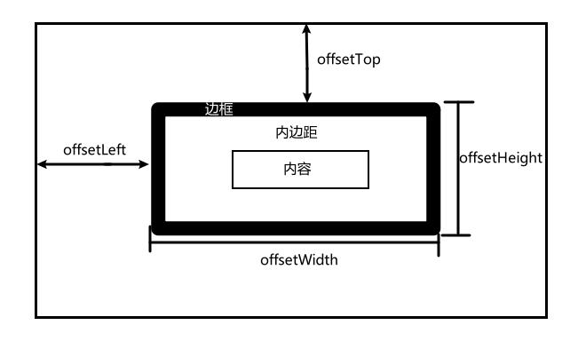
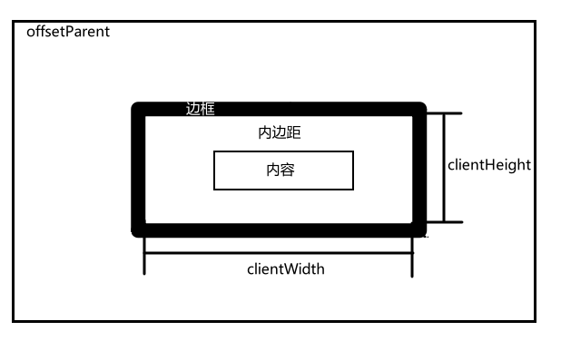
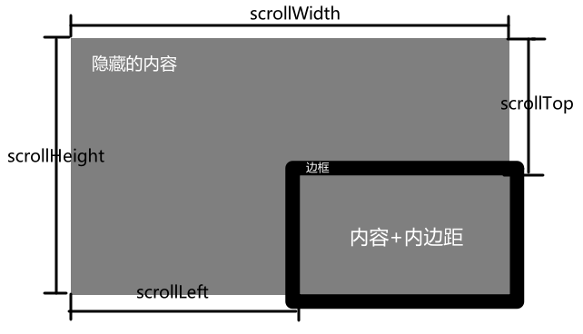
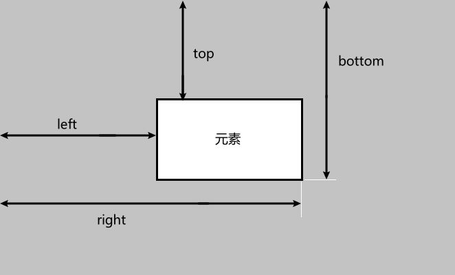

# 元素尺寸

## 偏移尺寸

* offsetTop：元素上边框和包含元素上边框的距离
* offsetLeft：元素左边框和包含元素左边框的距离
* offsetHeight：元素在垂直方向占用的像素尺寸
* offsetWidth：元素在水平方向占用的像素尺寸

## 客户端尺寸

客户端尺寸实际上就是元素内部的空间，因此不包含滚动条的空间  

## 滚动尺寸

scrollWidth和scrollHeight等于文档内容的宽度  
clientWidth和clientHeight等于视口的大小  
  
scrollLeft和scrollTop属性可以用于确定当前元素滚动的位置，或者用于设置它们的滚动位置（它们是可写的）  

## 确定元素尺寸

浏览器在每个元素上都暴露了getBoundingClientRect()方法，返回一个DOMRect对象  
包含6个属性：left、top、right、bottom、height、width  
