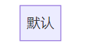

# Markdown 进阶操作

## 内嵌 HTML 使用

内嵌 HTML 使用是比较麻烦的事情，**不推荐使用**  
倒不是因为它很难，而是**兼容性问题很大**，各种不同的 Markdown 支持的 HTML 标签都不一样  

这会导致同样一份 markdown 在A网站显示良好，在B网站显示却不尽人意  
比如 <www.csdn.net> 的 Markdown 是支持`<span color="" size=num>`的，但 <www.github.com> 的 Markdown 却不支持这个标签  

因此，在要 HTML 内嵌时要**确定兼容性问题后再使用**  

我在此仅给出 GitHub Markdown 支持的常用 HTML 标签  

* 折叠标签`<details></details>`与`<summary></summary>`
  * 这两个标签合用能产生折叠内容并带有小标题的效果
* 定义键盘输入文本`<kbd></kbd>`
  * 这个标签能产生类似`` ` ` ``的代码片段效果，通常`<kbd></kbd>`标签之间嵌套使用
* 定义输出文本、无其它意义文本`<samp></samp>`
  * 通常与`<kbd></kbd>`嵌套使用
* 用于定义列表的`dl`、`dt`、`dd`标签
* 用来定义拼音的标签`<ruby></ruby>`、`<rp></rp>`、`<rb></rb>`
* `div`标签及其属性`itemscope`、`itemtype`
* 所有的 HTML 实体，即使用`&`进行转义的字符

## Mermaid 绘画使用

### Mermaid 简介

Mermaid 是一个类似 Markdown 的开源脚步语言，它能够根据输入的语句自动生成合适的图像，且广泛受支持。  
由于 Markdown 支持了 Mermaid 的制作，所以 Markdown 支持内嵌 Mermaid 语法以生成图像。  
Mermaid 是通过 JS 实现的插件，全称是`mermaid.js`，官网是[mermaid.js.org 官网](https://mermaid.js.org/)  


在 Markdown 中使用 Mermaid 需要以下声明语法  

````markdown
  ```mermaid
    具体的 mermaid 语法
  ```
````

例如上面流程图的源码如下

````markdown
  ```mermaid
    flowchart LR
      A["JS"]
      B["Mermaid"]
      C["Markdown 原生"]
      D["Markdown 定制"]
      A --制作了--> B --内嵌到了 --> C --衍生了--> D
  ```
````

Mermaid 中包含了12种可以使用的图表定义结构  
分别是：流程图、时序图、类图、状态图、实体关系图、用户行程图、甘特图、饼图、需求图、Git分支可视化、思维导图、ZenUML图  

考虑到实用性和学习成本，仅重点学习了9种图形语法  
包括：流程图、时序图、类图、状态图、实体关系图、用户行程图、饼图、需求图、思维导图  

推荐的学习方法是`随用随学` Mermaid 语法并不难学，根据需要进行学习是比较实用的方法  

### 流程图

流程图是由节点和边组成的，在 Mermaid 中有各式各样的语法定义它们的样式、效果等等  

#### 流程图-基础语法

##### 声明图像类型

告诉 Mermaid 下列语法是什么图像  
可以用`flowchart`或`graph`声明`流程图类型`  

##### 声明排列方向

告诉 Mermaid 流程图的排列方向  
其中：`L`代表`Left左边`、`R`代表`Right右边`、`T`代表`Top上面`、`B`代表`Bottom下面`，顺序为左边的字母到右边的字母  

| 顺序字母 | 代表意义 | 顺序字母 | 代表意义 |
| :---: | :---: | :---: | :---: |
| TB | 自上而下 | BT | 自下而上 |
| RL | 从右到左 | LR | 从左到右 |

````markdown
  ```mermaid
      flowchart TB
        subgraph 从左到右
          direction LR
          声明图像类型1 --> 声明排列方向1 --> 声明图像内容1
        end
        subgraph 从右到左
          direction RL
          声明图像类型2 --> 声明排列方向2 --> 声明图像内容2
        end
        subgraph 上下分明
          direction LR
          subgraph 从上到下
            direction TB
            声明图像类型3 --> 声明排列方向3 --> 声明图像内容3
          end
          subgraph 从下到上
            direction BT
            声明图像类型4 --> 声明排列方向4 --> 声明图像内容4
          end
          从上到下 --> 从下到上
        end
        从左到右 --> 从右到左 --> 上下分明
    ```
````


##### 声明节点

有两种声明节点的方式  

`直接声明`：直接在`连接声明区域声明节点`，此时节点名字作为节点内容，节点样式采用默认样式（即`[]`样式）
`完整声明`：使用`节点名字[节点内容]`声明节点，其中的`[]`代表节点样式，可以改变它以改变节点样式  

如采用`完整声明`则在`连接声明区域`内以`节点名字`指代节点  

`完整声明`中的`节点内容`可以使用`Unicode 字符`或`Markdown 语法`  

* 使用`Unicode 字符`时应该将节点内容以`" "`包裹
* 使用`Markdown 语法`时应该将节点内容以`` "` `" ``包裹

:exclamation: **每个节点名字都是唯一的**

````markdown
  ```mermaid
      graph TB
        subgraph 直接声明
          direction LR
          普通节点1 --> 普通节点2 --> 普通节点3
        end
        subgraph 完整声明
          普通节点[这是一个普通节点]
          Unicode节点["🐳Unicode节点"]
          Markdown节点["`**第一行**  
          *第二行*  
          ***第三行***`"]
          普通节点 --> Unicode节点 --> Markdown节点
        end
        直接声明 --> 完整声明
  ```
````


##### 声明节点形状

在介绍`完整声明`时有提到过可以自定义节点样式，例如使用`[ ]`包裹节点内容就代表这个节点是默认样式  
我们除了默认样式外，Mermaid 还可以定义其它很多的节点样式  

| 节点样式 | 样式语法 | 样式效果 | 节点样式 | 样式语法 | 样式效果 | 节点样式 | 样式语法 | 样式效果 |
| :---: | :---: | :---: | :---: | :---: | :---: | :---: | :---: | :---: |
| 默认 | `[文本]` |  | 圆边 | `(文本)` |  | 胶囊 | `([文本])` |  |
| 子程序 | `[[文本]]` |  | 圆柱 | `[(文本)]` |  | 圆形 | `((文本))` |  |
| 六边形 | `{{文本}}` |  | 棱形 | `{文本}` |  | 正四边形 | `[/文本/]` |  |
| 反四边形 | `[\文本\]` |  | 正梯形 | `[/文本\]` |  | 反梯形 | `[\文本/]` |  |
| 旗帜 | `>文本]` |  | 双圆 | `(((文本)))` |  |

##### 声明节点间的连接

声明节点间的连接使得有关联的节点能被 Mermaid 识别并绘制连接线  
声明单个连接语法`A --> B`能够声明`一条 A 到 B 链接`  
声明多个连接语法`A --> B --> C`能够声明`A 到 B、B 到 C 共两条链接`  
多个节点聚合声明语法`A & B --> C`能够对多个节点进行操作`声明 A 到 C、B 到 C 共两条链接`  

````markdown
  ```mermaid
      graph LR
        A --单连接声明--> B
        B --多连接声明--> C --多连接声明--> D
        D --多节点聚合--> E & F --多节点聚合--> A
    ```
````


##### 调整链接的长度

在某些情况下，可以大致定义链接的长度而改善 Mermaid 画出的图形  
Mermaid 内可以定义链接跨越的级数以调整链接长度  
想要跨越多少级数，只需要在正常的连接符号上加入对应数量的`-`、`.`、`=`等符号即可

````markdown
  ```mermaid
      graph LR
        subgraph 没调整链接长度之前
          direction TB
          %% A --> B 的链接声明是正常的
          A --> B --> D
          D --> E
          E --> B
        end
        subgraph 调整了链接长度之后
          direction TB
          %% A ---> B 的链接声明多了一个 - 符号
          %% 代表着跨1个级别
          A1 ---> B1 --> D1
          D1 --> E1
          E1 --> B1
        end
        没调整链接长度之前 --调整了A到B的跨级为1--> 调整了链接长度之后
  ```
````


##### 调整链接的样式

前面举例所使用的链接样式都是`-->`代表着有向箭头，Mermaid 内还拥有其它很多链接样式  

| 样式语法 | 样式效果 | 样式语法 | 样式效果 | 样式语法 | 样式效果 | 样式语法 | 样式效果 |
| :---: | :---: | :---: | :---: | :---: | :---: | :---: | :---: |
| `A --- B` |  | `B --标签--- C` |  | `C --> D` |  | `D --标签--> E` |  |
| `E <--> F` |  | `F -.-> G` |  | `G -.标签.-> H` |  | `H <-.-> I` |  |
| `J ==> K` |  | `K ==标签==> L` |  | `L --o M` |  | `M o--o N` |  |
| `N --x O` |  | `O x--x P` |  | `` |  | `` |  |


##### 注释

让文本以`%%`开头可以将文本标记为 Mermaid 注释

##### 字符转义

当你要输入特殊字符（与语法相冲突的字符）时，可以使用`" "`包裹住你的文本，这样就没有关系了  
此外 Mermaid 还支持 HTML 的实体（以`&`表示的字符）  

#### 流程图-进阶使用

##### 子流程图

在流程图的里面可以嵌入子流程图，子流程图内仍旧可以嵌入子流程图  
将子流程图当成一个整体看待的话，它的行为和普通节点基本一致  

子流程图的声明语法如下

```markdown
  subgraph 子流程图名字[子流程图文本内容（标题）]
    direction 子流程图方向
    子流程图具体信息
  end
```

子流程图实例

````markdown
  ```mermaid
    graph TB
    A[HTML 基础]
    subgraph B[HTML 进阶]
      subgraph 属性[各种属性]
        一般属性 --> 特殊属性
      end
      标签 --> 属性 --> 方法
    end
    C[HTML 深入]
    A --> B --> C
  ```
````

学习 HTML 的过程


##### 事件交互

我们可以把页面跳转或是js函数捆绑在节点的点击事件上  
这样就能够有一些交互性，这两者的用法和 HTML 差不多  

语法如下

```markdown
  <!--页面跳转-->
  click 节点名字 href "网址" "注释" 打开方式
  <!--函数捆绑-->
  <!--先定义一个函数-->
  <script>
    const callback = function(){
      alert("Function running!");
    };
  </script>
  <!--然后把这个函数引进 Mermaid 并将它和节点捆绑-->
  click 节点名字 callback "注释"
  click 节点名字 call callback() "注释"
```

示例如下

````markdown
  ```mermaid
    graph LR
      A --> B --> C
      click A callback "引入函数"
      click A call callback() "捆绑函数到节点A的点击事件"
      click B href "https://www.github.com" "前往GitHub" _blank
  ```
````


由于在他人网页上我们没有定义js脚本的权限，所以点击A节点什么事情都不会发生  
但如果你是在浏览器上点击B或C节点，就会跳转到GitHub网页  

##### 自定义链接与节点样式

###### 链接样式的定义

由于链接没有像节点一样的节点名字，所以如果要定义单个链接的样式，那么需要使用它的被声明顺序号（从0开始）  
例如我声明了三条链接，当我想要为第二条链接添加一个独特的样式时，应该这样做

```markdown
  linkStyle 1 stroke:#000, stroke-width:0px, color:#000
```

其中的`1`就是该链接的被声明顺序号  

假如要对全部连接进行改变，去掉顺序号即可  

###### 节点样式的定义

由于节点有独一无二的节点名字，当要修改节点样式时，可以根据节点名字定位节点位置  
定义节点样式语法如下  

```markdown
  style 节点名字 fill:#000, stroke:#000, stroke-width:0px, color:#000
```

###### 为节点添加类以定义样式

可以将某些样式和某一类节点绑定在一起，方便管理  
Mermaid 中定义类的语法如下

```markdown
  classDef 类的名字 fill:#000, stroke:#000, stroke-width:0px, color:#000
```

将节点和类绑定的语法如下

```markdown
  <!--绑定单个节点到类-->
  class 节点名字 类的名字
  <!--绑定多个节点到类-->
  class 节点名字1,节点名字2 类的名字
  <!--添加节点到类的简约写法-->
  节点名字:::类的名字
  示例
    A:::MyClass --> B
```

在可以为节点添加类后，也可以使用`CSS`根据`类选择器`为节点添加样式了

##### 使用fontawesome图标

通过使用语法`fa:图标名字`可以引入`fontawesome`的图标

### 时序图

#### 定义参与者

可以在时序图开头声明该时序图的参与者并给它们取别名  

* 以默认样式声明参与者`participant 别名 as 展示名`  
* 以角色样式声明参与者`actor 别名 as 展示名`

在声明链接时，使用的是`别名`  
在声明参与者时也可以不设置`别名`，此时`别名`和`展示名`一致  

````markdown
  ```mermaid
    sequenceDiagram
      participant 机构A as 大学校园
      actor 学生A as 小明
      机构A ->> 学生A: 发送学业警告书
      学生A ->> 机构A: 回复收到
  ```
````


#### 参与者分组

可以利用`box 颜色 组名` + `声明参与者` + `end`给参与者分组  
其中`颜色`可以使用`rgb(hex,hex,hex)`定义，也可以使用英文的颜色单词  

````markdown
  ```mermaid
    sequenceDiagram
      box Yellow 饭店
      participant A as 后厨
      actor B as 服务员
      end
      box rgb(250,50,250) 客人
      actor C as 上司
      actor D as 下属
      end
      D ->> C: 老板要吃什么
      C ->> D: 吃红烧排骨
      D ->> B: 靓仔，一份红烧排骨
      B ->> A: 红烧排骨一份
      A ->> B: 排骨好了
      B ->> D: 菜来了
  ```
````


#### 链接声明

时序图的链接，就是行为传递，语法如下
`参与者1 链接样式 参与者2: 传递信息、行为`  

链接样式共有八种  

| 样式语法 | 样式描述 | 样式语法 | 样式描述 |
| :---: | :---: | :---: | :---: |
| `->` | 没箭头实线 | `->>` | 有箭头实线 |
| `-->` | 没箭头虚线 | `-->>` | 有箭头虚线 |
| `-x` | 末端十字实线 | `--x` | 末端十字虚线 |
| `-)` | 末端空心箭头实线 | `--)` | 末端空心箭头虚线 |

````markdown
  ```mermaid
    sequenceDiagram
      participant A as 小明
      participant B as 小李
      A -> B: 没箭头实线
      A ->> B: 有箭头实线
      A --> B: 没箭头虚线
      A -->> B: 有箭头虚线
      A -x B: 末端十字实线
      A --x B: 末端十字虚线
      A -) B: 末端空心箭头实线
      A --) B: 末端空心箭头虚线
  ```
````


#### 参与者激活

激活时间段可以表示参与者正在处理消息或等待回应

Mermaid 中使用`activate`激活参与者，使用`deactivate`停止激活参与者  
还可以使用简略写法，在链接样式后面添加`+`代表激活，`-`代表停止激活  
激活状态是可以叠加的

````markdown
  ```mermaid
    sequenceDiagram
      participant A as 小明
      participant B as 小李
      A ->>+ B: 现在需要一些信息
      A ->> B: 把行程报告写完发我
      activate B
      B -->> A: 行程报告写好了
      deactivate B
      A ->>+ B: 再把报销凭证整理好，发过来
      B -->>- A: OK了，发给你
      B -->>- A: 信息全部发完了
  ```
````


#### 添加标签信息

通过语法`Note right of或left of或over 参与者: 标签文本`可以添加标签  
其中 `left of` `right of`可以在单个参与者的左边或右边添加标签信息  
`over`可以在多个参与者之间添加标签信息  

````markdown
```mermaid
    sequenceDiagram
      participant A as 小明
      participant B as 小李
      Note left of A: 小明很饿
      A ->> B: 去不去吃饭
      Note over A,B: 小明邀请小李吃饭
      B ->> A: 我还不饿
      Note over A,B: 小李谢绝了
      Note right of B: 小李很饱
  ```
````

```mermaid
  sequenceDiagram
    participant A as 小明
    participant B as 小李
    Note left of A: 小明很饿
    A ->> B: 去不去吃饭
    Note over A,B: 小明邀请小李吃饭
    B ->> A: 我还不饿
    Note over A,B: 小李谢绝了
    Note right of B: 小李很饱
```

#### 循环

通过语法`loop 循环名字` + `具体事件` + `end`为序列图添加循环  

````markdown
  ```mermaid
    sequenceDiagram
      participant A as 小明
      participant B as 小李
      A ->> B: 接下来每分钟给我发一条“你好”
      loop 每过一分钟
        B ->> A: 你好
      end
  ```
````


#### 条件语句

序列图中有两种条件语句，一种是类似`if else`类型的，另一种是类似`switch case`类型的  
它们的语法如下

```markdown
  A ->> B: xxxx
  alt 情况描述1
    B ->> A: 描述1对应的xxxx
  else 情况描述2
    B ->> A: 描述2对应的xxxx
  end
  opt 什么什么情况
    B ->> A: 对应的xxxx
  end
```

示例如下所示

````markdown
  ```mermaid
    sequenceDiagram
      participant A as 小明
      participant B as 小李
      A ->> B: 小李下班有没有事
      alt 没有事
        B ->> A: 没事，怎么了
        A ->> B: 那去吃饭吧
      else 有事
        B ->> A: 我下班还有其它事要做
        A ->> B: 没事，你先忙
      end
      opt 不确定有没有事
        B ->> A: 我也不确定啊
        A ->> B: 那到时候再说吧
      end
  ```
````


#### 平行发生声明

表示声明内发生的事情是同时发生的，这个声明可以嵌套以表述多个事件同时发生  
语法如下

```markdown
  par 情况描述
    A -> B: XXXX
  and 情况描述
    A -> C: XXXX
  end
```

示例如下所示

````markdown
  ```mermaid
    sequenceDiagram
      participant A as 小明
      participant B as 小李
      participant C as 小红
      par 大声聊天
        A ->> B: 最近新开的饭店不错
      and 发短信
        A ->> C: 下班要不要一起去新开的饭店
      and
        par 大声聊天
          B ->> A: 对啊，我上次也去吃过了
        and 发短信
          B ->> C: 下班要不要一起去新开的饭店
        end
      end
      par 发短信
        C ->> A: 不用了
        C ->> B: 不用了
      end
  ```
````


#### 关键步骤声明

可以在时序图中定义一些必不可少的步骤，也就是必须完成的步骤  

语法如下  

```markdown
  sequenceDiagram
  critical 描述xxx
    发生行为
  option 情况xxx
    应对xxx情况的处理行为
  end
```

示例如下

````markdown
  ```mermaid
    sequenceDiagram
      participant A as 商店
      actor B as 顾客
      critical 买东西必须要付钱
        A ->> B: 商品
        B ->> A: 钞票
      option 没钱
        A ->> B: 没钱不卖东西
      end
  ```
````


#### 空窗期定义

可以定义空窗期以在某段时间内停止序列的进行，这个空窗期通常用来表示处理一些事件  

语法如下

```markdown
  sequenceDiagram
    break 发生了事件xxx
      空窗期内发生的行为、
    end
```

示例如下

````markdown
  ```mermaid
    sequenceDiagram
      participant bank as 银行
      participant database as 数据库
      actor consumer as 顾客
      consumer ->> bank: 我卡里还有多少钱
      bank -->> consumer: 正在查询
      break 查找银行卡的余额
        bank ->> database: 请求数据
        database -->> bank: 返回数据
      end
      bank -->> consumer: 卡里还有xxxx元
  ```
````


#### 定义背景颜色

可以为一个行为或多个行为定义背景颜色，可使用`rgb(hex,hex,hex)`定义具体颜色  

语法如下

```markdown
  rect rgb(hex,hex,hex)
  行为
  end
```

示例如下

````markdown
  ```mermaid
    sequenceDiagram
      actor driver as 司机
      actor passenger as 乘客
      rect rgb(0, 200, 0)
      driver ->> passenger: 是尾号1234的乘客吗
      rect rgb(50, 150, 200)
      passenger ->> driver: 对
      end
      driver ->> passenger: 上车吧
      end
  ```
````


#### 为行为添加序列号

只需要输入`autonumber`即可

示例

````markdown
  ```mermaid
    sequenceDiagram
      autonumber
      A ->> B: 身体怎么样
      B ->> B: 自检中
      B ->> A: 身体还不错
      B ->> C: 你的身体怎么样
      C ->> B: 也还可以
  ```
````

```mermaid
  sequenceDiagram
    autonumber
    A ->> B: 身体怎么样
    B ->> B: 自检中
    B ->> A: 身体还不错
    B ->> C: 你的身体怎么样
    C ->> B: 也还可以
```

### 饼图

饼图能够很好的对比占有部分大小

在 Mermaid 中定义饼图很简单，只需如下语法  
showData 是可选的，填上以后数字会被显示在标签以后

```markdown
  pie showData
    title 图表标题
    "标签1" : 数字1
    "标签2" : 数字2
```

````markdown
  ```mermaid
    pie showData
      title 一天都在干什么
      "学习" : 12
      "睡觉" : 9
      "其它" : 3
  ```
````

```mermaid
  pie
    title 一天都在干什么
    "学习" : 12
    "睡觉" : 9
    "其它" : 3
```

### 用户行程图

用户行程图能够描述用户在完成特点任务或事情时所采取的步骤，该图可以显示当前用户的工作流程，并揭示未来工作流程可能的改进  

要在 Mermaid 定义用户行程图是比较简单的，可以用以下的语法  

```markdown
  journey
    title 图表标题
    section 大阶段计划
      细分任务:评分:参与者1, 参与者2
```

如下示例

````markdown
  ```mermaid
    journey
      title 毕业设计安排
      section 选题阶段
        导师申报论文题目 : 7 : 导师
        学生与导师双选 : 7 : 学生, 导师
        导师下达任务书 : 7 : 导师
      section 调研阶段
        学生搜集资料阅读资料 : 4 : 导师, 学生
        学生上交综述与译文 : 5 : 导师, 学生
      section 开题阶段
        完成开题报告与开题答辩 : 7 : 导师, 学生, 专业系, 学院
      section 撰写阶段
        写完三稿论文和设计说明书，经过三位老师评审 : 6 : 导师, 学生
        论文进度期中检查 : 6 : 专业系, 学院
      section 答辩评定阶段
        组织答辩 : 4 : 导师, 答辩小组, 答辩委员会
        成绩评定 : 3 : 导师, 答辩小组, 答辩委员会, 学院
      section 补充
        二次答辩 : 1 : 学院
      section 资料归档
        收尾工作 : 9 : 学院
  ```
````

```mermaid
  journey
    title 毕业设计安排
    section 选题阶段
      导师申报论文题目 : 7 : 导师
      学生与导师双选 : 7 : 学生, 导师
      导师下达任务书 : 7 : 导师
    section 调研阶段
      学生搜集资料阅读资料 : 4 : 导师, 学生
      学生上交综述与译文 : 5 : 导师, 学生
    section 开题阶段
      完成开题报告与开题答辩 : 7 : 导师, 学生, 专业系, 学院
    section 撰写阶段
      写完三稿论文和设计说明书，经过三位老师评审 : 6 : 导师, 学生
      论文进度期中检查 : 6 : 专业系, 学院
    section 答辩评定阶段
      组织答辩 : 4 : 导师, 答辩小组, 答辩委员会
      成绩评定 : 3 : 导师, 答辩小组, 答辩委员会, 学院
    section 补充
      二次答辩 : 1 : 学院
    section 资料归档
      收尾工作 : 9 : 学院
```
