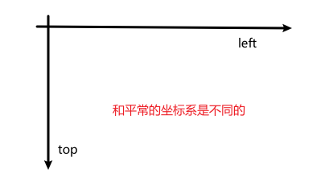
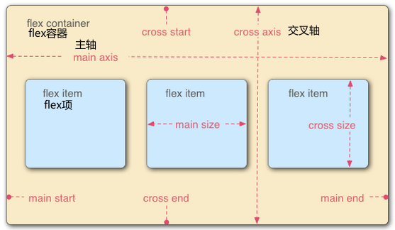
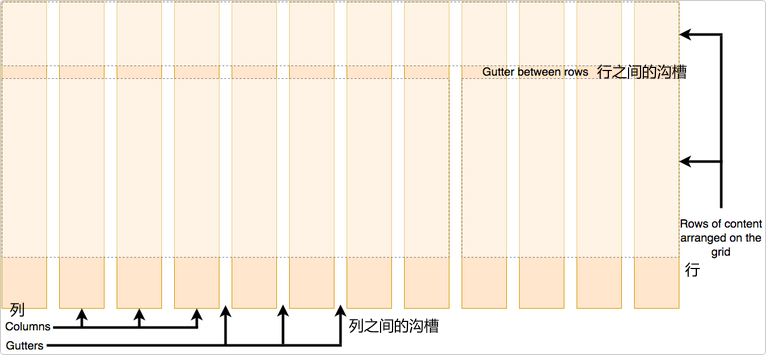
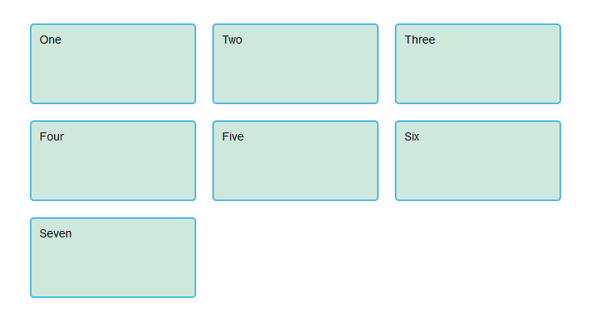
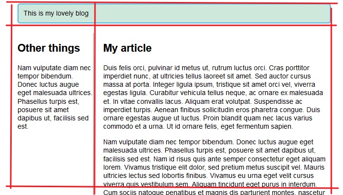

# CSS布局

## 介绍CSS布局

### 正常布局流简介

正常布局流是指在不对页面进行任何布局控制时，浏览器默认的 HTML 布局方式  
当你使用 css 创建一个布局时，你正在离开**正常布局流**  

下列布局技术会覆盖默认的布局行为

* `display`属性，如`block`、`inline`、`inline-block`、`grid`、`flex`
* 浮动，应用`float`值
* `position`属性
* 表格布局
* 多列布局

### display属性

此属性允许我们更改默认的显示方式  
还有一些更大的布局方法以`display`值开始  

### 弹性盒子简介

Flexbox 是 CSS 弹性盒子布局模块（Flexible Box Layout Module）的缩写  
它被专门设计出来用于创建横向或是纵向的**一维页面布局**  

要使用 flexbox，你只需要在想要进行 flex 布局的父元素上应用`display: flex` ，所有**直接**子元素都将会按照 flex 进行布局

### Grid布局简介

Grid 布局能够用于同时在**两个维度**上把元素按行和列排列整齐  
可以通过指定 display 的值来转到 grid 布局：`display: grid`  

使用 `grid-template-rows` 和 `grid-template-columns` 两个属性定义了一些行和列的轨道  
之后无需再在子元素上指定任何规则，它们自动地排列到了我们创建的格子当中  

```css
    .wrapper {
        display: grid;
        grid-template-columns: 1fr 1fr 1fr;
        grid-template-rows: 100px 100px;
        grid-gap: 10px;
    }
```

可以利用 `grid-column` 和 `grid-row` 两个属性来指定子元素从哪一行/列开始，在哪一行/列结束  
这就能够让子元素在多个行/列上展开  

```css
    .wrapper {
        display: grid;
        grid-template-columns: 1fr 1fr 1fr;
        grid-template-rows: 100px 100px;
        grid-gap: 10px;
    }

    .box1 {
        /*包括开头，不包括结尾*/
        grid-column: 2 / 4;
        grid-row: 1;
    }

    .box2 {
        grid-column: 1;
        grid-row: 1 / 3;
    }

    .box3 {
        grid-row: 2;
        grid-column: 3;
    }
```

### 浮动布局简介

把一个元素浮动起来，这一元素会浮动到左侧或右侧，并且从正常布局流中移除，这时候其他的周围内容就会在这个被设置浮动的元素周围环绕  

`float`属性有四个关键字

* `left`：将元素左浮
* `right`：将元素右浮
* `none`：默认值，不浮动
* `inherit`：继承父元素的浮动属性

### 定位技术简介

定位能够让我们把一个元素从它原本在正常布局流中应该在的位置移动到另一个位置  
它更像是让你去管理和微调页面中的一个特殊项的位置  

可以使用`position`属性来设置定位  

* 静态定位`static`：默认情况，将元素放在文档布局流的默认位置
* 相对定位`relative`：相对于元素的正常文档流位置移动它，本体没移动，表现移动了
* 绝对定位`absolute`：将元素完全从页面的正常布局流中移出，类似将它单独放在一个图层中，可以将元素相对于`<html>`元素固定，或相对于该元素的最近**被定位祖先元素**
* 固定定位`fixed`：它是将一个元素相对浏览器视口固定，而不是相对另外一个元素
* 粘性定位`sticky`：它会让元素先保持和`position: relative`一样的定位，当它的相对视口位置达到某一个预设值时，它就会像`position: fixed`一样定位

紧跟着`position`的是四个属性`top`、`left`、`bottom`、`right`  
它们都是表示相较于选定的边进行位移，不过由于坐标系是屏幕的，和常规不一样  



### 多列布局简介

多列布局模组给了我们一种把内容按列排序的方式，就像文本在报纸上排列那样  
使用`column-count`属性来告诉浏览器我们需要多少列  
或是使用`column-width`来告诉浏览器以至少某个宽度的尽可能多的列来填充容器  

## 正常布局流

如果未曾应用任何 CSS 规则改变元素的展现方式，网页元素将按照正常布局流来组织  

默认的，块级元素按照基于其父元素的`书写顺序`的`块流动方向`放置，每个块级元素会在上一个元素下面另起一行，它们会被设置好的`margin`分隔  

内联元素不会另起一行，它们与其他内联元素、相邻的文本内容被安排在同一行  
如果空间不够，溢出的文本或元素将移到新的一行  

## 弹性盒子

弹性盒子是一种用于按行或按列布局元素的**一维布局方法**  
元素可以膨胀以填充额外的空间，收缩以适应更小的空间  

### 指定元素布局为flexible

使用`display:flex`将某元素的布局指定为flexible，外部表现像是`块级元素`  
它的子元素布局为flex项  

### flex模型说明

  

* `主轴`：沿flex元素**放置方向**延伸的轴
* `交叉轴`：垂直于flex元素放置方向的轴
* 设置了布局为flex的元素称为`flex容器`
* 在flex容器中表现为弹性盒子的元素称为`flex项`

### 行列方向

使用`flex-direction`属性可以指定主轴的方向（弹性盒子子类的放置方向）  

* `row`：默认值，按浏览器默认语言的方向排列（从左到右）
* `column`：将元素设置为`列布局`
* `row-reverse`和`column-reverse`：对应排列的反向

### 换行问题

在布局中使用定宽或定高时，可能出现问容器中弹性盒子子元素溢出，破坏布局  

```css
    flex-wrap: wrap;
    flex: 200px;
```

任何溢出都会向下移动到下一行  
设置的 flex：200px 声明意味着每个声明将至少为 200px 宽  

### flex-flow缩写

`flex-flow`是`flex-direction`和`flex-wrap`的缩写  

```css
    flex-flow: row wrap;
```

### flex项的动态尺寸

使用`flex`为每个flex项指定它所占用主轴空间的比例及最小占用空间  

```css
    article {
        flex: 1 200px;
    }
    article:nth-of-type(3) {
        flex: 2 200px;
    }
```

上面的例子中，主轴空间将被平分为许多段  
第三个`<article>`占据的空间是其它`<article>`的两倍  
且每个`<article>`的最小主轴空间是`200px`  

### `flex`属性

`flex`属性是一个最多可以指定三个不同值的缩写属性  

* `flex-grow`：flex项空间占有比例
* `flex-shrink`：一般用于溢出容器的 flex 项
* `flex-basis`：最小值

**最好不要使用缩写值**，这样不够清晰  

### 水平和垂直对齐

`align-items`控制flex项在交叉轴的位置  

* `stretch`：使所有 flex 项沿着交叉轴的方向拉伸以填充父容器，如果父容器在交叉轴方向上没有固定宽度（即高度），则所有 flex 项将变得与最长的 flex 项一样长
* `center`：使flex项保持其原有的高度，但是会在交叉轴居中  
* `flex-start`或`flex-end`：这样使 flex 项在交叉轴的开始或结束处对齐所有的值

不过可以在某个flex项上使用`align-self`覆盖掉`align-items`的行为  

`justify-content`控制flex项在主轴上的位置

* `flex-start`：默认值，让flex项与主轴开始处对齐
* `flex-end`：让flex项与主轴结束处对齐
* `center`：让 flex 项在主轴居中
* `space-around`：使每个flex项在主轴方向上**两侧的空间相同**
* `space-between`：它是使得每个flex项**之间的空间相同**

> :grey_exclamation:`justify-self`是用在grid布局的，在flex布局中将被忽略

### flex项排序

弹性盒子有可以改变 flex 项布局位置而不会影响到源顺序的功能（即 dom 树里元素的顺序）  
定义flex项的`order`属性即可（它接受负值）  

* 所有flex项默认`order`值是0
* order值大的flex项比order值小的在排序中更加靠后
* 相同order值的flex项顺序按照源顺序排列

### flex布局嵌套

可以将flex容器的子元素定义为flex布局，这样能够将布局嵌套达到更加复杂的效果  

## 网格布局

网格是一个用于 web 的**二维布局系统**，利用网格，你可以把内容按照行与列的格式进行排版  

网格是由一系列水平及垂直的线构成的一种布局模式  
一个网格通常具有许多的**列**与**行**，以及行与行、列与列之间被称为**沟槽**的间隙  

  

### 定义一个网格

使用`display: gird`将一个元素的布局改为网格布局，初始状况的网格只有一列  
使用`grid-template-columns: 200px 200px`可以定义两个宽度只有200px的列  

### 使用fr单位

`fr`这个单位代表网格容器中可用空间的一份  
fr 单位按比例划分了可用空间  
可用空间是不包括那些已经确定被占用的空间的（被其它单位定义了的列占用的空间）  
fr可以和其它单位混用  

### 网格间隙

* `grid-column-gap`：定义列间隙
* `grid-row-gap`：定义行间隙
* `grid-gap`或`gap`：同时设定两者

间隙距离可以用任何长度单位包括百分比来表示，但不能使用`fr`单位  

### 重复构建轨道

使用`repeat`来重复构建具有某些宽度配置的某些列  

```css
    grid-template-columns: repeat(3, 1fr)
    grid-template-columns: repeat(2, 2fr 1fr)
```

上例中第一个就设置了三个1fr的列  
第二个则设置了四个列，分别是2fr、1fr、2fr、1fr  

### 显式网格与隐式网格

显式网格是我们用 `grid-template-columns` 或 `grid-template-rows` 属性创建的  
隐式网格则是当有内容被放到网格外时才会生成的（网格没有被定义时自动生成的网格）  

隐式网格中生成的行/列大小是参数默认是 `auto` ，大小会根据放入的内容自动调整  
可以使用`grid-auto-rows`和`grid-auto-columns`属性手动设定隐式网格轨道的大小  

简单来说，隐式网格就是为了放显式网格放不下的元素，浏览器根据已经定义的显式网格自动生成的网格部分  

```css
    .container {
        display: grid;
        grid-template-columns: repeat(3, 1fr);
        grid-auto-rows: 100px;
        grid-gap: 20px;
    }
```

  

### minmax()函数

`minmax 函数`为一个行/列的尺寸**设置了取值范围**。比如设定为 minmax(100px, auto)，那么尺寸就至少为 100 像素，并且如果内容尺寸大于 100 像素则会根据内容自动调整  

```css
    .container {
        display: grid;
        grid-template-columns: repeat(3, 1fr);
        grid-auto-rows: minmax(100px, auto);
        grid-gap: 20px;
    }
```

### 自动填充列

我们可以通过设置grid-template-columns属性，实现让网格自动创建很多列来填满整个容器  
这需要用到`repeat`的关键字`auto-fill`以及使用`minmax`函数  

### 基于线的元素放置

网格有许多**分隔线**，第一条线的起始点与文档书写模式相关  
在英文中，第一条列分隔线在网格的最左边而第一条行分隔线在网格的最上面  

我们根据这些分隔线来放置元素，通过以下属性来指定从那条线开始到哪条线结束  

* `grid-column-start`
* `grid-column-end`
* `grid-row-start`
* `grid-row-end`

也可以使用缩写形式同时指定开始与结束的线  

* `grid-column`
* `grid-row`

开始与结束的线的序号要使用`/`符号分开  

```css
    header {
        grid-column: 1 / 3;
        grid-row: 1;
    }
    article {
        grid-column: 2;
        grid-row: 2;
    }
    aside {
        grid-column: 1;
        grid-row: 2;
    }
```

  

> :grey_exclamation:也可以用 -1 来定位到最后一条列分隔线或是行分隔线，并且可以用负数来指定倒数的某一条分隔线
> 但是这只能用于显式网格，对于隐式网格-1不一定能定位到最后一条分隔线

### 使用grid-template-areas属性放置元素

另一种往网格放元素的方式是用grid-template-areas属性  
你要命名一些元素并在属性中使用这些名字作为一个区域  

```css
    .container {
        display: grid;
        grid-template-areas:
            "header header"
            "sidebar content"
            "footer footer";
        grid-template-columns: 1fr 3fr;
        gap: 20px;
    }
    header {
        grid-area: header;
    }
    article {
        grid-area: content;
    }
    aside {
        grid-area: sidebar;
    }
    footer {
        grid-area: footer;
    }
```

最终效果和上面的按线放置元素一样  

`grid-template-areas`属性的使用规则如下  

* 需要填满网格的每个格子
* 某个横跨多个格子的元素，重复写上那个元素grid-area属性定义的区域名字
* 所有名字只能出现在一个连续的区域，不能在不同的位置出现
* 一个连续的区域必须是一个矩形
* 使用`.`符号，让一个格子留空

## 定位

使用`position`可以实现一些元素的定位效果  
具体情况已经在上面说过了[定位技术简介](#定位技术简介)  

补充`position: sticky`和`z-index`概念  

### `position: sticky`

```css
    h1{
        position: sticky;
        top: 10%;
    }
```

上例中，如果`<h1>`距离顶部的距离小于10%，那么它将被固定在视口的10%处  

### `z-index`

`z-index`接受负数  
元素的z-index值越大，它的图层越前面  
如果父元素的z-index值小于其它元素，那么子元素的图层会排在底部，无论它的z-index值多大  

## 多列布局

多列布局声明提供了一种多列组织内容的方式，正如你在一些报纸中看到的那样  

### 设置列的数量与宽度

使用`column-count`和`column-width`设置列的数量与宽度  

### 设置列的样式

使用`column-gap`设置列之间的间隙  
使用`column-rule`设置列之间的分割线，设置方法同`border`  
分割线不占用空间  

### 内容折断

折断就是多列布局的内容被拆成碎块  
例如，一个标题或者一个图片被拆分到两个不同的列中  

使用`break-inside: avoid`避免在元素内部发生折断  

## 响应式布局

**响应式 Web 设计不是单独的技术**，它是描述 Web 设计的一种方式、或者是一组最佳实践的一个词，它是用来建立可以**响应**查看内容的设备的样式的一个词  

### 媒体查询

媒介查询允许我们运行一系列测试，例如用户的屏幕是否大于某个宽度或者某个分辨率，并将 CSS 选择性地适应用户的需要应用在样式化页面上  

```css
    @media screen and (min-width: 800px) {
        .container {
            margin: 1em 2em;
        }
    }
```

如上例中，媒体查询：Web 页面是否被展示为屏幕媒体，且视口至少有 800 像素宽  

可以在一张样式表上**加入多条媒体查询**，调整页面或部分页面以适应各式屏幕尺寸  
媒体查询，以及样式改变时的点，被叫做**断点**  

### 灵活网格

响应式站点不只是在断点之间改变它们的布局，它们是建立在灵活网格上的  
使用灵活网格，你只需要加进去一个断点，在内容看起来不齐整的时候改变设计  
例如现在的多列布局，flex布局，grid布局都是灵活的  

### 响应式图像

响应式图像，使用了`<picture>`元素和`` `srcset`和`sizes` 特性  
这在HTML中有学过[查看响应式图片设计](./HTML-多媒体嵌入.md/#响应式图片)  

### 响应式排版

还有一个响应式设计理念是响应式排版的理念  
本质上讲，这描述了根据屏幕真实使用范围的多少，在媒体查询的同时改变字体大小  

```css
    html {
        font-size: 1em;
    }
    h1 {
        font-size: 2rem;
    }
    @media (min-width: 1200px) {
        h1 {
            font-size: 4rem;
        }
    }
```

正如这种排版方式展示的这样，你不需要让媒介查询只能改变页面的布局  
它们也能用来调节每个元素，让它们在别的大小的屏幕上更加可用或者更具吸引力  

还有一个方法是使用视口单位`vw`来实现响应式排版  
问题在于，因为文本总是随着视口的大小改变大小，用户失去了放缩使用vw单位的文本的能力  

这里有一个解决方法，它使用了`calc()`，如果你将`vw`单位加到了使用固定大小（例如em或者rem）的值组，那么文本仍然是可放缩的  

```css
    h1 {
        font-size: calc(1.5rem + 3vw);
    }
```

### 视口元标签

```css
    <meta name="viewport" content="width=device-width,initial-scale=1">
```

这个元标签告诉移动端浏览器，它们应该将视口宽度设定为设备的宽度，将文档放大到其预期大小的 100%  
移动端浏览器倾向于在它们的视口宽度上说谎  

和视口元标签一起，你可以使用另外几个设定  

* `initial-scale`：设定了页面的初始缩放，我们设定为 1
* `height`：特别为视口设定一个高度
* `minimum-scale`：设定最小缩放级别
* `maximum-scale`：设定最大缩放级别
* `user-scalable`：如果设为`no`的话阻止缩放

> :grey_exclamation:你应该避免使用`minimum-scale`、`maximum-scale`，尤其是将`user-scalable`设为`no`
> 用户应该有权力尽可能大或小地进行缩放，阻止这种做法会引起访问性问题

## 媒体查询入门

CSS 媒体查询为你提供了一种应用 CSS 的方法，仅在浏览器和设备的环境与你指定的规则相匹配的时候 CSS 才会真的被应用  

### 媒体查询基础

最简单的媒体查询语法

```css
    @media media-type and (media-feature-rule) {
        /* CSS rules go here */
    }
```

* 媒体类型：告诉浏览器这段代码是用在什么类型的媒体上的（例如打印机或者屏幕）
* 媒体特征规则：是一个被包含的 CSS 生效所需的规则或者测试
* CSS 规则：会在测试通过且媒体类型正确的时候应用

### 媒体类型

主要使用的媒体类型有  

* `all`
* `print`
* `screen`
* `speech`

> :grey_exclamation:媒体类型是可选的，如果你没有在媒体查询中指示一个媒体类型的话，那么媒体查询默认会设为用于全部媒体类型

### 媒体特征规则

#### 宽和高

一般最常探测的特征是视口宽度  
使用`min-width`、`max-width`和`width`媒体特征在视口宽度大于、小于、等于时应用CSS  
使用`min-height`、`max-height`、`height`也是可以的  

#### 朝向

另一个受到良好支持的媒体特征是`orientation`  
我们可以用它测得竖放`portrait`和横放`landscape`模式  

```css
    @media (orientation: landscape) {
        body {
            color: rebeccapurple;
        }
    }
```

横放是桌面视角，竖放是手机或平板电脑  

#### 使用指点设备

`hover`媒体特征被引入了进来  
这种特征意味着你可以测试用户是否能在一个元素上悬浮  
这也基本就是说他们正在使用某种指点设备（如鼠标这类的指点设备）

```css
    @media (hover: hover) {
        body {
            color: black;
        }
    }
```

以及`pointer`媒体特征  

* `none`：没有指点设备
* `fine`：有鼠标或触摸板这类的，可以精确的指向一小片区域
* `coarse`：触摸屏上的手指

### 更复杂的媒体查询

有了所有不同的可用的媒体查询  
可以把它们混合起来，或建立查询列表：其中的任何一个都可以匹配生效  

* `与`逻辑：使用`and`连接不同条件
* `或`逻辑：使用逗号`,`分开这些查询
* `非`逻辑：使用`not`反转整个媒体查询的含义

### 断点的选择

除了将所有的设计用在特定的尺寸上以外  
一个更好的方法是在内容某种程度上开始变得混乱的时候，改变尺寸的设计  

引入媒体查询的点就叫做**断点**  

### 移动优先的响应式设计

采用两种方式可以实现响应式设计  
从桌面或者最宽的视图开始，然后随着视口变得越来越小，加上断点，把物件挪开  
从最小的视图开始，随着视口变得越来越大，增添布局内容  

第二种方式被叫做**移动优先**的响应式设计  

使用`em`作为响应式布局的宽度媒体查询单位  
因为这样做的话，断点会根据字体的大小而非屏幕的绝对宽度判断  
这样用户更改了字体大小也不会影响断点的正常运行  
