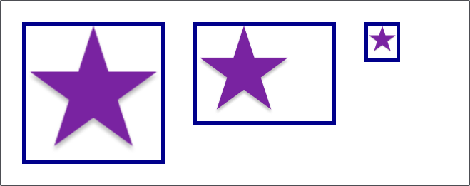

# CSS构建基础

## CSS选择器

### 选择器是什么

CSS 选择器是 CSS 规则的第一部分，它用来选择HTML元素，选择器所选择的元素，叫做`选择器的对象`  

### 选择器列表

如果有多个使用相同样式的 CSS 选择器，那么这些单独的选择器可以被混编为一个`选择器列表`  

```css
    h1 {
        color: blue;
    }

    .special {
        color: blue;
    }

    /*下面的规则等效于上面的两个规则*/
    h1, .special {
        color: blue;
    }
```

> :grey_exclamation:当你使用选择器列表时，如果任何一个选择器无效，那么整条规则都会被忽略

### 选择器的种类

`类型选择器`，选择所有对应元素类型的元素

```css
    h1{ }
```

`类选择器`，选择所有拥有对应类名的元素

```css
    .className{ }
```

`id选择器`，选择拥有对应id的元素（id是唯一的）

```css
    #idName{ }
```

`标签属性选择器`，选择存在某个属性的标签，或有对应属性值的标签

```css
    a[href]{ }

    a[href="www.baidu.com"]{ }
```

`伪类选择器`，用来选择元素的某个特定状态

```css
    a:hover{ }
```

`伪元素选择器`，选择元素的某个部分而非元素本身

```css
    p::first-line{ }
```

`运算符`，这一类选择器可以把其它的选择器组合起来，完成更加复杂的任务

```css
    article > p{ }
```

## 类型、类和ID选择器

### 类型选择器

`类型选择器`也被称为`标签选择器`或`元素选择器`  
它会在文档中选择全部的某元素类型的元素  

### 全局选择器

它会选择文档的所有内容，由一个星号代指`*`  
它一般用在重置样式表或初始化样式表时使用  

`全局选择器`的特殊用法  

```css
    article :first-child{ }

    article *:first-child{ }
```

全局选择器可以用来优化选择器的语法结构  
如上所示，如果不加`*`容易混淆`article :first-child()`和`article:first-child()`  
前者是：选择所有`<article>`的第一子元素  
后者是：选择所有作为其它元素第一子元素的`<article>`  

### 类选择器

类选择器以`.`开头，会选择所有应用了该类的元素  

一个元素可以有多个类  
在应用样式时可以为每个类应用一些样式，这样样式会整合  
也可以在元素同时拥有多个类时再应用样式（此时类选择器之间不能有空格）  

```html
    <p class="borderHave hightLight">这个段落元素有多个类</p>
```

```css
    .borderHave{
        border: 1px solid rgb(0,0,0);
    }
    .hightLight{
        background-color: rgb(125,125,255);
    }

    /*下面的规则和上述两个规则等效*/
    .borderHave.hightLight{
        border: 1px solid rgb(0,0,0);
        background-color: rgb(125,125,255);
    }
```

### ID选择器

id选择器以`#`开头，用法和类选择器相似  
它能够选择设定了`id`的元素，而`id`是唯一的  

> :grey_exclamation:ID选择器的优先级很高，因此一般使用类选择器

## 属性选择器

元素可以带有属性， CSS 中，你能用属性选择器来选中带有特定属性的元素  

### 存否和值选择器

这些选择器允许基于一个元素自身是否存在属性，或基于各式不同的按属性值的匹配  

| 选择器 | 示例 | 描述 |
| :---: | :---: | :---: |
| `[attr]` | `*[title]` | 匹配所有拥有`attr`属性的元素 |
| `[attr=value]` | `*[title="abc"]` | 匹配所有`attr`属性值等于`abc`的元素 |
| `[attr!=value]` | `*[title!="abc"]` | 匹配所有`attr`属性值不等于`abc`的元素 |
| `[attr~=value]` | `*[class~="special"]` | 匹配所有`attr`属性值内包含了`abc`的元素<br>属性值内部多个值以空格分割 |
| `[attr|=value]` | `*[lang|="zh"]` | 匹配所有`attr`属性值等于`zh`或以`zh-`开头的元素 |

### 子字符串匹配选择器

这些选择器让更高级的属性的值的子字符串匹配变得可行  

| 选择器 | 示例 | 描述 |
| :---: | :---: | :---: |
| `[attr^=value]` | `li[class^="box-"]` | 匹配带有一个名为attr的属性的元素，**其值开头**为value子字符串 |
| `[attr$=value]` | `li[class$="-box"]` | 匹配带有一个名为attr的属性的元素，**其值结尾**为value子字符串 |
| `[attr*=value]` | `li[class*="box"]` | 匹配带有一个名为attr的属性的元素，**其值包含**value子字符串 |

### 大小写敏感

如果你想在**大小写不敏感**的情况下，匹配属性值的话，你可以在闭合括号之前，使用`i`值  
例如`*[class*=Red i]`就是以大小写不敏感来匹配子字符的  

## 伪类和伪元素

### 何为伪类

伪类是选择器的一种，它用于选择`处于特定状态的元素`  
它们表现得会像是你向你的文档的某个部分应用了一个类一样  

伪类的开头为冒号，如`:pseudo-class-name`(pseudo 假的，伪的)  
使用伪类更有利于维护、开发，因为伪类的选择是逻辑性的，而非特定的  

### 简单伪类

如`:last-child`、`:only-child`、`:invalid`这种平常的伪类可以叫做`简单伪类`  
它们选中你的文档中处于某种状态的那部分，表现得就像是你已经向你的 HTML 加入类一样  

### 用户行为伪类

一些伪类如`:hover`、`:focus`只会在用户以某种方式和文档交互的时候应用  
这些`用户行为伪类`，有时叫做`动态伪类`  
表现得就像是一个类在用户和元素交互的时候加到了元素上一样  

### 何为伪元素

伪元素以类似方式表现，不过表现得`像往标记文本中加入全新的元素`一样  
而不是像伪类一样表现的像是向元素添加了类  

伪元素的开头为双冒号，如`::pseudo-element-name`  
它的选择也是逻辑性的，而不像是选择了特定的元素  

### 组合使用伪类和伪元素

给出个示例

```css
    article p:first-child::first-line {
        font-size: 120%;
        font-weight: bold;
    }
```

可以看到伪类和伪元素组合使用时，是没有空格的  

### 使用`::before`或`::after`插入内容到文档中

`::before`和`::after`可以和`content`属性一起使用，以将某些内容插入到文档之中  

```css
    p::after{
        content: "插入文字";
    }
    /*插入图标*/
    a::before{
        content: "📯";
    }
    /*插入一个空内容block*/
    div::after{
        content: "";
        display: block;
    }
```

`::before`和`::after`伪元素与`content`属性的共同使用，在 CSS 中被叫做`生成内容`  

由于内容是被插入进去的，所以不是原先就存在于HTML  
因此不要插入一些重要文本，用它们插入一些视觉的功能更适合  

### 常用伪类

可以在[MDN-CSS参考文档](https://developer.mozilla.org/zh-CN/docs/Web/CSS)查看所有伪类的文档

#### 作用于通用元素的伪类

| 伪类选择器 | 描述 |
| :---: | :---: |
| `:not` | 匹配作为值传入自身的选择器未匹配的物件（也就是未被选中的元素） |
| `:disabled` | 匹配处于关闭状态的用户界面元素 |
| `:enabled` | 匹配处于开启状态的用户界面元素 |
| `:active` | 在用户激活（例如点击）元素的时候匹配 |
| `:focus` | 当一个元素有焦点的时候匹配 |
| `:hover` | 当用户悬浮到一个元素之上的时候匹配 |
| `:link` | 匹配未曾访问的链接 |
| `:visited` | 匹配已访问链接 |
| `:any-link` | 匹配一个链接的`:link`和`:visited`状态 |

#### 作用于表单元素的伪类

| 伪类选择器 | 描述 |
| :---: | :---: |
| `:read-only` | 匹配用户不可更改的元素 |
| `:read-write` | 匹配用户可更改的元素 |
| `:required` | 匹配必填的 form 元素 |
| `:optional` | 匹配不是必填的 form 元素 |
| `:valid` | 匹配诸如`<input>`元素的处于可用状态（输入合法）的元素 |
| `:invalid` | 匹配诸如`<input>`的位于不可用状态（输入不合法）的元素 |
| `:blank` | 匹配空输入值的`<input>`元素 |
| `:checked` | 匹配处于选中状态的单选或者复选框 |
| `:default` | 匹配一组相似的元素中默认的一个或者更多的元素（如默认选项） |

#### 利用关系选择元素的伪类

| 伪类选择器 | 描述 |
| :---: | :---: |
| `:first-child` | 匹配**兄弟元素**中的第一个元素 |
| `:first-of-type` | 匹配**兄弟元素**中第一个某种类型的元素 |
| `:last-child` | 和`:first-child`相似，但它是最后一个 |
| `:last-of-type` | 和`:first-of-type`相似，但它是最后一个 |
| `:nth-child` | 匹配一列**兄弟元素**中的元素，可以用数字，可以用even、odd |
| `:nth-of-type` | 匹配某种**类型**的一列**兄弟元素**，可以用数字，可以用even、odd |
| `:nth-last-child` | 和`:nth-child`相似，但它是从后往前数 |
| `:nth-last-of-type` | 和`:nth-of-type`相似，但它是从后往前数 |
| `:only-child` | 匹配没有兄弟元素的元素 |
| `:only-of-type` | 匹配兄弟元素中某类型仅有的元素 |

### 常用伪元素

可以在[MDN-CSS参考文档](https://developer.mozilla.org/zh-CN/docs/Web/CSS)查看所有伪元素的文档

| 伪元素选择器 | 描述 |
| :---: | :---: |
| `::after` | 匹配出现在原有元素的实际内容之后的一个可样式化元素 |
| `::before` | 匹配出现在原有元素的实际内容之前的一个可样式化元素 |
| `::first-letter` | 匹配元素的第一个字母 |
| `::first-line` | 匹配包含此伪元素的元素的第一行 |
| `::selection` | 匹配文档中被选择的那部分 |
| `::grammar-error` | 匹配文档中包含了浏览器标记的语法错误的那部分 |
| `::spelling-error` | 匹配文档中包含了浏览器标记的拼写错误的那部分 |

## 关系选择器

它们在其他选择器之间和其他选择器与文档内容的位置之间建立了一种有用的关系  

### 后代选择器

用单个空格（" "）字符——组合两个选择器  
它会匹配第一个选择器**后代**中符合第二个选择器的所有元素  

```css
    body p{ }
```

如上例中就是匹配`body`元素的`后代`中所有的`p`元素  

### 子代关系选择器

子代关系选择器是个大于号（`>`），只会在选择器选中直接子元素的时候匹配  
也就是说，它会匹配第一个选择器的**子代**中符合第二个选择器的所有元素  

```css
    body > p{ }
```

如上例，选择器将匹配`body`元素的`子代`中所有的`p`元素

### 邻接兄弟选择器

邻接兄弟选择器（`+`）用来选中恰好处于另一个在继承关系上同级的元素旁边的物件  
具体表现是：它会选择符合第二个选择器要求的，第一个选择器的**下一个兄弟元素**  

```css
    p + h2{ }
```

```dom
    body
    |
    |--h1
    |
    |--p
    |
    |--h2
```

如上例，`h1`、`p`、`h2`这三个是兄弟元素  
显然`p`的下一个兄弟元素是`h2`，然后再看看`h2`是否符合第二个选择器要求  
如果符合，那么就选择它，如果不符合，就选择不了任何元素  

### 通用兄弟选择器

通用兄弟关系选择器（`~`）即使元素不直接相邻，你也可以选中它  
它会选择符合第二个选择器要求的第一个选择器的**所有在它后面的兄弟元素**  

```css
    p ~ h2{ }
```

```dom
    body
    |
    |--h2   /*不被选择*/
    |
    |--p
    |
    |--div
    |
    |--h2   /*被选择*/
    |
    |--h2   /*被选择*/
```

在上面的例子中，选择器将把在`p`后面的两个`h2`都进行选择  

> :exclamation:小心使用关系选择器，因为它是根据位置关系进行选取的
> 如果改变了原有的HTML文档，那么选择器很可能失效  
> 这在`开发迭代`时是非常麻烦的，因此通常使用`类选择器`

## 层叠与继承

### 冲突规则

CSS 全称为 Cascading Style Sheets 层叠样式表，`层叠`是CSS的一个关键  

当声明之间发生冲突时，要决定应该使用哪一个声明，也就是要解决冲突  
与这些相关的则是`层叠`、`优先级`、`继承`的概念  

#### 层叠

简单来说，在拥有相同优先级的情况下，后面的声明将覆盖前面的声明而被应用  

#### 优先级

`优先级`和`选择器`相关，优先级高的声明将覆盖优先级低的声明  
基本上，一个选择器的目标越明确，那它的优先级就越高  

#### 继承

一些设置在父元素上的CSS属性可以被子元素继承，一些则不可以  
css属性能不能继承是由属性决定的，而非父元素  

### 理解继承

可以在[MDN-CSS参考文档](https://developer.mozilla.org/zh-CN/docs/Web/CSS)中查看所有CSS属性的继承与否  
通常情况下，也可以用常识判断哪些属性会被继承  

#### 控制继承

CSS给出了五种通用`属性值`，用以控制继承  

* `inherit`：设置该属性会使子元素属性和父元素相同，实际上就是`开启继承`
* `initial`：将应用于选定元素的属性值设置为`该属性的初始值`
* `revert`：将应用于选定元素的属性值重置为`浏览器的默认样式`
* `revert-layer`：将应用于选定元素的属性值重置为在`上一个层叠层中建立的值`
* `unset`：如果属性是自然继承那么就是`inherit`，否则和`initial`一样

#### 重设所有属性值

CSS 的简写属性`all`可以用于同时将这些继承值中的一个应用于几乎所有属性  

```css
    p{
        color: black;
        border: 2px solid black;
    }
    /*下面的两个规则等价*/
    p a{
        all: inherit;
    }
    p a{
        color: inherit;
        border: inherit;
    }
```

### 理解层叠

在多个CSS声明冲突时，应该怎么选择合适的CSS声明，有三个因素要考虑  

1. 重要程度
2. 声明的优先级
3. 资源顺序

#### 资源顺序

在优先级相同的情况下，后面的声明会覆盖前面的声明  

#### 声明的优先级

优先级高的声明将覆盖优先级低的声明，优先级是由声明所处规则的选择器决定的  

选择器的优先级将被计算出来，计算规则如下

* ID选择器为100权重，类选择器为10权重，元素选择器为1权重
* 通用选择器`*`、组合符`+`、`>`、`~`、` `不影响优先级
* 调整优先级的选择器如`:is()`、`:where()`、`:not()`会选择参数内最高优先级权重作为自身权重

给出如下示例

| 选择器 | ID | 类 | 元素 | 优先级权重 |
| :---: | :---: | :---: | :---: | :---: |
| `h1` | 0 | 0 | 1 | 0-0-1 |
| `h1 + p::first-letter` | 0 | 0 | 3 | 0-0-3 |
| `li > a[href*="en-US"] > .inline-warning` | 0 | 2 | 2 | 0-2-2 |
| `#identifier` | 1 | 0 | 0 | 1-0-0 |
| `button:not(#mainBtn, .cta)` | 1 | 0 | 1 | 1-0-1 |

> :exclamation: 低优先级的选择器不会覆盖高优先级的选择器
> 如一百万权重的类选择器不能覆盖一权重的ID选择器

> :exclamation:正确比较复合选择器的优先级应该要单个单个的比较
> 只有当单个选择器优先级相同时，才去比较下一个选择器
> 例如`#id > p`和`.class > #id`两个比较
> 先比较`#id`和`.class`的优先级，显然`#id`优先级高，此时就不用比较接下来的选择器了
> 在这种情况下，即使`.class > #id`整体权重大于`#id > p`，`#id > p`仍然优先级高

### 样式连接方法的优先级

`内联样式`>`内部样式`>`外部样式`  

### !important

`!important`的优先级非常高，能够高于上述的所有优先级  
由于`!important`改变了层叠的常规工作方式，因此尽量不要使用它  
它会使得调试CSS变得非常困难  

使用`!important`时，要把它放在声明的后面  

```css
    p{
        color: red;
        border: none !important;
    }
```

### CSS位置的影响

CSS 声明的优先级取决于定义它的样式表和级联层  
例如下面的列表中，越到底部优先级越高  

1. 用户代理样式表中的声明（例如，浏览器的默认样式，在没有设置其他样式时使用）。
2. 用户样式表中的常规声明（由用户设置的自定义样式）。
3. 作者样式表中的常规声明（这些是我们 web 开发人员设置的样式）。
4. 作者样式表中的 !important 声明
5. 用户样式表中的 !important 声明
6. 用户代理样式表中的 !important 声明

### 级联层的顺序

在级联层中声明 CSS，优先级的顺序由声明层的顺序来决定  
在任何层之外声明的 CSS 样式会组合形成未命名层，被当作最后声明的层  

对于存在冲突的常规样式，后面的层比先前定义的层的优先级高  
对于带有`!important`标记的样式，其顺序相反  

但内联样式比所有作者定义的样式的优先级都要高，不受级联层规则的影响  

```css
    /*声明级联层的顺序*/
    @layer firstLayer, secondLayer;

    @layer firstLayer{
        #id{
            color: red;
        }
    }

    @layer secondLayer{
        #id{
            color: green;
        }
    }

    #id{
        color: yellow;
    }
```

## 级联层

英文文档，暂时不管，择机翻译[MDN-CSS级联层](https://developer.mozilla.org/en-US/docs/Learn/CSS/Building_blocks/Cascade_layers)  

## 盒子模型

### 块级盒子与内联盒子

CSS 中使用的两种盒子为`块级盒子`与`内联盒子`，这两种盒子在`页面流`和`元素间关系`有不同的表现行为  

`块级block盒子`的行为

* 盒子会在内联方向扩展并占据父容器在该方向的所有可用空间（多数情况下盒子和父容器一样宽）
* 盒子会换行
* 可以使用`width`和`height`
* 可以使用`padding`、`margin`、`border`把其它元素推开

除非特殊指定，诸如`<h1>`、`<p>`在默认情况下都是块级盒子  

`内联inline盒子`的行为

* 盒子不会换行
* 无法使用`width`和`height`
* `padding`、`margin`、`border`会被应用，但不能推开其它`inline`盒子

像是`<a>`、`<span>`、`<em>`、`<strong>`都是`inline`状态

可以通过**使用`display`属性设置，来控制盒子的外部显示类型**  

### 内部和外部显示类型

外部显示类型，来决定盒子的表现是块级还是内联  
同样盒模型还有内部显示类型，它决定了盒子**内部元素**是如何布局的  

例如正常情况下是`正常文档流`，可以通过`display:flex`修改盒子的内部显示类型为`flex`  

### 什么是盒子模型

完整的 CSS 盒模型应用于块级盒子，内联盒子只使用盒模型中定义的部分内容  

#### 盒子模型组成

* Content box 内容：用来显示内容，可通过设置`width`、`height`来调整大小
* Padding box 内边距：包裹在内容外的空白区域，大小通过`padding`设置
* Border box 边框：包裹内容和内边距，大小通过`border`设置
* Margin box 外边距：最外层区域，是盒子和其它元素之间的空白区域，大小通过`margin`设置

  

#### 标准盒子模型

在标准模型中，给盒子设置`width`和`height`，实际设置的是`content box`  
`padding`和`border`再加上`content box` 的宽高一起决定整个盒子的大小  

  

> :grey_exclamation:`margin`会影响盒子在页面的占用空间，但是盒子的大小和它无关，盒子的范围到边框而止

#### 替代盒子模型（IE默认使用该盒子模型）

使用了这个模型后，所有的`width`和`height`都是可见的宽高  

  

浏览器默认使用`标准盒子模型`，如果要切换，应该使用`box-sizing: border-box`  

```css
    /*对单个元素设置替代盒子模型*/
    .box {
        box-sizing: border-box;
    }
    /*对所有的元素设置替代盒子模型*/
    html {
        box-sizing: border-box;
    }
    *, *::before, *::after {
        box-sizing: inherit;
    }
```

### 内边距、外边距、边框

#### 外边距

外边距是盒子周围一圈看不到的空间，它会把其他元素从盒子旁边推开  
外边距属性值可以为正也可以为负，设置负值会导致和其他内容重叠  

可以使用`margin`一次性设置四个边，`margin:top right bottom left`  
也可以分别设置它们`margin-top`、`margin-bottom`、`margin-left`、`margin-right`  

#### 外边距折叠

如果有两个外边距相接的元素，相接外边距将合并为最大的单个外边距的大小  

例如下图中，第一段的`margin-bottom: 50px`，第二段的`margin-top: 30px`  
那么由于外边距折叠，它们渲染出来的实际边距是`50px`  


#### 边框

为边框设置样式时，有大量的属性可以使用，有四个边框，每个边框都有样式、宽度和颜色  

可以使用`border: 1px solid black`一次性设置四个边框的宽、样式、颜色  
同样也可以和`margin`一样分别设置`top`、`bottom`、`left`、`right`  
其中，每个边都有三个属性`width`、`style`、`color`  
例如设置左边框线的样式的属性为`border-left-style`  

`style`有四个值  

* `dash`：虚线
* `dotted`：点线
* `solid`：实线
* `double`：双划线

#### 内边距

不能有负数量的内边距，所以值必须是 0 或正的值  
内边距通常用于将内容推离边框  

`padding`的语法和`margin`基本一致，只是把主要单词换成了`padding`罢了  

### 盒子模型和内联盒子

如图，内联盒子也设置了`width`、`height`、`padding`、`margin`、`border`  
不过，`width`、`height`都被忽略了  


### display:inline-block

display 有一个特殊的值，它在内联和块之间提供了一个中间状态  
不希望一个项切换到新行，但希望它可以设定宽度和高度，并避免上面看到的重叠  

`display:inline-block`的效果如下  

* `width`和`height`属性会生效
* `padding`、`margin`、`border`会推开其它元素
* 元素不会换行


> :grey_exclamation:如果想要让`<a>`的点击范围比看起来大，可以使用`padding`属性

## 背景与边框

### CSS的背景样式

可以使用`background`属性简写多个属性，但涉及的属性有些多

```css
    .box {
        background: linear-gradient(
                105deg,
                rgba(255, 255, 255, 0.2) 39%,
                rgba(51, 56, 57, 1) 96%
            ) center center / 400px 200px no-repeat, url(big-star.png) center
            no-repeat, rebeccapurple;
    }
```

### 背景颜色

`background-color`可以定义背景颜色，接受`rgb()`、`rgba()`、`颜色单词`作为输入  

### 背景图像

#### 背景图像的设置

`background-image: url(图像地址)`可以在元素的背景中显示一个图像，作为背景图像  
默认情况下，大图将只显示一部分，小图将平铺  

如果同时定义了背景颜色，那么图像将显示在背景颜色的上面  

#### 控制背景图像的平铺

`background-repeat`属性用于控制图像的平铺行为，拥有下列关键字  

* `no-repeat`：阻止背景重复平铺
* `repeat-x`：仅水平方向上重复平铺
* `repeat-y`：仅垂直方向上重复平铺
* `repeat`：**默认值**，在水平和垂直两个方向重复平铺

#### 调整背景图像大小

使用`background-size`可以设置`长度 高度`来调整图像大小  
以及关键字也可以使用  

* `cover`：让图像保持宽高比，同时完全覆盖盒子的区域，此时图像有可能跳出盒子外
* `contain`：图像保持宽高比，但会被调整到合适的大小，此时盒子和图像可能出现空隙

#### 背景图像定位

利用`background-position`属性允许调整背景图片的位置  
其值的声明`水平位置 垂直位置`，可以使用`top`、`center`、`bottom`、`left`、`right`关键字  

### 渐变背景

使用渐变背景时，可以把它当成`background-image`的输入  
然后能够使用和`background-image`相同的控制属性对它进行控制  

渐变的生成能够在[MDN-CSS-gradient](https://developer.mozilla.org/zh-CN/docs/Web/CSS/gradient)上查看  
也可以使用在线的[渐变背景编辑器](https://cssgradient.io/)

### 多个背景图像

在对`background-image`指定多个属性值后将引入多个背景图片  
这些图片将相互重叠，最后列出的图片放在最下层  

```css
    background-image: url(image1.png), url(image2.png), url(image3.png),
        url(image4.png);
    background-repeat: no-repeat, repeat-x, repeat;
    background-position: 10px 20px, top right;
```

从示例中可以看到，不同的属性值之间以`,`分隔  
而为了给`background-image`的各个图像设置控制属性值，下面的`-repeat`和`-position`也都有被`,`分隔的多个值  
如果控制属性值不够，那么控制属性值将会`以循环的方式应用`到各个图像上  

### 背景滚动

指定当内容滚动时，背景的滚动方式可以使用`background-attachment`  

* `scroll`：使元素的背景在页面滚动时滚动，背景被固定在页面的相同位置
* `fixed`：使元素的背景固定在视口上，它将始终保持在屏幕上相同的位置
* `local`：将背景固定在它所设置的元素上，当你滚动该元素时，背景也随之滚动

### 使用background简写属性

如果使用多个背景，则需要为第一个背景指定所有普通属性，然后在逗号后面添加下一个背景  

使用示例如下

```css
    body{
        background: url() center center/contain no-repeat;
    }
```

先指定背景图像，然后是图像位置，然后是图像大小，最后是平铺控制  
在图像位置和图像大小之间要以`/`分隔  

### 边框样式

和前面所描述的一样[边框样式设计](#边框)

### 盒子圆角

盒子的圆角是使用`border-radius`属性以及属性值实现的  
`border-radius`属性可以接受两个值，第一个值是水平半径，第二个值是垂直半径  
不过一般只需输入一个值，然后应用到两个上面就可以了  

也可以为四个角指定形状，顺序是左上角开始顺时针，属性值可以是`水平半径/垂直半径`  

可以使用在线工具帮助创建好看的图形[CSS图形生成](https://9elements.github.io/fancy-border-radius)

## 处理不同文本的方向

CSS 在最近几年得到了改进，以更好地支持不同方向的文本，包括从右到左，也包括从上到下的文本，这些不同的方向属性被称为书写模式  

### 什么是书写模式

CSS 中的书写模式是指文本的排列方向是`横向`还是`纵向`的  
可以使用`writing-mode`进行属性间的切换  

* `horizontal-tb`：块流向从上至下，对应的文本方向是横向的
* `vertical-rl`：块流向从右向左，对应的文本方向是纵向的
* `vertical-lr`：块流向从左向右，对应的文本方向是纵向的

`writing-mode`属性实际上设定的是页面上块级元素的显示方向，而这决定了文本的方向  

### 书写模式、块级布局、内联布局

块级显示和内联显示与文本的书写模式密切相关  
例如，当使用横向的书写模式时，块在页面上是从上到下的  

当我们切换书写模式时，我们也在改变块和内联文本的方向  
`块维度`指的总是块在页面书写模式下的`块显示方向`，而`内联维度`指的总是`文本方向`  

如横向书写时的两种维度  


纵向书写时的两种维度


### 逻辑属性和逻辑值

一个问题  
给一个盒子设置宽为`30px`，改变了书写模式后宽是不变的  
更好的方式应该是在改变了书写模式后，宽和高要能够对应变化  

为了实现上述问题的理想变化情况，CSS开发了一系列映射属性  
这些属性用`逻辑（logical）`和`相对变化（flow relative）`代替了像宽`width`和高`height`一样的物理属性  

横向书写模式下，映射到`width`的属性被称作内联尺寸（`inline-size`），`内联维度`的尺寸  
而映射`height`的属性被称为块级尺寸（`block-size`），`块维度`的尺寸  

而`内联维度`和`块维度`就如上面的图片所示⬆️  

### 逻辑外边距、边框、内边距属性

和`width`、`height`一样，`margin`、`border`、`padding`也有相应的映射    

示例如下  

| 物理属性 | 逻辑属性 |
| :---: | :---: |
| `margin-top` | `margin-block-start` |
| `padding-left` | `padding-inline-start` |
| `border-bottom` | `border-block-end` |

`left`对应`inline-start`，`right`对应`inline-end`  
`top`对应`block-start`，`bottom`对应`block-end`

### 逻辑值

不单单有物理属性和逻辑属性，也有物理值和逻辑值  

将上面所说的对应关系整理成表  

| 物理值 | 逻辑值 |
| :---: | :---: |
| `left` | `inline-start` |
| `right` | `inline-end` |
| `top` | `block-start` |
| `bottom` | `block-end` |

> :grey_exclamation:由于逻辑值出现的比较晚，因此最近才开始在浏览器应用
> 或许支持度不是很好，如果不需要改变书写模式，用物理值就可以了

## 溢出

溢出是在你往盒子里面塞太多东西的时候发生的，盒子里面的东西不会老老实实待着  

### CSS溢出的默认处理方式

因为盒子太小，盒子里的内容就会超出盒子范围，这称之为`溢出`  
只要有可能，CSS 就不会隐藏你的内容，隐藏溢出的数据通常会造成困扰  

### overflow属性

`overflow`属性是你控制一个元素溢出的方式，它告诉浏览器你想怎样处理溢出  

`overflow`可以接受两个值，它们分别代表着`X轴`和`Y轴`上对于溢出的处理  
当然也可以只接受一个值，此时`X轴`和`Y轴`上对于溢出的处理行为是一样的  

可以被`overflow`识别的关键字如下  

* `visible`：默认值，效果就和CSS的默认处理方式一样
* `hidden`：隐藏，超出盒子范围的内容将被隐藏
* `scroll`：总是显示滚动条，即使没有溢出
* `auto`：自动添加滚动条，只有发生溢出时才会出现滚动条

### 块级排版上下文

在对`overflow`使用了`scroll`或`auto`后，就建立了一个`块级排版上下文`  

### 时刻考虑溢出

在开发网站的时候，你应该一直把溢出的问题挂在心头，你应该用或多或少的内容测试设计，增加文本的字号，确保你的 CSS 可以正常地协调  

## CSS的值与单位

在 CSS 规范和 MDN 的属性页上，你将能够发现值的存在  
它们被尖括号包围，如 `<color>` 或 `<length>`  
CSS 中的值类型是一种定义了一些可使用的值的集合的方式  

### CSS的数值类型

CSS中有各种数值数据类型，如下所示  

| 数值类型 | 描述 |
| :---: | :---: |
| `<integer>` | `<integer>` 是一个整数，比如 `1024` 或 `-55` |
| `<number>` | `<number>` 表示一个小数，例如 `0.255`、`128` 或 `-1.2` |
| `<dimension>` | `<dimension>` 是一个 `<number>` 它有一个附加的单位，例如 `45deg`、`5s` 或 `10px`<br>`<dimension>` 是一个伞形类别，包括 `<length>`、`<angle>`、`<time>` 和 `<resolution>` 类型 |
| `<percentage>` | `<percentage>` 表示一些其他值的一部分，例如 `50%`，百分比值总是相对于另一个量 |

### 长度

CSS 中有两种类型的长度，`相对长度`和`绝对长度`  

#### 绝对长度

它们与其他任何东西都没有关系，通常被认为`总是相同的大小`  

| 单位 | 名称 | 换算 |
| :---: | :---: | :---: |
| `cm` | 厘米 | 1cm = 37.8px |
| `mm` | 毫米 | 1mm = 0.1cm |
| `Q` | 四分之一毫米 | 1Q = 0.25mm |
| `px` | 像素 | 无 |

这里面的某些值在打印时用的更多，例如一般不会在屏幕上使用`cm`  

#### 相对长度

相对长度单位相对于其他一些东西，比如父元素的字体大小，或者视图端口的大小  
你可以使文本或其他元素的大小与页面上的其他内容相对应  

| 单位 | 相较于 |
| :---: | :---: |
| `em` | 在 `font-size` 中使用是相对于父元素的字体大小<br>在其他属性中使用是相对于自身的字体大小 |
| `rem` | 根元素`<html>`的字体大小 |
| `vw` | 视口宽度的 1% |
| `vh` | 视口高度的 1% |
| `vmin` | 视口较小（宽、高中较小）尺寸的 1% |
| `vmax` | 视口较大（宽、高中较大）尺寸的 1% |

### 百分比

在许多情况下，百分比与长度的处理方法是一样的，不过它们总是相对于其他值设置  

例如：  
如果将元素的字体大小设置为百分比，那么它将是元素父元素字体大小的百分比  
如果使用百分比作为宽度值，那么它将是父值宽度的百分比  

虽然许多值接受长度或百分比，但也有一些值只接受长度，需要注意  

### 颜色参数

可以使用`颜色关键字`指定颜色，这些关键字通常可以查到  

也可以使用`rgb()`、`hsl()`和`rgba()`、`hsla()`指定颜色，使用[在线颜色选择工具](http://color.aurlien.net)

> :grey_exclamation:在旧版CSS中`rgb()`和`hsl()`是不支持输入alpha参数的，需要使用`rgba()`或`hsla()`才能输入alpha参数，但新版中前两个也都可以接受alpha参数了

### 图片参数

图片参数可以是通过`url()`指定的一张图片，也可以是一个`渐变`  

### 位置参数

位置参数是一组2D坐标，接受两个值（第一个水平，第二个垂直），用来定位一个元素，它可以使用关键字如：`top`、`bottom`、`left`、`right`、`center`来定位  

### calc()函数

这个函数使你能够在 CSS 中进行简单的计算  
如果你想计算一些你在编写项目的 CSS 时无法定义的数值，并且需要浏览器在运行时为你计算，那么它特别有用  

例如：`width: calc(20% + 100px)`

## 在CSS中调整大小

### 原始尺寸、固有尺寸

在受 CSS 设置影响之前，HTML 元素有其原始的尺寸，这个尺寸就是**固有尺寸**  
一个空的`<div>`是没有尺寸的，它内部没有内容，边框宽度扩展到整个容器宽度  

### 设置具体尺寸

可以给设计中的元素指定具体大小，我们将其称为**外部尺寸**  
由于存在溢出问题，在网络上使用长度或百分比固定元素的高度需要非常小心  

#### 使用百分数

许多时候，百分数是长度单位，当使用百分数时，你需要清楚，它是什么东西的百分数  

如果你把 `margins` 和 `padding` 设置为百分数的话，你会注意到一些奇怪的表现  
值是以**包含块（父级）的内联尺寸**进行计算的，也就是元素的水平宽度  

### min-和max-尺寸

如果有一个包含了变化内容的盒子，可以让 CSS 给定它一个最大或最小尺寸  
当内容小于高度时展现最小高度，大于时则变化高度以适应内容  

如`min-height: 150px`  


`max-width`的常见用法为，在没有足够空间以原有宽度展示内容时，让内容缩小，同时确保它们不会比这一宽度大  

如``设置了`max-width: 100%`  



### 视口单位

视口，即你在浏览器中看到的部分页面，也是有尺寸的  
根据视口改变物件的大小是很有用的  

## 图像、媒体、表单元素

图像和视频被描述为**替换元素**  
这意味着 CSS 不能影响它们的内部布局，而仅影响它们在页面上相对于其他元素的位置  

### 调整图像大小

可以如前面所说，使用`max-width: 100%`来控制图片显示  

也可以使用`object-fit`属性，它的表现和`background-size`相似  

* `cover`：图片会以相同的长宽比被缩放，占满盒子，但有可能溢出被隐藏
* `contain`：图片同样会以固定长宽比缩放，但它不会溢出，这样可能有空隙
* `fill`：图片会被拉伸到填满盒子，但长宽比不固定  

### 布局中替换元素的表现

`flex` 或者 `grid` 布局中，默认情况下元素会被拉伸到充满整块区域  
但是**替换元素不会被拉伸**，而会对齐到网格区域或者弹性容器的起始处  

替换元素在成为网格或者弹性布局的一部分时，有不同的默认行为  
这一默认行为很有必要，因为它避免了替换元素被布局拉伸成奇怪的样子  

### form元素

#### 样式化文本输入元素

允许文本输入的元素有很多，在样式化上，它们和页面上其他盒子的表现相同  
只不过在不同的操作系统和浏览器上访问时，这些元素**默认的样式化方式可能不同**  

> :exclamation:应该谨慎改变表单样式，确保用户仍然能轻松辨认表单元素

#### 表单元素的继承

在一些浏览器中，表单元素**默认不会继承字体样式**  
为了保险起见，手动规定继承`font-family: inherit`  

#### form元素的盒子模型

跨浏览器的 form 元素对于不同的表单元素使用不同的盒子约束规则  
为了统一，应该手动设置它们的盒子模型`box-sizing: content-box`  
且让`form`元素的后代使用`box-sizing: inherit`  

## 样式化表格

### 间隔和布局

对`<table>`可以应用如下属性，来设置一些样式和布局  

* `table-layout`：对该属性使用`fixed`是通常做法，因为在默认情况下列表的尺寸会根据内容的大小而变化，可能产生奇怪的结果<br>使用了`table-layout:fixed`就可以根据列标题的宽度来规定列的宽度
* `border-collapse`：通常使用`collapse`属性值，它会合并相邻边框为一个边框

### 图片和颜色

可以使用`background`给表格的元素添加`背景图片`或`背景颜色`  

## 组织CSS

在更大的样式表和大项目上作业的时候，会发现维护一个大型的 CSS 文件很麻烦  
因此，增强CSS的可维护性是很重要的  

### 代码风格规范

在与他人协同工作时，需要有一个`代码风格规范`，个人喜好应该排在规范之后  
代码的各个部分应该保持统一，例如统一的命名规范、统一的颜色格式、统一的格式化方法  

### 将CSS转化为可读形式

将每个属性值对放在新的一行会更好读  

### 添加注释

在你的样式表里面的逻辑段落之间，加入一块注释，是个好技巧  
如果你使用了一个不存在于代码里面的字符串，你可以从段落到段落间跳转，只需要搜索一下，例如使用`||`  
不必在你的 CSS 中给每个东西都加上注释，你应该加上注释的是那些你因为某些原因做的特殊决定  
有必要的话，在注释里面加入教程或文档的url  

### 在代码里面加入逻辑段落

将CSS规则分类，同一类的放在一起  
例如，可以分为`初始化元素`、`工具类定义`、`跨页面样式`  

### 避免使用太特定的选择器

当选择器太依赖HTML结构时，在维护、迭代、修改网页时会很麻烦  
应该要使用一些宽泛的选择器  

### 拆分大样式表为小样式表

这可以让你更容易保持 CSS 的组织性，也意味着如果有多人在写 CSS，你会更少遇到有两个人需要同时编写相同的样式表的情况，防止在源代码的控制上产生冲突  

### CSS方法论

CSS 本身没有什么内置的组织方式，所以你需要自己完成建立编写 CSS 时维持统一性和规则的工作  

但你也可以选择接纳一个已经已经由社群设计、经由诸多项目检验的方法，并从中获益  
这些方法论都是有着结构化的编写和组织 CSS 途径的 CSS 代码指南  
在接纳了一个方法以后，你的代码会更有条理，而且因为这些体系许多都是被很广泛使用的，其他的开发者更有可能理解你在使用的方式  

#### OOCSS面向对象的CSS

OOCSS 的基本理念是将你的 CSS 分解成可复用的对象  
于是你可以在你的站点上任何需要的地方使用  

#### BEM块级元素修饰字符

在 BEM 中，一个块，例如一个按钮、菜单或者标志，就是独立的实体  
修饰字符是标记到一个块或者元素的标识，能够改变样式或者行为  

#### 其它的方法论

其它流行的方法论包括SMACSS、ITCSS、ACSS  

### CSS构建体系

另一种组织 CSS 的方法是利用一些对于前端开发者可用的工具，它们让你可以稍微更程式化地编写 CSS  

我们将它们分成**预处理工具**和**后处理工具**  

* 预处理工具以你的原文件为基础运行，将它们转化为样式表，如`Sass`
* 后处理工具使用你已完成的样式表，优化它以使它加载得更快,如`cssnano`


