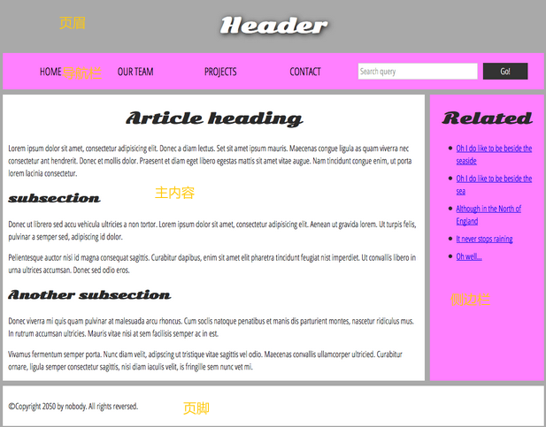

# HTML-介绍

## HTML-简介

> MDN 文档引用：
> 就其核心而言，HTML 是一种相当简单的、由不同元素组成的标记语言，它可以被应用于文本片段，使文本在文档中具有不同的含义（它是段落吗？它是项目列表吗？它是表格吗？），将文档结构化为逻辑块（文档是否有头部？有三列内容？有一个导航菜单？），并且可以将图片，影像等内容嵌入到页面中。

HTML 的主要特性总结

* 由不同元素组成的标记语言
* 标记文本片段为元素，以赋予其含义
* 组织文档，让其拥有逻辑结构
* 给予文档额外的功能性

## HTML-入门

### HTML-组织结构

HTML 构建的文章总体由各种元素组成，元素之间可以嵌套，且由于不同元素含有不同意义，元素之间可以拥有逻辑和排版上的结构  
HTML 文章与元素之间的关系大致可以表述如下图所示  

```mermaid
    graph TB
        subgraph HTML-文章-总体
            direction TB
            subgraph 元素1
                direction LR
                标签-标记元素类型 --- 属性与属性值-定义元素的额外行为 --- 内容-被标记的元素片段
            end
            subgraph 元素2
                direction TB
                subgraph 元素2自身内容
                    direction LR
                    标签2 --- 属性2 --- 内容2
                end
                subgraph 内含元素
                    direction LR
                    subgraph 元素3
                        direction LR
                        标签3 --- 属性3 --- 内容3
                    end
                    subgraph 元素4
                        direction LR
                        标签4 --- 属性4 --- 内容4
                    end
                    元素3 --- 元素4
                end
                元素2自身内容 --- 内含元素
            end
            元素1 --- 元素2
        end
```

### HTML-元素分类

#### 元素的具体结构  


#### 块级元素和内联元素

* `块级元素`在页面中以块的形式展现
  * 块级元素自己`独占一行`，通常是页面的`结构元素`
  * 块级元素可以嵌套在块级元素内，但不能嵌套在内联元素内
* `内联元素`通常嵌套在块级元素内
  * 内联元素不会导致换行
  * 内联元素通常和文本一起使用，并带来一些效果

> :grey_exclamation:元素的类型与 CSS 中`display:类型`并不一样，尽管 CSS 可以改变元素的显示，但不能够改变元素的类型，也改变不了元素间包含和被包含的关系

> :grey_exclamation:HTML5 重新定义了元素的分类，原因如上所示，害怕混淆

#### 空元素

有一些元素没有`结束标签`，它不包含文章片段，而是用来执行一些额外行为  
例如``或``就是用来在文章中插入图片所使用的元素  
这些元素称为`空元素`，如上所示在空元素标签的末尾添加`/`也是可行的，此时`XML`也可以识别该元素  

### HTML-元素属性

#### 属性简介

元素的属性通常是`定义元素行为`或为元素`添加额外信息`

  

* 属性和属性、属性和标签之间以空格分隔
* 属性与属性值以`=`相连
* 属性值由`" "`包裹

#### 属性使用示例

```html
    <a href="github.com" title="点击前往GitHub" target="_blank">前往GitHub</a>
```

示例元素的属性声明了元素的额外行为，与额外信息  

* `href`属性声明了`跳转目的地`这个额外信息
* `title`声明了`链接描述`这个额外信息
* `target`声明了`跳转方式`这个额外行为

#### 布尔属性

有些属性可以不用写它的属性值，因为它只有一个和它属性名相同的属性值  
这种属性称为`布尔属性`，通常是用于声明某种行为  
如表单元素的`disable`属性就是布尔属性，它表示禁用此表单元素

#### 属性值的引号问题

当元素中只有一个属性时可以不使用`" "`包裹属性值  
但当属性不止一个时，不使用`" "`包裹属性值则很可能产生错误结果  
可以使用`" "`也可以使用`' '`包裹属性值，可以嵌套，不能混用

### HTML-文档剖析

HTML 页面的一般结构  

```html
    <!DOCTYPE html>
    <html lang="zh-CN">
        <head>
            <meta charset="utf-8" />
            <title>我的测试站点</title>
        </head>
        <body>
            <p>这是我的页面</p>
        </body>
    </html>
```

* `<!DOCTYPE html>`是一个历史遗留问题，现在只需把它加入 HTML 页面文档开头即可
* `<html>`包含了页面的所有内容，称为`根元素`
* `<head>`包含了一些有关 HTML 页面的信息，其中内容并不显示在页面
* `<meta/>`用于设置一些独特的信息，如`字符集`、`关键字`等等
* `<title>`设置了页面的标题信息
* `<body>`包含了所有显示在页面上的信息

> :grey_exclamation:在 HTML 文档中连续的空格或换行在渲染时都仅被当成一个空格

### HTML-实体引用

实体引用类似于转义，是用来表示特殊字符的代码  
常用实体引用如下表

| 所表示字符 | 实体引用代码 | 所表示字符 | 实体引用代码 |
| :---: | :---: | :---: | :---: |
| < | `&lt` | > | `&gt` |
| " | `&quot` | ' | `&apos` |
| & | `&amp` | 空格 | `&nbsp` |

### HTML-注释

只需要用`<!--`和`-->`包裹起来注释内容即可创建一行 HTML 注释

## HTML-head标签内容

### `<title>`元素的使用

`<title>`是用来给 HTML 文档添加标题的标签，但是和`<h1>`不同  

* `<title>`添加的是整个文档文件的标题
* `<h1>`是为文档包含的内容添加标题

### `<meta>`元素

`元数据`是用来描述数据的数据，HTML 中可以使用`<meta>`来添加元数据  
`<meta>`有许多不同种类，常见的有如下一些  

#### 指定文档字符编码

```html
    <meta charset="字符集">
```

不同的字符编码会将同一字符数据解释为不同的字符，为了兼容性考虑，使用`utf-8`是最好的  
虽然某些浏览器会尝试修正错误编码，但这显然不稳妥，应该要指定字符编码

#### 为文档添加作者

```html
    <meta name="author" content="LoveEmiliaForever">
```

* `name`属性用于指定`<meta>`的类型
* `content`属性则包含了想要写入的数据

#### 给文档添加描述

```html
    <meta name="description" content="网页描述">
```

给网页添加描述能够让使用者快速了解网页，并且搜索引擎也会使用该元数据  

> :grey_exclamation: 许多的`<meta>`特性以及被弃用了，如`<meta name="keywords" content="关键字">`

#### 其它类型元数据

某些网站是有自己的元数据协议的，也就是说某些元数据类型是专门使用在特定网站上的  
如 Facebook、Twitter 都有一些特有的元数据协议，用于提供扩展服务  

### 自定义站点图标

可以在`<head></head>`中指定特定图片作为站点的图标（通常是`.ico`格式）  
可以使用下列语法指定站点图标

```html
    <link rel="icon" href="图标路径" type="image/x-icon">
```

### 引入-CSS-文件和-JS-脚本

可以在`<head>`内通过`<link/>`和`<script>`分别引入外部 css 文件、 js 文件  

```html
    <link rel="stylesheet" href="css文件路径">
```

```html
    <script src="js文件路径" defer></script>
```

给`<script>`添加属性`defer`即意味着告诉浏览器 “在解析完 HTML 文件后再加载 js 文件”。这样可以防止 js 在运行环境尚未完成时运行，避免出现错误  

### 给文档设定主语言

可以通过使用`lang`属性给元素设定主语言，该属性通常是被放置在`<html>`内，以规定该页面的主语言  

```html
    <html lang="zh-CN">
        页面内容
    </html>
```

## HTML-文本处理基础

### 标题和段落

通过将内容包裹在`<p>`中可以标记一个段落  
通过将标题内容包裹在`<h1>`到`<h6>`内，可以定义六个等级的标题  

* 使用标题时应该要安排好文档的层次结构
* 每个文档最好只使用一次`<h1>`，这是顶级标题
* 标题等级最好不要跳跃式定义
* 每个文档最好不要超过三个级别的标题

### 语义化的重要性

语义化标签可以元素赋予对应的含义，使得元素之间能够进行`视觉、逻辑、结构上的统一`  

这样做的好处有很多  

* 使文档结构清晰，易于阅读
* 让页面后续维护开发更加简单
* 利于搜索引擎提取页面信息

### 列表

#### 无序列表

无序列表是没有顺序标签的，也就是说使用该列表时顺序应该要是无关紧要的事情  
如下所示，`<ul>`用于声明无需列表，`<li>`用于声明列表项  

```html
    <ul>
        <li>吃饭</li>
        <li>睡觉</li>
        <li>喝水</li>
    </ul>
```

#### 有序列表

和无序列表相反，有序列表是有顺序标签的  
它们的结构相似`<ol>`用于声明有序列表，`<li>`用于声明列表项  

```html
    <ol>
        <li>步骤一</li>
        <li>步骤二</li>
        <li>步骤三</li>
    </ol>
```

#### 列表嵌套

列表之间是可以嵌套的，只需要在`<li>`内部插入`<ul>`或`<ol>`即可  

```html
    <ol>
        <li>步骤一</li>
        <li>步骤二</li>
        <li>步骤三
            <ul>
                <li>材料A</li>
                <li>材料B</li>
                <li>材料C</li>
            </ul>
        </li>
    </ol>
```

### 重点强调

HTML 中提供了一些标签用于标记文字，使得文字具有特殊效果，以达到强调文字内容的作用  

#### 斜体

可以使用`<em>`标记文本以获得斜体字，但是它是具有语义的元素  
如果仅仅只是想要斜体字，且没有代表什么含义那么就不应该使用`<em>`，可以使用`<i>`或是<kbd>`<span>` 或 `<mark>` + CSS </kbd> 

```html
    <!--此时的斜体代表著名书籍-->
    <p><em>《哈姆雷特》</em>是一本经典的书</p>
    <!--下面的斜体则没有什么含义-->
    <p>我<i>今天</i>想吃水饺</p>
```

#### 粗体

语义化的粗体标签是`<strong>`，普通的粗体标签是`<b>`  

#### 下划线

由于`超链接`一般会拥有下划线，所以如果要给文字添加下划线，最好定义一些独特的格式  
可以使用`<u>`定义下划线，但最好使用<kbd>`<span>` 或 `<mark>` + css</kbd>给下划线一个明确的语义，然后使用下划线  

#### 表象元素

HTML 中的大部分标签都是具有语义的，但有一些标签没有什么含义  
例如`<i>`、`<b>`、`<u>`
这些标签定义的元素叫做`表象元素`，应该减少这些标签的使用  

## 超链接

### 超链接简介

超链接是一个`地址`，指向`其它资源`或是`文档内容`  
点击超链接后就可访问`地址`，以进行跳转或获取资源  

### 超链接的定义

在 HTML 中可以使用`<a>`定义一个超链接，在其中还包含有一些属性以定义超链接  

```html
    <a href="地址" title="页面描述" target="打开方式">描述文字</a>
```

`<a>`可以包含`块级元素`，这基本意味着它可以把任何东西作为超链接而不单单是文字  

### URL与Path

`url`全名`Uniform Resource Locator`，它是代表了一个网络位置的字符串  
如`https://www.baidu.com`就是一个`url`  

`path`一般指本地的文件路径，是访问本地文件的一个路径，代表着文件的逻辑存放位置  

路径分为`相对路径`和`绝对路径`

* 绝对路径是从`根目录`开始定位文件位置的
* 相对路径则是依据现处位置定位文件位置
  * 相对于现路径同级则为`./`
  * 前往现路径的上一级为`../`

定义 超链接 访问文章锚点  

1. 为元素设置锚点`id=id名字`
2. 设置`<a>`的`href`为`#id名字`
3. 点击超链接即可前往对应位置

### 超链接最佳实践

* 不要使用 url 作为链接的描述
* 链接的描述应该 精确、简洁
* 不要用一些没有意义的词描述链接
* 当链接到特殊 url 时应该描述清楚（如下载，观看视频等）
* 当链接到下载文件的 url 时，应该使用`download`属性指定一个默认的下载文件名

### 定义邮箱链接

可以更改`地址`为`mailto:邮件地址`来指向一个电子邮箱  
甚至可以提前指定好`邮件题目subject`、`收件人cc`、`邮件内容body`

```html
    <a href="
    mailto:邮件地址&cc=address1&cc=address2&subject=xxx&body=xxx">
        发送一个邮件
    </a>
```

> :exclamation:`cc`、`subject`、`body`中包含的信息应该要被转义过

## 文本处理进阶

### 描述列表

除了`无序列表`和`有序列表`外，还存在着`描述列表`  
这种列表的每一项包括`目标文本`和`描述文本`，其中`描述文本`可以有多个  
它的定义和其它列表也不太一样  

```html
    <dl>
        <dt>被描述的东西</dt>
            <dd>相关的一些描述，解释，介绍等等</dd>
        <dt>被描述的东西</dt>
            <dd>相关的一些描述，解释，介绍等等</dd>
        <dt>被描述的东西</dt>
            <dd>相关的一些描述，解释，介绍等等</dd>
            <dd>相关的一些描述，解释，介绍等等</dd>
    </dl>
```

### 引用

HTML 有用于标记引用的标签，并且有`块引用`和`行内引用`  
浏览器会分别给它们添加默认的样式  

```html
    <!--块引用-->
    <blockquote cite="引用地址">
        <p>引用一个 HTML 块</p>
    </blockquote>
    <!--行内引用-->
    <p>
        有一句很著名的话，
        <q cite="引用地址">一千个读者有一千个哈姆雷特</q>
        广为人知
    </p>
```

使用`<blockquote>`和`<q>`标签虽然为文本添加引用样式，但是不能充分利用`cite`属性的内容  
因此，使用`<a><cite></cite></a>`这样的结构更能够体现引用地址  

```html
    <a href="寂静的春天">
        <cite>
            《寂静的春天》
        </cite>
    </a>
    描述了一个悲惨的世界
```

### 缩略语

在编辑文档时经常遇到`缩略语`的编写，为了防止有人不知道缩略语的意思，编写者通常会解释一遍缩略语  
如果使用`<abbr>`标签，那么当鼠标移到缩略语上时，缩略语会自动浮现出全名  

```html
    <p>
        <abbr title="Hyper Text Markup Language">HTML</abbr>
        是一个非常重要的标记语言
    </p>
```

其中`title`属性应该填写有关缩略语的全称  

> :grey_exclamation:曾经有一个`<acronym>`也是缩略语，但它已经废弃  

### 联系方式标记

可以使用`<address>`标记联系地址  

```html
    <address>
        <p>123大街123号</p>
        <a href="mailto:123456@gamil.com">我的邮箱</a>
    </address>
```

> :grey_exclamation:联系方式标记的位置要小心，不要搞错了
> `<address>`标记的联系方式应该是离它最近的`<article>`所属
> 或是当它放在`<footer>`时，它应该是整个页面的联系方式

### 上标、下标

上标的标签是`<sup>`，下标的标签是`<sub>`

### 展示计算机代码

* `<code>`用来标记计算机通用代码
* `<pre>`将文本包裹在其中，`空白字符`和`换行符`将以原样展示
* `<var>`标记变量名
* `<kbd>`标记输入
* `<samp>`标记输出

```html
    <p>下面是一段 Python 代码</p>
    <pre>
        <code>
            <var>BAT</var>="比亚迪，埃安，特斯拉"
            <var>STR</var>=input()
            print(BAT,STR)
        </code>
    </pre>
    <p>当我们输入<kbd>我爱</kbd>后，程序会输出<samp>比亚迪，埃安，特斯拉我爱</samp></p>
```

### 标记时间和日期

因为文本表示时间的格式太多了，因此可以把时间插入到`<time>`中  
并为它设置一个`机器时间`，以此统一时间格式  

```html
    <time datetime="2016-06-26">2023年 6月 26日</time>
```

> :grey_exclamation:注意如果时间的位数不够，要用零填补其它位置

利用`datetime`设置一个机器时间

## 文档与网站架构

HTML 不仅能够定义一些细分的结构，也可以使用块级元素定义网页的整体架构，从而使得网页`规划整齐`、`可读性高`、`语义化强`  

### 文档的基本组成部分

* 页眉
  * 通常横跨网页顶部，有大标题或标志
  * 放置一些网站的通用信息，通常存在于每个网站页面
* 导航栏
  * 存放着指向网站各部分的超链接，是一个索引集
  * 通常不跟随页面改变而改变
* 主内容
  * 存放有网页的展示信息等等
* 侧边栏
  * 一些辅助性的功能，通常和主内容有关
* 页脚
  * 和页眉相似，放在网页底部
  * 通常放置一些声明，链接等等信息



### 用于构建内容的HTML

HTML 可根据功能来为区段添加标记，使用元素来无歧义地表示内容区段  

| 标签 | 名字 | 介绍 |
| :---: | :---: | :---: |
| `<header>` | 页眉 | 如果是`<main>`的子元素那么就是网页的页眉<br>如果是`<article>`、`<section>`的子元素那么就是它们独有的页眉 |
| `<nav>` | 导航栏 | 包含页眉的导航功能，但不应该包含二级链接等等 |
| `<main>` | 主内容 | 存放每个页面独有的内容，每个页面仅有一个 |
| `<article>` | 文章 | 包裹着一篇文章这类的，与其它部分无关 |
| `<section>` | 大分区 | 组织页面的分块 |
| `<aside>` | 侧边栏 | 包含有一些间接信息，辅助功能等等 |
| `<footer>` | 页脚 | 放置页面的页脚，内含一些通用信息 |
| `<div>` | 块级无语义标签 | 配合id、class使用 |
| `<span>` | 内联无语义标签 | 配合id、class使用 |
| `<br>` | 换行 | 适当的换行能够优化结构 |
| `<hr>` | 水平线 | 使用水平线可以分隔不同部分 |

> :exclamation:不要滥用`div`标签，能不用就不用

## HTML-调试

通常的代码错误分为下列两种  

* 语法错误：使用错误的编写使得程序无法运行
* 逻辑错误：存在逻辑上的错误使得不能产生预期结果

因为浏览器是以`宽松模式`运行的，HTML并不容易出现导致程序停止的错误  
但正因如此，浏览器在修复语法错误时很可能给出非预期的结果  

在不规则语法时，可以手动查找  
但更好的方法是使用[标记验证服务网站](https://validator.w3.org/)，让机器帮助你找到语法错误  

## HTML-语义化小项目

[HTML-语义化-信件](./HTML-语义化-信件/HTML-语义化-信件.html)
[HTML-语义化-观鸟者网](./HTML-语义化-观鸟者网/index.html)
