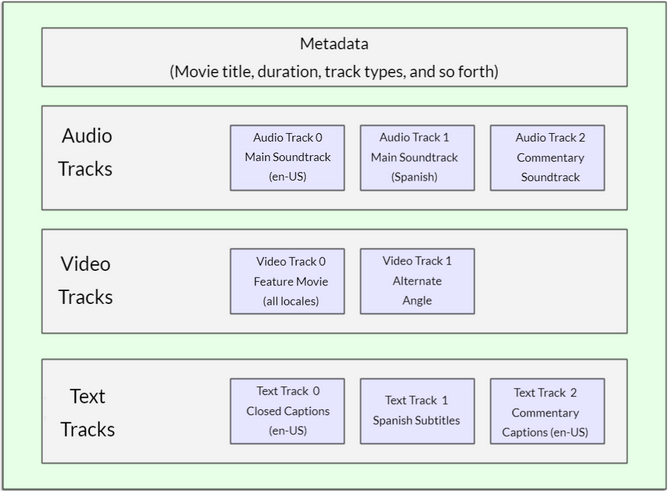
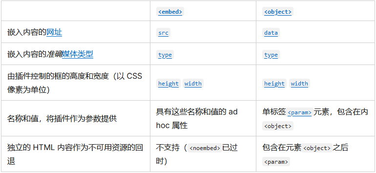

# HTML-多媒体与嵌入

## HTML-中的图片

### 将图片放入网页

可以使用``来将图片嵌入网页，它是一个空元素，最少只需`src`属性即可工作  

```html
    
```

`src`指向图片资源的地址，是``正常工作必不可少的属性

> :exclamation:除非有必要，否则**永远不要**把`src`指向其它网站上的图片，这被称之为`盗链`，如果这样做，你会占用他人带宽，可能降低你的页面加载速度，图片将不受你的控制可能被替换

> :grey_exclamation:像是``和`<video/>`这样的元素有时被称之为`替换元素`，因为它们的内容和尺寸由外部资源决定，而非元素本身

`alt`属性的属性值称之为`备选文本`，它应该是用于描述图片的文本  
`备选文本`会在图片加载出错时被展示出来，会被搜索引擎所检索，能够用在一些特殊应用场景  

> :grey_exclamation:备选文本的关键是保证网页在无法加载图片时的使用

可以给``添加`width`和`height`属性以指定它的宽高，但是这样的方法不好  
**如果要改变图片在网页显示的尺寸应该使用`CSS`而非HTML**  

使用`title`可以给图片添加标题，图片标题通常会在鼠标悬停时出现  
不要把重要信息放置其中，`title`属性的重要性较小

### 打包图片和其相关元素

有时，我们希望给图片一个解说，并通常使用`<p>`创建解说  
但问题是，从语义的角度看，``和`<p>`并没有什么关联，这可能造成一些问题  
此时，可以使用`<figure>`和`<figcaption>`元素打包图片和图片相关的元素  

```html
    <figure>
        
        <figcaption>对图片的解释介绍</figcaption>
    </figure>
```

其中`<figure>`可以把一些元素打包成一个整体，`<figcaption>`则是用来给图片添加描述的  

并且`<figure>`不一定只是用来打包图片的，也可以用来打包其它东西  

* 用简洁、易懂的方式表达意图
* 可以放在页面的某处
* 为主要内容提供重要的补充说明

因此，`<figure>`可以是几个图片、一段代码、音视频、方程、表格之类的  

### CSS放置图片和HTML放置图片的区别

主要的区别是`语义方面`的，也就是说图片有没有意义  
如果图片是用来装饰或干什么的，使用 CSS 更好，如果图片是有意义的使用 HTML 更好  

## HTML-中的音视频

在`HTML5`中出现了`<video>`和`<audio>`标签，还有一些API对它们进行控制  

### `<video>`标签

`<video>`标签可以插入视频到网页之中  

```html
    <video src="视频地址" controls>
        <p>后备内容</p>
    </video>
```

* `src`属性
  * 指向你想要嵌入的视频的地址  
* `controls`属性
  * 用户在观看视频时会需要对视频进行操作，`controls`意味着添加浏览器默认视频控制界面
  * 同时，也可以使用`JS`来根据`API`构建自定义的控制界面
* `<video>`的内容
  * 它的内容叫做`后备内容`，当浏览器不支持`<video>`时就会显示这段内容
  * 这是出于兼容性考虑的设计

### 设置多个播放源

#### 音视频的格式

视频文件是有多种格式的，常见的如`MP3`、`MP4`、`WebM`  
他们定义了音频轨道和视频轨道的储存结构，其中还包含描述这个媒体文件的元数据，以及用于编码的编码译码器等等  

一个`WebM`格式的视频文件如下所示，它包含`音频轨道`、`视频轨道`、`文本轨道`  



其中的`音频轨道`以`音频编解码器`进行操作，`视频轨道`以`视频编解码器`进行操作  

* WebM格式，在所有现代浏览器都支持，除了老版本
* MP4格式，包括IE在内的所有现代浏览器都支持
* Ogg格式，Firefox和Chrome支持，但它已经被WebM取代

音频文件则简单许多，只有一个音轨  
常见的音频文件有`MP3`、`FLAC`、`Ogg`  

#### 多种格式的播放源

由于`MP4`是存在版权要收费的，因此有其它的开源视频格式  
浏览器内会有各种`解码器`，但是不同的浏览器拥有的解码器并不完全相同  
因此要准备多种视频格式  

```html
    <video controls>
        <source src="MP4视频格式" type="video/mp4">
        <source src="WebM视频格式" type="video/webm">
        <p>备选文本</p>
    </video>
```

设置多个播放源时，移除了`<video>`的`src`属性，然后将`<source/>`包括在`<video>`之中以提供源地址信息  
在`<source/>`中有`type`属性，是用来说明源的格式的  
有了`type`后浏览器识别视频格式会快很多，否则就要一个个加载，一个个尝试  

### 其它`<video>`特性

`<video>`还拥有其它很多的实用`属性`，如下所示

```html
    <video controls width="400" height="400"
        autoplay loop muted
        poster="poster.png">
        <source src="MP4文件地址" type="video/mp4">
        <source src="WebM文件地址" type="video/webm">
        <p>备选文本</p>
    </video>
```

* `width="数字"`和`height="数字"`
  * 可以用此属性控制视频尺寸，也可以用 CSS 控制视频尺寸
  * 无论怎么设置高宽，视频都会保持原来的长宽比，而超出部分以黑边填充
* `autoplay`
  * 这个属性会使得音视频自动播放，即使其余部分没有加载完
  * 尽量不要使用这个属性，用户会反感，某些浏览器会禁用自动播放
* `loop`
  * 让音频或视频循环播放，同样不建议使用
* `muted`
  * 他会让媒体静音
* `poster="图片地址"`
  * 当视频没有播放时，它会给视频一个封面
* `preload="下列选项"`用来缓冲较大的文件
  * `"none"`：不缓冲
  * `"auto"`：页面加载后缓冲媒体文件
  * `"metadata"`：只缓冲媒体文件的元数据

### `<audio>`标签

`<audio>`和`<video>`使用方法很相似，只有一些地方不同  

```html
    <audio controls>
        <source src="MP3音频地址" type="audio/mp3">
        <source src="Ogg音频地址" type="audio/ogg">
        <p>备选文本</p>
    </audio>
```

* 不支持`width`和`height`标签，没有可视化部件
* 不支持`poster`，同样没有可视化部件

### 用 JS 控制媒体

可以在 JS 中使用`load()`方法来重置媒体，也就是重新加载播放  

通过监听`HTMLMediaElement.audioTracks`对象的`addtrack`事件，可以使用 JS 对音轨的增加做出响应  

```js
    const mediaElem = document.getElementById("my-media-element");
    mediaElem.load();

    const mediaElem = document.querySelector("video");
    mediaElem.audioTracks.onaddtrack = function(event) {
    audioTrackAdded(event.track);
    }
```

### 给声音添加字幕

在 HTML5 中可以给`<audio>`或`<video>`添加`<track>`进而引入字幕文件  

字幕文件是使用`WebVTT`格式编写的，并有如下类型  

* `subtitles`：字幕类型，如翻译字幕等
* `captions`：也是字幕，但一般是同步翻译对白、描述一些重要信息声音
* `timed descriptions`：文字转为音频，服务有视觉障碍的人

一个WebVY文件

```webvtt
    WEBVTT

    1
    00:00:22.230 --> 00:00:24.606
    第一段字幕

    2
    00:00:30.739 --> 00:00:34.074
    第二段

    ...
```

可以在`<video>`或`<audio>`引入`<track>`标签，`<track>`要放在所有的`<source>`后面  

```html
    <video controls>
        <source src="example.mp4" type="video/mp4">
        <source src="example.webm" type="video/webm">
        <track kind="subtitles" src="subtitles_en.vtt" srclang="en">
    </video>
```

其中`<track>`标签有三个属性`kind`、`src`、`srclang`  

* `kind`属性用来指明字幕的类型，可以有`subtitles`、`captions`、`descriptions`三种类型  
* `src`用来指明字幕文件路径
* `srclang`指明字幕的语言类型

> :grey_exclamation:添加文本轨道还有利于SEO

## object、iframe等其它嵌入技术

### `<iframe>`详解

#### iframe使用

`<iframe>`元素可以让你将其它的web文档嵌入到当前文档中，这很适合将第三方内容嵌入网站内  
但它有一些**严重的安全隐患**要考虑，需要谨慎设置  

```html
    <iframe src="目标地址"
            width="100%" height="500" frameborder="0"
            allowfullscreen sandbox>
    <p>备选文本</p>
    </iframe>
```

* `allowfullscreen`：允许`<iframe>`通过全屏API设置为全屏模式
* `frameborder`：默认情况为`1`绘制边框，设置为`0`删除边框，应该使用`CSS`设置`border:none`
* `src`：指向要嵌入文档的地址
* `width`和`height`：和其它标签一样
* `sandbox`：沙盒模式，能够提高安全性

> :grey_exclamation:为了提高速度，在主内容完成加载后，使用 JavaScript 设置`<iframe>`的`src`属性更好

#### 安全隐患

虽然`<iframe>`是有安全隐患的，但只需要谨慎和完善的设置就能够使用它  

网络的黑客(hacker)常将iframe作为攻击目标，或称为攻击向量[^1]  

预防方法如下所示

1. 只在必要时嵌入第三方内容，这样会免去许多麻烦  
2. 使用`HTTPS`为网站提供服务，**绝对不能使用`HTTP`嵌入第三方内容**
   * `HTTPS`减少了远程内容在传输过程中被篡改的机会
   * `HTTPS`防止嵌入式内容访问你的父文档和子文档的内容
3. 始终使用`sandbox`属性
   * `sandbox`属性可以给嵌入的内容自动指定最低限度的权限
   * 使用`sandbox=""`设置权限
   * **永远不要同时添加`allow-scripts`和`allow-same-origin`到`sandbox`属性值内**
4. 配置`CSP`指令
   * `CSP`代表`内容安全策略`，它提供一组HTTP标头，旨在提高HTML文档安全性
   * 可以配置服务器，以防止其它网站嵌入你的网站内容[配置X-Frame-Options](https://developer.mozilla.org/zh-CN/docs/Web/HTTP/Headers/X-Frame-Options)

[^1]: 攻击向量就是攻击者用来获取本地或远程网络和计算机的一种方法，一般用于描述攻击者（或恶意软件）的攻击路径

### `<embed>`和`<object>`

这两个标签时用来嵌入多种类型外部内容的通用嵌入工具  
例如嵌入Java小程序、Flash、PDF、视频、SVG、图像等等  

然而它们已经老了，因此了解一下以防遇到它们是不知道是干什么用的  



### 其它的嵌入标签

其它还有一些HTML5的嵌入标签  
`<canvas>`用于 JS 生成的 2D 和 3D 图形  
`<svg>` 用于嵌入矢量图形  

## 嵌入矢量图形

### 什么是矢量图形

网络上主要有两种类型的图片

* 像素图：包含的是像素位置和像素颜色等信息，放大会像素化
* 矢量图：包含了图形和路径的定义，是使用算法计算出图形的图片，放大照样清晰

### 什么是SVG

`SVG`是用于描述矢量图像的`XML语言`，它基本上是像 HTML 一样的标记，只是你有许多不同的元素来定义要显示在图像中的形状，以及要应用于这些形状的效果  

```html
    <svg version="1.1"
        baseProfile="full"
        width="300" height="200"
        xmlns="http://www.w3.org/2000/svg">
    <rect width="100%" height="100%" fill="black" />
    <circle cx="150" cy="100" r="90" fill="blue" />
    </svg>
```

上面的代码将展示如下图案  


虽然可以通过手动编写简单SVG，但遇到复杂图形时还是使用像`inkscape`、`illustrator`这样的编辑器更好  

| SVG的优点 | SVG的缺点 |
| :---: | :---: |
| 图像中的文本仍可访问，利于SEO | SVG容易变复杂，使得文件大小处理速度上升 |
| SVG可以被CSS、JS操作 | SVG创建可能更难 |
| 放大不会失真 | 老旧浏览器不兼容它 |

### 添加SVG到页面

#### 使用``添加`SVG`

```html
    
```

| 优点 | 缺点 |
| :---: | :---: |
| 使用方便快捷 | 无法使用css、js操作svg |
| 可以将其作为``对待 | 不能应用css伪类重设图像样式 |

#### 在HTML中引入SVG代码

```html
    <svg width="300" height="200">
        <rect width="100%" height="100%" fill="green" />
    </svg>
```

直接打开`SVG`并复制它的代码到HTML中，这称为`SVG内联`  

| 优点 | 缺点 |
| :---: | :---: |
| 减少HTTP请求 | 让HTML更加繁杂 |
| 可以用css、js操作 | 会增加HTML大小 |
| SVG唯一使用CSS交互、CSS动画的方法 | 浏览器不把它当作普通图片对待 |
| 可以把它包裹在超链接内 | 需要兼容老旧浏览器 |

#### 使用`<iframe>`嵌入SVG

```html
    <iframe src="triangle.svg" width="500" height="500" sandbox>
        
    </iframe>
```

这不是个好方法，如果浏览器不支持`<iframe>`则会回退到备选文本，此外除非SVG和网页同源，否则不能用js操作它  

## 响应式图片

### 为什么用响应式图片

由于设备的不同，每个人的屏幕、分辨率都不一样  
同样的图片在不同设备上显示的效果不同，有时会产生不理想的效果  

即使响应式的改变图片的大小，图片仍然可能显示出不理想的效果  
因此，有如下解决方法

* 提供不同分辨率的图像，以适配清晰度不同的屏幕，称为**分辨率切换问题**
* 为不同的屏幕提供裁剪过后不同大小的图片，以改进阅读体验，称为**美术设计问题**

### 分辨率切换：不同尺寸

可以在``内添加`srcset`和`sizes`属性来判断应该使用什么图片  

```html

```

`srcset`属性定义了一系列的图片信息，每个图片信息之间用`,`隔开，一个图片信息包括  

1. 图片地址
2. 空格
3. 图片的宽度，真实单位是像素但是写出来的单位应该是`w`

`sizes`定义了一组媒体条件，当条件为真时选择一个期望尺寸，每个条件之间同样以`,`隔开  

1. 一个媒体条件如`(max-width:600px)`视口宽度小于等于600px
2. 一个空格
3. 条件为真时，期望宽度大小

> :grey_exclamation:示例中有一个没有媒体条件的，那是使用在无匹配条件时的默认选项

在有了这些属性后，浏览器会如下运行：

1. 检查设备宽度
2. 检查`sizes`列表真假值，并最终得到`期望宽度大小`
3. 加载`srcset`中最接近`期望宽度大小`的图片

> :grey_exclamation:如果在把浏览器宽度设置到最小时，没有加载更小的图，应该检查一下此时的视口大小`document.querySelector('html').clientWidth`,不同浏览器可以缩小到的最小宽度不同，有时会超过这个最小宽度

> :grey_exclamation:在`<head>`中存在这样的元数据`<meta name="viewport" content="width=device-width">`,这行代码会强制让手机浏览器采用它们真实可视窗口的宽度来加载网页，这样才能使用响应式

### 分辨率切换：同尺寸，不同分辨率

结合`srcset`和`x语法`能够让浏览器选择合适分辨率的图片

```html
    
```

浏览器会计算出正在显示的显示器的分辨率，然后`srcset`引用的最适合的图片，`2x`代表用两个或更多设备像素表示一个显示像素  

### 美术设计

美术设计问题涉及到更改显示的图像以适应不同的显示尺寸  
分辨率切换是改图像尺寸不改图像内容，美术设计是改更改图像内容、尺寸

```html
    <picture>
        <source media="(max-width: 799px)" srcset="elva-480w-close-portrait.jpg" />
        <source media="(min-width: 800px)" srcset="elva-800w.jpg" />
        
    </picture>
```

`<source>`可以包含`media`、`srcset`、`sizes`、`type`  
`media`和`srcset`不应该一起用，`media`应该用在美术设计时  
`type`在`<source>`中起到的作用和在`<video>`起到的作用一样，用于选择合适的格式  
任何情况下，都应该提供一个``作为备选图片  

