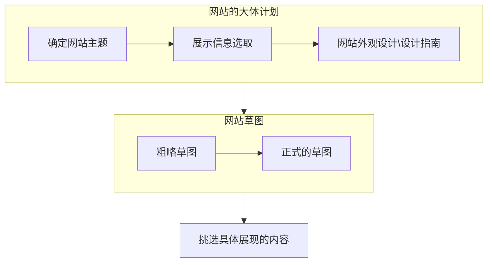
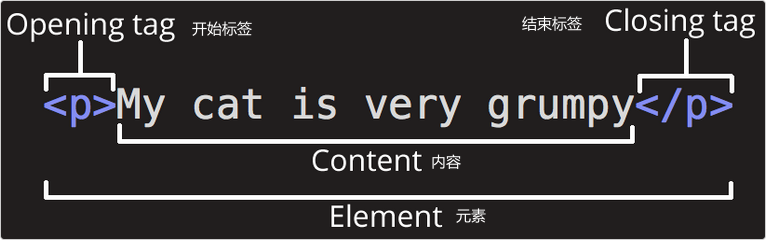
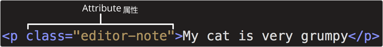
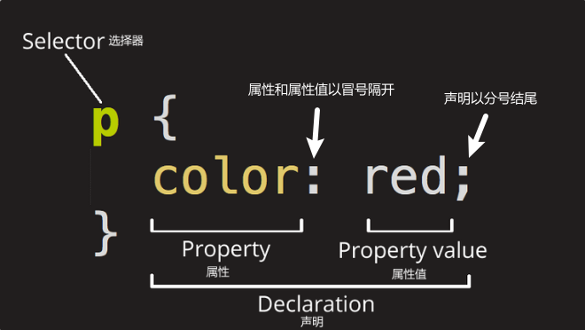
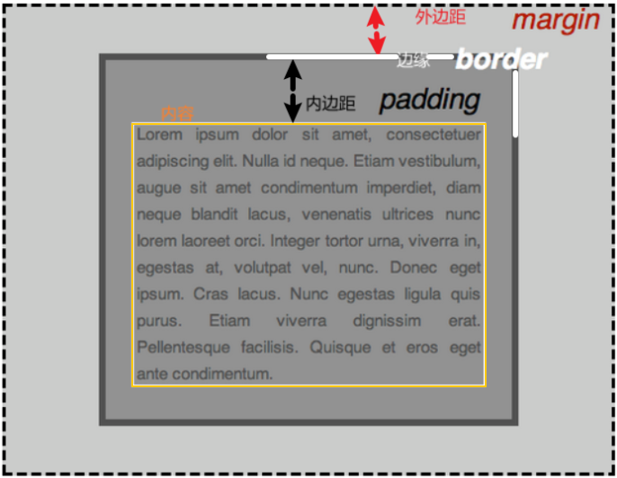
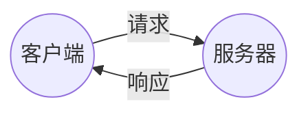
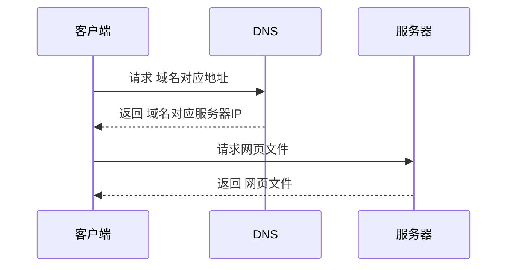
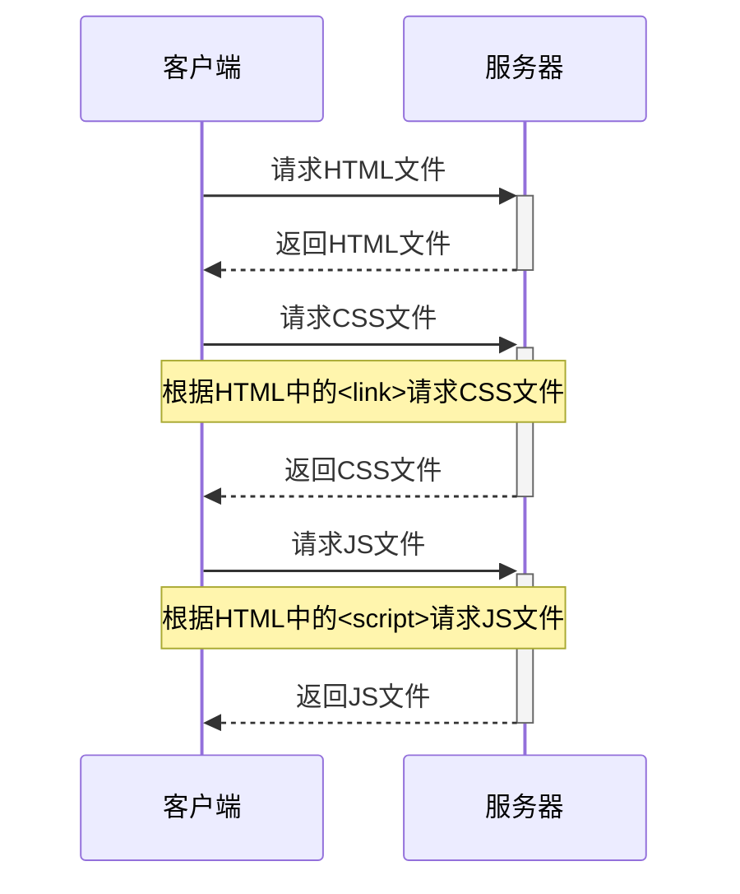
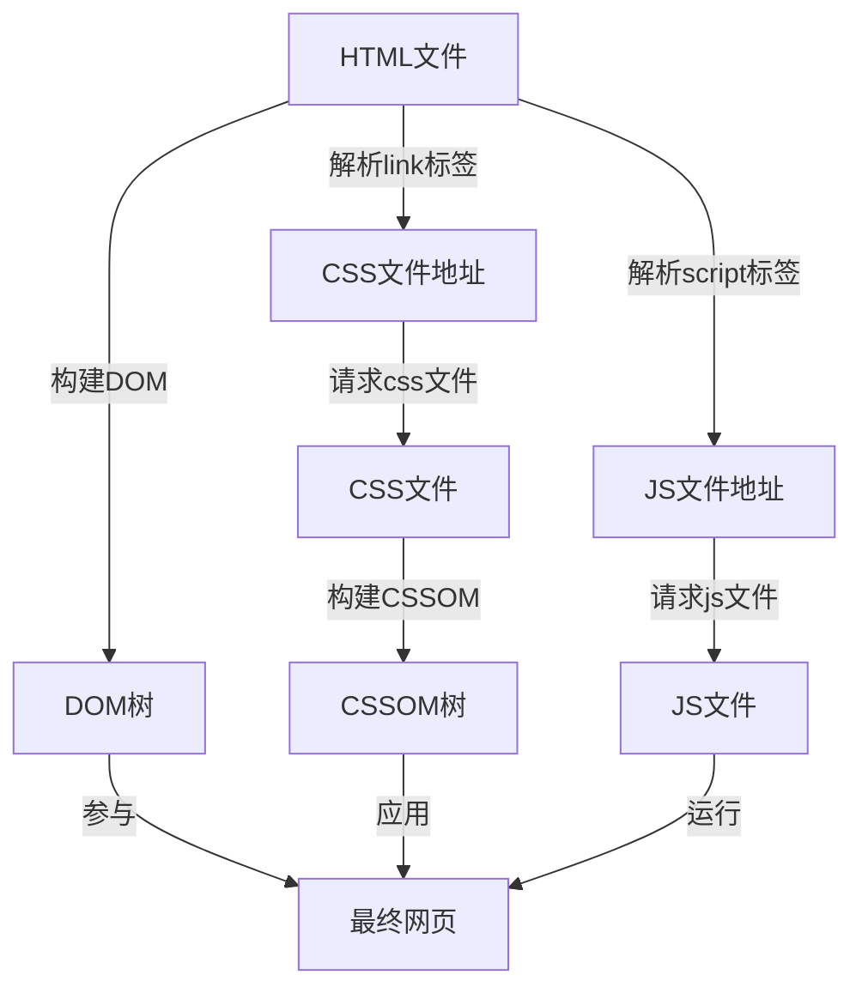

# Web 入门

## 安装基础软件

* 计算机：Windows、MacOS、Linux
* 文本编辑器：VS Code（推荐）、Sublime Text、Atom、Vim等等
* IDE（和文本编辑器二选一即可）：Dreamweaver（不推荐）、WebStorm
* 多种浏览器：Firfox、Chrome、Opera、Safari、Edge、IE（测试兼容性问题）、Lynx（无障碍友好浏览器）
* 图形编辑器：Photoshop等等
* 版本控制系统：Git、SVN
* FTP工具：老式web托管账户，以管理服务器文件。Cyberduck、Fetch、FileZilla
* 自动化构建工具：Webpack、Vite、Grunt、Gulp，用来自动执行重复性任务，简化代码运行和测试
* 库、框架等等
  * 应该库往往是一个现有的JS或CSS文件，提供了现成的功能供编码时使用
  * 框架则更进一步，提供了一个完整的系统和一些自定义的语法，能够使用它们写一个 Web 应用

## 设置一个本地测试服务器

在使用了某些技术后，如果想要测试程序，需要模仿服务器端到客户端的环境  
例如程序含有`异步请求`或`服务端代码`

使用`Python`的`SimpleHTTPServer`模块构建一个简单的HTTP服务器

* 安装`Python`
* 使用命令行 cd 进入程序的所在目录
* 根据版本使用启动服务器命令
  
  ```python
    # 3.x的Python
    python -m http.server
    # 2.x的Python
    python -m SimpleHTTPServer
  ```

* 浏览器进入`localhost:8000`即可，如果8000端口被占用，在启动服务命令后面加上端口，如`python -m http.server 9000`
* 如果需要运行服务端代码，应该确保有它们的运行环境

## 设计网站外观（网站设计）



## 文件组织结构

网站包含了各种各样的文字，是一个文件集合体的展示  
所以妥善安排好文件之间的结构就是十分重要的事情  
在对文件的命名时最好使用`小写字母单词-小写字母单词`的形式，以避免各个系统之间的兼容性问题  

## HTML 基础

### HTML 简介

HTML 的中文是`超文本标记语言`  
它由一系列`元素`组成，并组织元素的展示方式  

### HTML元素详解

而`元素`的标记，则使用`标签`或`标签对`包裹内容  


`元素`是可以拥有属性的  
  

* 属性和元素名、属性和属性之间应有空格
* 属性和属性值由`=`连接
* 属性值应该被`" "`包裹

`元素`可以嵌套，这样它们的效果会叠加  

```html
    <p>My cat is <strong>very</strong> grumpy.</p>
```

`空元素`是不包含任何内容的元素如``元素

### HTML 文档结构

HTML 有一些基本结构，如下所示

```html
    <!DOCTYPE html>
    <html><!--别名：根元素-->
        <head><!--网页的头信息，不会被渲染，但是用于设置一些东西-->
            <meta charset="utf-8"><!--设定网页的编码-->
            <title>网页标题</title>
            <link href="CSS样式表的位置" rel="stylesheet"><!--引入CSS文件-->
        </head>
        <body><!--网页呈现内容，会被渲染-->
            内容
            <script src="js文件的位置"></script><!--引入JS文件-->
        </body>
    </html>
```

### ``元素

```html
    
```

### 标题

HTML 中可以定义六个级别的标题`<h1>`到`<h6>`

```html
    <h1>一级标题</h1>
    <h2>二级标题</h2>
    <h3>三级标题</h3>
```

### 段落

使用`<p> </p>`来指定段落

```html
    <p> 段落内容 </p>
```

### 列表

列表的标记需要两种标签，`列表类型`与`列表项`  
其中`列表项`被包含在`列表类型`中  
`列表类型`包括`<ul>无序列表</ul>`以及`<ol>有序列表</ol>`，列表项为`<li></li>`  

```html
    <ul>
        <li>第一项的内容是什么什么</li>
        <li>第二项的内容又是什么什么</li>
    </ul>
```

### 链接

链接使用`<a href="指向地址">显示名称</a>`

```html
    <a href="https://www.github.com">前往 GitHub</a>
```

## CSS 基础

### CSS 简介

CSS 能够为网站内容添加样式，使它变得好看  
CSS是一门样式表语言，它是由规则集构成的，规则集结构如下  
  

### CSS 选择器

CSS 有多种多样的选择器，以选取所需元素  
下面是常用的选择器  

| 选择器名称 | 选择内容 | 示例 |
| :---: | :---: | :---: |
| 元素选择器 | 指定类型的元素 | `p`选择所有`<p>` |
| id选择器 | 选择`id`所对应的元素，id是唯一的 | `#element-id`选择到`<标签 id="element-id">`的元素 |
| 类选择器 | 选择具有特定类的元素，类可以有多个实例 | `.element-class`选择到所有`<标签 class="element-id">`的元素 |
| 属性选择器 | 选择具有特定属性的元素 | `img[src]`选择所有包含有`src`属性的`` |
| 伪类选择器 | 选择元素的特定状态（如被点击时的状态） | `a:hover`选择所有`<a>`的`hover`状态 |

### 字体与文本样式设置

CSS 能够设置文本的字体和排版样式，以美化网页，常用的属性如下  

```css
    选择器 {
        font-size: 12px;/*字体大小设置*/
        text-align: center;/*水平对齐方式设置*/
        line-height: 2em;/*行高设置*/
        letter-spacing: 1em;/*字间距设置*/
    }
```

### CSS盒子模型

CSS 将大部分的 HTML 元素看作一个个的盒子，盒子有其自身属性，盒子之间有嵌套等等关系  
  

* `padding`（内边距）：是指内容周围的空间。
* `border`（边框）：是紧接着内边距的线。
* `margin`（外边距）：是围绕元素边界外侧的空间。
* `元素`则是`内容+内边距+边缘`

CSS 不但能对上面的属性进行设置，还能够对其它的盒子属性进行一些设置  

* `width`：元素的宽度
* `background-color`：元素内容和内边距底下的颜色
* `color`：元素内容（通常是文本）的颜色
* `text-shadow`：为元素内的文本设置阴影
* `display`：设置元素的显示模式

## JavaScript 基础

### JS 简介

JS 是一门编程语言，可以为网站提供动态的交互特性  
JS 简介、灵活，且生态非常的宽广，拥有大量实用工具  

* 浏览器应用程序接口（API）：浏览器的内置API
* 第三方 API：开发者可以使用其他内容提供者的功能（如：Twitter、Facebook）
* 第三方框架和库：用来快速构建网站和应用

### JS 入门

#### 变量

声明一个变量可以使用关键字`var`、`let`、`const`，它们产生的效果各不相同  
在 JS 中变量的名字是`大小写敏感`的，且有一些限制  
JS 语句最好使用`;`结尾

```javascript
    let name = "BlackCat";
    name = "WhiteCat";
    console.log(name);//显示为WhiteCat
```

#### 变量类型

JS 的变量有各种各样的类型，常见的5种如下

| 变量 | 解释 | 示例 |
| :---: | :---: | :---: |
| String | 字符串：字符串值必须用引号括起来 | `let name = "Cat";` |
| Number | 数字：正常书写 | `let num = 10;` |
| Boolean | 布尔值：`true`或`false` | `let flag = true;` |
| Array | 数组：存储多个值的结构 | `let array = [1, "Cat", true]` |
| Object | 对象：JS的一切都是对象，一切都可存储在对象内 | `let variable` `document.querySelector("h1")` 变量、方法都是对象 |

#### 运算符

运算符能对变量进行操作，得到结果

| 运算符 | 解释 | 符号 | 示例 |
| :---: | :---: | :---: | :---: |
| 加 | 把数字相加，或拼接字符串 | `+` | `6 + 9` `"STR1"+"STR2"` |
| 减、乘、除 | 数学运算 | `-`、`*`、`/` | `2-1`、`2*2`、`4/2` |
| 赋值 | 给变量赋值 | `=` | `let Variable = "Cat"` |
| 等于 | 测试两个值是否相等，返回一个布尔值 | `===` | `let a = 3; a === 1; false` |
| 不等于 | 测试两个值是否不相等，返回一个布尔值 | `!==` | `let a = 3; a !== 1; true` |
| 取非 | 返回逻辑相反的值 | `!` | `let a = true; !a; false` |

#### 条件语句

常用`if(条件){执行}else{执行}`  

```js
    let k = false;
    if (k) {
        console.log("k=false");
    } else {
        console.log("k=true");
    }
```

#### 函数

函数是一些可复用代码的集合  

```js
    function 函数名(参数1, 参数2){
        代码
        return 结果;
    }
```

#### 事件

事件是浏览器发生的一些事情，可以将 JS 代码和事件绑定以对事件做出一些回应  

```js
    document.querySelector("html").addEventListener("click", function () {
    alert("别戳我，我怕疼。");
    });
```

上例中，先选择了元素，再调用了元素的`addEventListener()`方法，把事件`click`和函数`function(){alert("xxx");}`做了绑定  

在例子中定义的函数是`匿名函数`它没有名字，除了上述的定义方法外还可以使用`() =>{}`定义匿名函数

## 万维网的工作流程

### 客户端与服务器



* 客户端
  * 接入互联网的设备
  * 设备上的联网软件
* 服务器
  * 存储网页、网站、应用等的计算机

### 其余部分

* 网络连接
  * 有了网络连接才能在互联网发送和接受数据
* TCP/IP
  * 传输控制协议，定义数据如何进行传输的协议
* DNS
  * 域名解析系统，能够将域名映射到具体的服务器IP
* HTTP
  * 定义客户端和服务器之间交流的协议
* 组成文件
  * 代码：组织规划网页的文件
  * 资源：参与构建网页的文件

### 进入网站时发生了什么



### 解析组成文件的顺序




