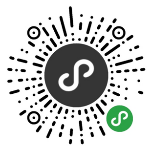

# 小程序简介

小程序是一种全新的连接用户与服务的方式，它可以在微信内被`便捷地获取和传播`，同时具有出色的使用体验。  

## 小程序技术发展史

1. 2015年初，微信发布了一整套`网页`开发工具包，称之为 JS-SDK，开放了拍摄、录音、语音识别、二维码、地图、支付、分享、卡券等几十个API。
2. 微信面临的问题是如何设计一个比较好的系统，使得所有开发者在微信中都能获得比较好的体验。这个问题是之前的 JS-SDK 所处理不了的，需要一个全新的系统来完成，这就是`小程序`的由来。

## 小程序和普通网页开发的区别

小程序的主要开发语言是 JavaScript ，小程序的开发同普通的网页开发相比有很大的相似性，但是二者还是有些许区别的。  

| Web网页 | 小程序 |
| :---: | :---: |
| 单线程 | 逻辑层和渲染层线程不同 |
| 有完整的浏览器对象 | 缺少BOM、DOM的API |
| V8 | JSCore |

同时运行环境也有很多不同  

| 运行环境 | 逻辑层 | 渲染层 |
| :---: | :---: | :---: |
| iOS | JavaScriptCore | WKWebView |
| 安卓 | V8 | chromium定制内核 |
| 小程序开发者工具 | NWJS | Chrome WebView |

## 小程序的实例演示

